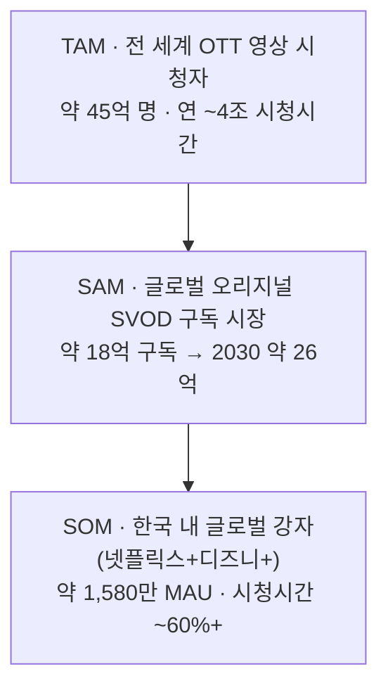
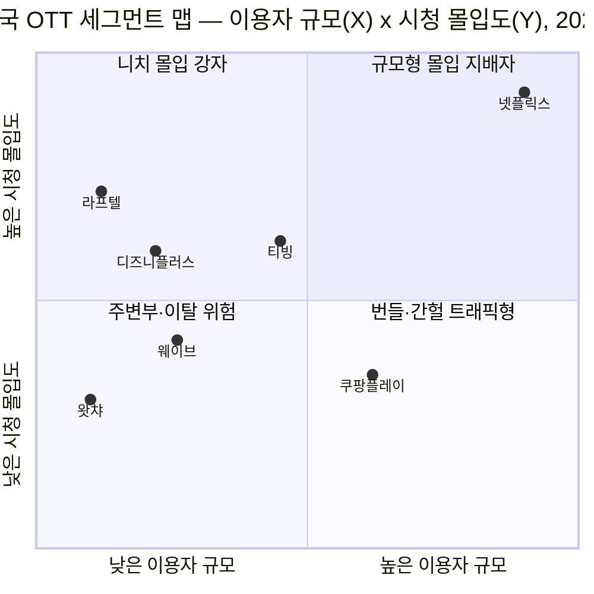

# 시장 규모 분석 ②: 글로벌 오리지널 제작 OTT (TAM-SAM-SOM & 세그먼트 맵)

> 대상: **자체 영화·드라마를 제작해 전 세계 동시 공개하고, 한국에서도 서비스하는 글로벌 OTT** — 넷플릭스·디즈니+·아마존 프라임 비디오·애플 TV+
> 근거 분석: `../01-five-forces/analysis-2-ott-streaming.md`, `../02-value-chain/analysis-2-ott-streaming.md`, `../03-ksf/analysis-2-ott-streaming.md`
> 방법: `methodology.md`의 7단계 워크플로우
> **관점: 기존 글로벌 강자** / **지표: 시청시간·MAU(engagement)** / **기준: 2025 추정 · 2030 전망** / **데이터: 웹 리서치 검증**

---

## 확정된 분석 뼈대

| 계층 | 정의 |
|---|---|
| **TAM** | 전 세계 OTT 영상 시청자·시청시간 총량 |
| **SAM** | 글로벌 오리지널 제작 SVOD가 도달 가능한 구독 시장 |
| **SOM** | 기존 글로벌 강자(**넷플릭스 + 디즈니+**)가 **한국**에서 실제 확보 중인 몫 |

---

## 1~2단계: 탐색과 범위 축소 (Broad Inquiry & Funneling)

OTT 영상 시장은 **수익모델(SVOD·AVOD·TVOD·FAST)** × **콘텐츠 조달(오리지널 제작 vs 순수 라이선싱)** × **지리(글로벌 vs 로컬)** × **번들 여부**가 겹친 복합 시장이다. 이 중 분석 대상은 세 축의 교집합 — **[SVOD × 오리지널 제작 × 글로벌 공개]** 세그먼트다.

- **중심(대상)**: 넷플릭스, 디즈니+, 아마존 프라임 비디오, 애플 TV+
- **경계 밖(제외)**: 티빙·웨이브·왓챠(로컬 집중), 쿠팡플레이(한국 한정·커머스 번들), 유튜브·숏폼(AVOD/UGC)

범위 축소를 위해 4가지 제약을 확정했다 → **관점(기존 글로벌 강자)·지표(시청시간·MAU)·기간(2025→2030)·데이터(웹 검증)**.

## 3단계: 핵심 원인 분석 (Causal Analysis)

지표를 **시청시간·MAU**로 잡으면, 문제의 초점이 "시장이 얼마나 큰가"에서 **"유한한 시청 시간을 누가 얼마나 깊게 붙잡는가"**로 이동한다(5 Forces의 "여가 시간 쟁탈전"과 직결). 그리고 1차 데이터가 결정적 현상을 드러낸다 — **이용자 점유와 시청시간 점유의 괴리**:

> 한국에서 넷플릭스는 **이용자 점유 약 40%(1,393만 MAU)**인데, **사용시간 점유는 57.7%**다.

글로벌 오리지널 강자는 "얼마나 많이 켜는가"보다 **"켠 사람이 얼마나 오래 머무는가"에서 과대대표(over-index)**된다. 원인은 **독점 오리지널 IP**(KSF 1)가 만드는 깊은 몰입이며, 그 몰입이 이탈 방어(구매자 힘)이자 규모의 경제(KSF 4)의 연료다.

## 4단계: 가설 수립 (Hypothesis)

> **가설.** 기존 글로벌 강자의 진짜 해자는 **가입자 수(MAU)가 아니라 1인당 시청시간(engagement)**이다. 시장을 MAU 축으로만 보면 지배력이 과소평가되고, **시청시간 축을 겹쳐 보면** 지배력이 정확히 드러난다. 이 과대대표는 글로벌(SAM)에서도 한국(SOM)에서도 재현된다.

→ 그래서 TAM-SAM-SOM은 단일 축이 아니라 **"이용자 규모 × 시청 몰입도" 2축**으로 그려야 진실을 보여준다. 이것이 세그먼트 맵의 축을 결정한다.

## 5단계: 정량적 검증 (Quantitative Validation)

검증된 실측·추정치로 산정한 TAM-SAM-SOM. (기준 2025 · 단위 이중 표기 · 출처 하단)

| 계층 | 정의 | 이용자 축 (MAU/구독) | 시청시간 축 (engagement) | 2030 전망 |
|---|---|---|---|---|
| **TAM** | 전 세계 OTT 영상 시청자 전체 | **약 45억 명** | 1인 주당 ~17시간 → **연 약 4조 시간(개략)** | 이용자 ~55억+ 명 |
| **SAM** | 글로벌 오리지널 SVOD 도달 가능 구독 시장 | **약 18억 구독** | 스트리밍이 美 TV 시청시간의 **47.5%**(2025.12) 장악, 그중 유료 오리지널이 프리미엄 몫 | **약 26억 구독** (CAGR 한 자릿수 후반) |
| **SOM** | 글로벌 강자(넷플릭스+디즈니+)의 **한국** 확보분 | **약 1,580만 MAU** (넷플릭스 1,393만 + 디즈니+ 190만) | **한국 OTT 시청시간의 ~60%+** (넷플릭스 단독 57.7%) | 확인 필요 |

**가설 입증**
- 한국 OTT 전체 MAU 2,089만 중 글로벌 강자는 **이용자 축 ~46%**.
- 그러나 **시청시간 축에서는 ~60%+** → **약 +14%p over-indexing**. 가설이 정량적으로 확인된다.

**참조 — 글로벌 대상 4사 규모(2025)**: 넷플릭스 3.25억 구독 / 아마존 프라임 비디오 2~2.4억(추정) / 디즈니+ ~1.3억 / 애플 TV+ ~4,500만+(추정).

> **방법론 주의.** TAM(이용자 수)·SAM(구독 건수)·SOM(MAU)은 측정 기준이 서로 달라, 계층 간 단순 나눗셈 비율로 해석하면 안 된다. "동심원의 크기 감(感)"으로 읽되, 각 축 내부(예: 한국 시장 안에서의 점유 비교)에서만 정밀 비율을 사용한다.

### TAM-SAM-SOM 동심 구조

## 6단계: 반복적 정제 (Iterative Refinement)

1차 산정을 세그먼트 맵으로 옮기며 다음을 정제했다.
1. **축 확정** — 가설과 직결되도록 X=이용자 규모(MAU), Y=시청 몰입도(1인당 시청시간)로 고정.
2. **상대 위치 확보** — 대상(넷플릭스·디즈니+)만이 아니라 한국 경쟁자(쿠팡플레이·티빙·웨이브·라프텔·왓챠)를 함께 배치해 글로벌 강자의 위치를 상대적으로 드러냄.
3. **사분면 의미 부여** — 각 분면에 전략적 라벨을 붙여 "빈 땅(white space)"과 진입 경로를 읽을 수 있게 함.
4. **좌표 근거** — 한국 2025.6 MAU 실측 + 시청시간 점유(넷플릭스 57.7%)를 기준으로 정규화 배치.

## 7단계: 솔루션 구체화 (Solution Definition) — 마켓 세그먼트 맵

가설을 가장 직관적으로 드러내는 **좌표평면(2×2 매트릭스)**. 오른쪽 위로 갈수록 "규모도 크고 몰입도 깊은" 지배적 위치다.

**사분면 해석**

| 사분면 | 의미 | 대표 플레이어 | 전략적 시사 |
|---|---|---|---|
| **우상단** 규모형 몰입 지배자 | 큰 규모 + 깊은 몰입 | **넷플릭스** | 글로벌 강자의 독식 구역. 가설이 가리키는 목적지. |
| **좌상단** 니치 몰입 강자 | 작은 규모 + 깊은 몰입 | 라프텔(애니), **디즈니+**(IP), 티빙(로컬) | 신규 진입자의 출발점(KSF 2 니치). 여기서 몰입을 쥐고 우상단으로 이동. |
| **우하단** 번들·간헐 트래픽형 | 큰 규모 + 얕은 몰입 | 쿠팡플레이 | 본업 번들·스포츠 스파이크로 MAU는 크나 상시 몰입은 약함(KSF 3). |
| **좌하단** 주변부·이탈 위험 | 작은 규모 + 얕은 몰입 | 왓챠 | 규모의 경제 미달 + 몰입 부족 → 구조적 이탈 위험. |

**솔루션(실행 함의)**
- **기존 글로벌 강자 관점(이번 분석의 관점).** 넷플릭스의 해자는 MAU가 아니라 **우상단의 몰입 우위**다. 방어 전략은 가입자 확보 마케팅이 아니라 **오리지널 IP 파이프라인으로 1인당 시청시간을 계속 끌어올리는 것**. 디즈니+는 좌상단(IP 몰입은 강하나 규모 부족)에 갇혀 있어, 번들·요금제로 **X축(규모)을 오른쪽으로 밀어야** 우상단에 합류한다.
- **신규 진입자에의 함의.** 우상단은 이미 점유됨 → 정면승부 금지. **좌상단(니치 고몰입)에서 시작**해 몰입으로 발판을 만든 뒤, **본업 번들(KSF 3)로 X축 규모를 확보**해 우상단으로 북동진하는 경로가 유일하게 현실적이다. 이는 KSF의 `니치·로컬(2) → 규모(4)` 순서와 정확히 일치한다.

---

## 출처

- 전 세계 OTT 이용자·시장 규모 — [Statista, OTT Video Users Worldwide](https://www.statista.com/forecasts/1207843/ott-video-users-worldwide/), [Statista, Video Streaming Worldwide](https://www.statista.com/topics/7527/video-streaming-worldwide/)
- 전 세계 SVOD 구독 규모·전망 — [Futuresource/Media Play News](https://www.mediaplaynews.com/futuresource-global-svod-consumer-spending-at-150-billion/), [Digital TV Research/Streaming Media](https://www.streamingmediaglobal.com/Articles/News/Featured-News/Global-SVOD-Subscriptions-to-Reach-1.6-Billion-by-2026-Digital-TV-Research-149269.aspx)
- 스트리밍 시청시간 점유(美) — [Nielsen, The Gauge 2025.12 (47.5%)](https://www.nielsen.com/news-center/2026/streaming-shatters-multiple-records-in-december-2025-with-47-5-of-tv-viewing-according-to-nielsens-the-gauge/)
- 한국 OTT MAU·점유율·시청시간 — [경향신문(2025.7)](https://www.khan.co.kr/article/202507291558001), [뉴스1](https://www.news1.kr/it-science/cc-newmedia/5900452)
- 플랫폼별 구독자 규모 — [Variety, Netflix Q4 2025(3.25억)](https://variety.com/2026/tv/news/netflix-q4-2025-financial-earnings-subscribers-1236635615/), [TheWrap, 스트리머 비교(2025.11)](https://www.thewrap.com/netflix-disney-hbo-max-paramount-peacock-subscribers-revenue-profit-november-2025-update/)

> 수치는 조사기관·정의(구독 건수 vs 순 이용자 vs MAU)에 따라 편차가 있어 **개략치·추정치**로 표기했다. 정밀 인용이 필요하면 각 원문의 최신 리비전을 재확인할 것.
