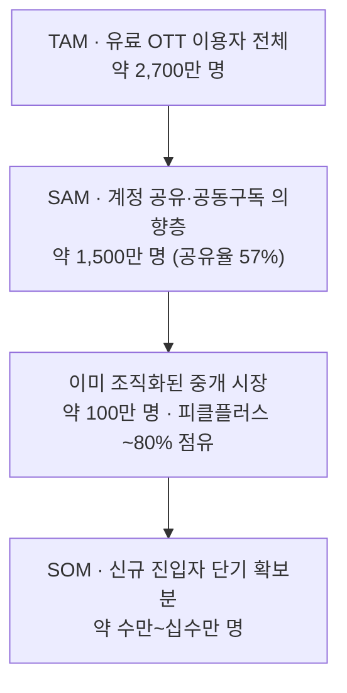
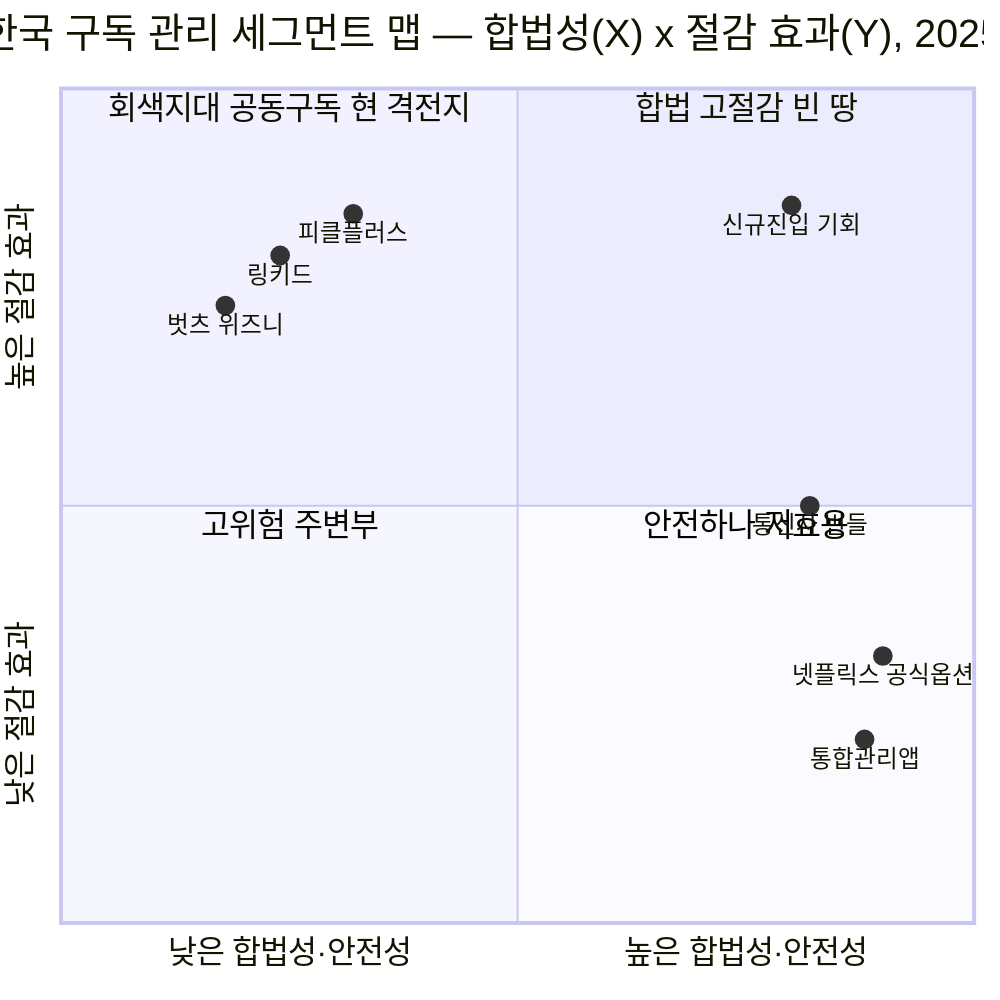
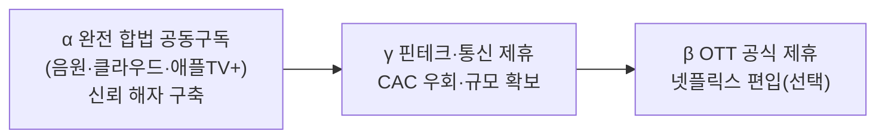

# 한국 공동구독(OTT 계정 공유) 중개 시장 — 신규 진입자 가능성 분석 (TAM-SAM-SOM)

> 대상: 한국에서 서비스 중인 **OTT 공동구독 중개 시장** (피클플러스·링키드·벗츠·위즈니 등)
> 관점: **기존 1위(피클플러스)의 시각에서 신규 진입자의 가능성**을 평가
> 방법: `../methodology.md`(TAM-SAM-SOM) + `../../01-five-forces/methodology.md`(신규 진입자의 위협)
> 지표: **이용자 수(사람) 기준** · 중개 매출(수수료)은 보조 스케치 · 한국 한정 · 2025 기준
> 탐색 배경: 이 분석에 이르기까지의 과정은 `../problem-definition/ott-cost-and-discovery.md`(Pivot Log)에 기록

---

## 1. 시장 지형 (요약)

공동구독 중개는 **낯선 사람끼리 4인 계정을 매칭해 비용을 분할**하고 플랫폼이 수수료를 받는 모델이다. 한국 OTT 구독 관리 3갈래(공동구독 중개 / 통합 관리·해지 앱 / 통신사 번들) 중 **유일하게 독립 흑자**를 내는 갈래다.

| 플레이어 | 이용자 | 특징 |
|---|---|---|
| **피클플러스**(1위) | 회원 **80만+**(2025), MAU ~70만 | 2024 매출 **30.8억**, 영업이익률 ~**20%**, NPS **71** |
| 링키드 | **10만+** | 2위권 |
| 벗츠·위즈니·겜스고 등 | 소규모 | 롱테일 |

**시장을 흔드는 변수**: 넷플릭스·디즈니+의 **계정 공유 단속**(가구 외 인증). 공식 공유를 막자 → 중개 플랫폼 수요가 자극됐지만, 동시에 **이용정지·먹튀·환급지연 등 소비자 피해**가 급증(약관·법적 회색지대).

## 2. 신규 진입자의 위협 분석 — 피클플러스의 해자 ↔ 진입의 틈

기존 1위 관점에서 "내 자리는 얼마나 방어적인가"를 5 Forces의 '신규 진입자 위협'으로 본다.

### 피클플러스의 진입장벽(해자)

1. **양면 네트워크 효과** — 참여자 풀이 클수록 4인 매칭이 빠르고 안전. 80만 회원이 **매칭 유동성**을 선점 → 후발주자는 "빈자리를 못 채우는" 콜드스타트에 걸린다.
2. **신뢰·안전 자산** — 먹튀·이용정지 피해가 만연한 시장에서 **"안전 보장·환불" 평판(NPS 71)**이 곧 해자. 신뢰는 돈으로 못 사고 시간이 필요하다.
3. **흑자 → 재투자 여력** — 영업이익률 ~20%로 마케팅·피해 보증 재원을 자체 조달. 적자 출혈 경쟁을 견딘다.

### 신규 진입자의 틈 (그럼에도 열려 있는 곳)

1. **회색지대 정면 회피** — 피클의 최대 약점은 **넷플릭스 단속·약관 위반 리스크**. 이를 **합법 구조**(공식 파트너십, 가족요금제 대행, 또는 계정 공유를 *허용*하는 상품 — 음원·오피스·클라우드 등 — 집중)로 우회하면 피클이 못 서는 땅에 설 수 있다.
2. **미조직 시장 개척** — 아래 TAM-SAM-SOM이 보이듯, 공유 의향층 대부분은 **아직 중개 플랫폼을 쓰지 않는다**(지인끼리 사적 공유). 피클과 100만을 두고 싸우는 게 아니라 **1,400만 미조직층을 조직화**하는 쪽에 진짜 기회가 있다.
3. **인접 번들로 CAC 우회** — 피클은 순수 독립 플랫폼. **통신사·핀테크·카드사 제휴**로 대량 유입 경로를 확보하면 마케팅비 없이 규모에 도달할 수 있다(04·KSF의 '번들' 교훈).

> **판단**: 조직화된 중개 시장 안에서는 피클플러스의 해자(네트워크·신뢰·흑자)가 견고해 **정면 진입은 위험**. 그러나 그 해자는 **"이미 중개를 쓰는 100만"에만 유효**하다. 신규 진입자의 승산은 피클의 회색지대 리스크를 회피하는 **합법 모델**로 **미개척 1,400만**을 여는 데 있다.

## 3. TAM-SAM-SOM (이용자 수 기준, 2025)

| 계층 | 정의 | 규모(이용자) | 산정 근거 |
|---|---|---|---|
| **TAM** | 한국의 유료 OTT 이용자 전체 (구독 비용 최적화의 이론적 전체 수요) | **약 2,700만 명** | 국민 53.4% 유료 OTT 이용(인구 ~5,100만) |
| **SAM** | 그중 계정 공유·공동구독으로 절감할 의향·행동이 있는 층 | **약 1,500만 명** | 유료 이용자의 **계정 공유율 57%** 적용 |
| **SOM** | 신규 진입자가 단기(현 리소스)로 확보 가능한 몫 | **약 수만~십수만 명** | 조직화 중개 시장 ~100만(피클 80만·점유 ~80%) 중 신규 확보 가능분 + 미조직층 초기 전환 |

**해석 — 신규 진입자에게 주는 신호**
- **조직화율이 낮다**: SAM 1,500만 중 중개 플랫폼을 쓰는 층은 ~100만(약 **6~7%**)뿐. 나머지 **~1,400만은 미조직**(사적 공유·비용 민감층) → **시장의 진짜 파이는 미개척지에 있다.**
- **정면 SOM은 좁다**: 조직화 시장 100만은 피클이 ~80% 선점 → 여기서 뺏는 SOM은 수만~십수만에 그침. **피클과 정면 승부하면 SOM이 작다.**
- **결론**: 신규 진입자의 SOM을 키우는 유일한 길은 **조직화율 자체를 끌어올리는 것** — 즉 피클이 못 건드리는 **합법·안전 모델**로 미조직 1,400만의 일부를 처음으로 조직화하는 것.

**중개 매출(수수료) 보조 스케치**: 피클플러스 2024 매출 30.8억(회원 50만대 시기) → 1인당 연 수천 원대 중개 마진 추정. 조직화 시장(~100만) 기준 현 시장 매출은 대략 **수십억~100억 원 초기 규모**. 미조직 SAM(1,400만)을 열면 매출 잠재는 **10배+**로 확장 가능(구독 시장 전체는 100조·연 11% 성장이라는 업계 추정도 배경).

## 4. 마켓 세그먼트 맵 — 합법성 × 절감 효과

이 시장의 핵심 긴장("절감은 되지만 위태롭고, 안전하면 저효용")을 두 축으로 놓으면 신규 진입자가 노릴 **빈 땅(white space)**이 드러난다. X축 = 합법성·안전성, Y축 = 비용 절감 효과.

**사분면 해석**

| 사분면 | 의미 | 대표 플레이어 | 시사 |
|---|---|---|---|
| **좌상단** 회색지대 공동구독 | 절감 크지만 합법성 낮음 | **피클플러스**(1위), 링키드, 벗츠·위즈니 | 현 격전지. 넷플릭스 단속·약관 리스크에 상시 노출. |
| **우상단** 합법 고절감 (빈 땅) | 절감 크고 합법·안전 | *(비어 있음)* → **신규 진입 목표** | 아무도 못 선 땅. 여기에 서면 미조직 1,400만을 열 수 있음. |
| **우하단** 안전하나 저효용 | 합법·안전하나 절감 약함 | 통합관리앱(토스·왓섭), 통신사 번들, 넷플릭스 공식옵션 | 안전하지만 "돈 아껴주는 느낌"이 약해 강한 구매 이유가 못 됨. |
| **좌하단** 고위험 주변부 | 절감·합법성 모두 낮음 | 영세·미검증 중개 | 먹튀·이용정지 피해의 온상. |

**핵심 메시지**: 기존 플레이어는 **좌상단(위태로운 절감)** 아니면 **우하단(안전한 저효용)**에 갈려 있고, **우상단(합법이면서 절감도 큰)은 비어 있다.** 신규 진입자의 승부처는 바로 이 빈 땅 — 공유를 *허용하는* 상품(음원·오피스·클라우드 등)이나 공식 파트너십·가족요금제 대행 등 **합법 구조로 큰 절감을 제공**해, 피클플러스가 리스크 때문에 못 서는 자리를 선점하는 것이다. (04의 세그먼트 맵에서 신규 진입자가 '북동진'해야 했던 것과 동일한 구조.)

## 5. 반복적 정제 (워크플로우 6단계) — '빈 땅'을 실행 가능한 모델로

우상단 "합법 고절감"은 아직 추상적이다. 실제 상품의 계정 공유 정책을 대입해 **구체적 하위 모델 3가지**로 정제한다.

**합법성 지형(실측)**
- **완전 합법(다인/가족 공식 허용)**: 애플TV+ 패밀리, 유튜브 프리미엄·스포티파이·음원 가족요금제, MS365 가족, 클라우드, 라프텔 등.
- **제한적 합법(공식 옵션 존재)**: 넷플릭스 **추가 회원**(1인 5,000원), 티빙·웨이브 **더블 이용권**(공식 통합 요금제).
- **회색지대(약관 위반)**: 넷플릭스·디즈니+ 등의 '파티장 계정' 공유 — **피클플러스의 현 주력** 방식.

**정제된 하위 모델**

| 모델 | 방식 | 합법성 | 절감 폭 | 넷플릭스 | 실행 난이도 |
|---|---|---|---|---|---|
| **α. 공유 허용 상품 전문** | 공식적으로 다인/가족을 허용하는 서비스만 매칭(애플TV+·음원·오피스·클라우드·라프텔) | ★★★ 완전 합법 | 큼 | ✗ (제외) | **낮음 — 즉시 가능** |
| **β. 공식 그룹·번들 재판매** | 티빙·웨이브 더블이용권·넷플릭스 추가회원 등 공식 옵션을 묶어 판매·관리 | ★★☆ 합법(제휴 필요) | 중 | △ (추가회원) | 높음 — OTT 제휴 |
| **γ. 핀테크·통신 제휴형 안전 관리+절감** | 안전한 구독 관리(우하단)에 공식 할인·번들(절감)을 결합, 제휴 채널로 유입 | ★★★ | 중 | △ | 중 — 제휴 협상 |

**정제로 드러난 핵심 트레이드오프**: 완전 합법(α)으로 가면 **최대 수요인 넷플릭스를 포기**해야 한다. 넷플릭스를 넣으려면 공식 옵션(추가 회원·제휴, β/γ)에 기대야 하나 절감 폭이 줄고 제휴 난이도가 오른다. → **"합법성 vs 넷플릭스 포함"이 빈 땅 공략의 결정 변수**다. 어느 쪽을 beachhead로 삼느냐가 7단계 솔루션의 형태를 좌우한다.

## 6. 솔루션 구체화 (워크플로우 7단계) — A안: 완전 합법 공동구독

**선택**: 모델 **α(공유 허용 상품 전문)**를 beachhead로 확정. 넷플릭스를 초기엔 포기하는 대신 **"먹튀·계정정지 걱정 없는 100% 합법 공동구독"**을 무기로, 피클플러스가 리스크 때문에 못 서는 자리를 선점한다.

### 6.1 제품 개념 & 포지셔닝

- **한 줄 정의**: 공식적으로 가족/다인을 **허용하는 구독만** 안전하게 나눠 쓰게 해주는 합법 공동구독 플랫폼. *(가칭) 세이프팟(SafePot)*
- **포지셔닝**: 피클플러스 = "싸지만 위태롭다" ↔ 세이프팟 = **"조금 덜 화려해도(넷플릭스 X) 절대 안 잘린다"**. 신뢰가 곧 쐐기(wedge).
- **대상 상품(MVP)**: 애플TV+ 패밀리, 유튜브 프리미엄·음원(스포티파이 등) 가족요금제, MS365 가족, 클라우드(구글/애플), 라프텔 등 — **약관상 다인/가족 이용이 허용된 것만**.

### 6.2 타깃 beachhead (미조직 SAM의 첫 조각)

넷플릭스가 아니라 **"거의 누구나 쓰지만 혼자 요금을 다 무는" 필수 구독**을 진입점으로. 특히 **음원 + 클라우드**는 이용률이 높고 가족요금제 절감 폭이 커, 넷플릭스 없이도 강한 구매 이유가 된다. → "넷플릭스는 지인과 쓰더라도, 음원·클라우드·애플TV+는 세이프팟에서 안전하게".

### 6.3 MVP 범위

1. **매칭**: 2~3개 상품으로 시작해 파티(가족/다인 그룹) 자동 결성.
2. **안전장치(핵심 차별점)**: 에스크로 결제 · 자동 월 정산 · 본인인증 · **파티 파장·미납 시 환불/재매칭 보장**. → "계정정지·먹튀 0"을 상품화.
3. **관리**: 정산·갱신 리마인드, 한 화면 구독 대시보드(우하단 관리앱 기능 흡수).

### 6.4 수익 모델

- **매칭·정산 수수료**(파티 결성 및 월 정산 기준) + **프리미엄**(우선 매칭·보장 강화). 절감액에서 일부를 떼는 구조라 지불 저항이 낮다(“아껴준 만큼만”).

### 6.5 핵심 지표(KPI)

- 파티 **결성 성공률** / **정산 성공률** / **계정정지율 0 유지**(신뢰의 증거) / CAC / 3개월 리텐션.

### 6.6 리스크 & 대응

| 리스크 | 대응 |
|---|---|
| 넷플릭스 부재로 초기 흡인력 약함 | 음원·클라우드 등 **필수재**로 진입, "안전" 메시지로 차별화 |
| 공급 서비스의 가족요금제 약관 변경 | 상품 포트폴리오 분산, 약관 모니터링, 제휴(γ)로 전환 |
| 매칭 유동성 콜드스타트 | **소수 상품 집중**으로 밀도 우선 확보 후 확장 |

### 6.7 확장 경로 (세그먼트 맵상 '북동진')

→ KSF 관점: **①안전·신뢰라는 새 해자**로 피클의 네트워크 해자를 우회 → **②번들(γ 제휴)로 CAC를 낮춰 규모(임계질량)**에 도달 → 이후 필요 시 **③OTT 공식 제휴(β)로 넷플릭스까지** 편입. 세그먼트 맵의 빈 땅(우상단)에 진입해 오른쪽·위로 굳히는 경로다.

---

## 출처

- 유료 OTT 이용률·계정 공유율 — [KISDI/한국콘텐츠진흥원(53.4%·공유율 57%)](https://www.kisdi.re.kr/report/view.do?key=m2101113025891), [MHN(10명 중 9명·57% 공유)](https://www.mhnse.com/news/articleView.html?idxno=358294)
- 피클플러스 규모·재무 — [헤럴드경제(MAU·영업이익률 20%)](https://biz.heraldcorp.com/article/10559662), [사람인(2024 매출 30.8억)](https://www.saramin.co.kr/zf_user/company-info/view-inner-finance/csn/cHNaK1VBNXdSbU01RzFMZGVNRkxkUT09), [ZDNet(이용자·링키드 10만+)](https://zdnet.co.kr/view/?no=20240622164836)
- 계정공유 피해·단속 — [한경매거진(피해 급증)](https://magazine.hankyung.com/business/article/202502219979b), [뉴시스(단속 후 재부상)](https://www.newsis.com/view/NISX20240709_0002804957)

> 수치는 조사기관·정의(이용 인구 vs MAU vs 구독 계정)에 따라 편차가 있어 **개략치**로 표기했다. TAM은 유료 이용 인구, SOM은 조직화 시장 점유 기반 추정이라 계층 간 단순 나눗셈 해석은 지양.
