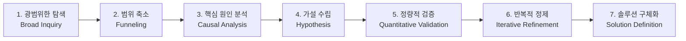

# TAM-SAM-SOM & 마켓 세그먼트 맵: 시장의 '크기'와 '지도'를 그리는 법

> 5 Forces(산업 매력도)·가치사슬(내부 활동)·KSF(집중할 성공 요인)에 이어,
> 이 프레임은 "그래서 그 시장이 **얼마나 크고, 어디를 노려야 하는가**"를 **정량**으로 답한다.

---

## 1. TAM-SAM-SOM: 시장을 3겹의 동심원으로 좁히기

시장 규모는 하나의 숫자가 아니라 **점점 좁아지는 세 겹**으로 본다. 큰 원 안에 작은 원이 들어가는 구조다.

| 구분 | 의미 | 한 줄 정의 | 주요 데이터 출처 |
|---|---|---|---|
| **TAM** (Total Addressable Market) | 전체 시장 규모 | "이론적으로 접근 가능한 전체 수요" | Statista, IBISWorld, Crunchbase |
| **SAM** (Serviceable Available Market) | 서비스 가능 시장 | "우리 제품/서비스가 현실적으로 도달 가능한 영역" | 산업 협회, 정부 통계, 시장조사기관 |
| **SOM** (Serviceable Obtainable Market) | 획득 가능 시장 | "현재 리소스로 단기 실현 가능한 목표 범위" | 설문·JTBD 인터뷰, 검색 트렌드, 실측 점유율 |

**핵심 원칙**
- **TAM은 크게, SOM은 정직하게.** TAM은 "시장이 매력적인가"를, SOM은 "우리가 실제로 먹을 수 있는가"를 말한다.
- **관점(Perspective)이 SOM을 결정한다.** 같은 시장이라도 신규 진입자의 SOM과 기존 강자의 SOM은 다르다. 산정 전에 "누구의 관점인가"를 반드시 고정한다.
- **지표(단위)를 하나로 고정한다.** 매출(USD)·가입자 수·시청시간(MAU) 중 무엇으로 재느냐에 따라 이야기가 달라진다. 세 계층을 서로 다른 기준으로 재면 단순 나눗셈 비율로 읽어선 안 된다(정의 주의).

## 2. 마켓 세그먼트 맵: 시장을 '지도'로 펼치기

TAM-SAM-SOM이 시장의 **크기**라면, 세그먼트 맵은 시장의 **지형**이다. 경쟁자·수요를 몇 개의 축으로 분해해 "누가 어디에 있고, 빈 땅은 어디인가"를 본다.

**시각화 방향 선택 가이드** — 목적에 맞는 표현을 고른다.

| 표현 방식 | 가장 잘 맞는 상황 |
|---|---|
| **2×2 매트릭스 / 좌표평면** | 두 개의 핵심 축으로 경쟁자 포지션과 빈 공간(white space)을 드러낼 때 |
| 벤다이어그램 | 세그먼트 간 겹침·교집합을 보여줄 때 |
| 히트맵 | 세그먼트 × 속성의 강약을 한눈에 비교할 때 |
| 히스토그램/막대 | 세그먼트별 규모 순위를 단순 비교할 때 |
| 동심원(nested) | TAM→SAM→SOM 포함 관계를 보여줄 때 |

이 저장소의 OTT 분석은 가설(**"글로벌 강자의 해자는 규모가 아니라 몰입"**)을 가장 직관적으로 드러내기 위해 **좌표평면(2×2 매트릭스)**을 선택했다 — X축 이용자 규모, Y축 시청 몰입도. → `analysis-2-ott-streaming.md` 참조.

## 3. 문제의식을 계획으로 바꾸는 7단계 워크플로우

이 프레임은 정적인 표 채우기가 아니라, **광범위한 질문 → 좁히기 → 검증 → 시각화 → 솔루션**으로 이어지는 리서치 프로세스로 수행한다.

| 단계 | 사용자 행동 | AI 역할 / 산출물 |
|---|---|---|
| 1. 광범위한 탐색 | 거시적·복합적 시장을 정의 | 초기 정보 제공, 광범위한 데이터 수집 |
| 2. 범위 축소 | AI의 질문으로 연구 범위를 구체화 | 제약 조건(관점·지역·기간·지표)을 역질문해 초점 한정 |
| 3. 핵심 원인 분석 | 1차 데이터에서 더 근본적 문제로 초점 이동 | 심층 분석 자료 제공 |
| 4. 가설 수립 | 핵심 원인 기반으로 가설 설정·검증 요청 | 가설 검증 스파링, 논거·데이터 제공 |
| 5. 정량적 검증 | 상반 데이터의 시각화·수치화 요청 | 맞춤 차트/표 1차 초안 생성 |
| 6. 반복적 정제 | 1차 결과를 검토하고 세분화 수정 지시 | 피드백 반영한 최종 시각화·데이터 |
| 7. 솔루션 구체화 | 검증된 데이터로 구체적 실행 계획 수립 | 아이디어를 실행 계획으로 문서화 |
