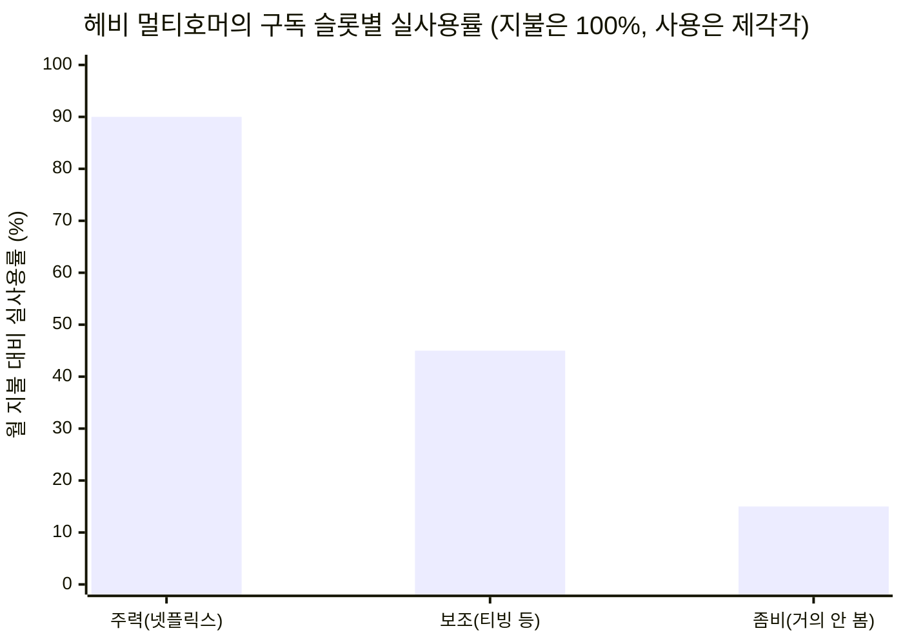

# 탐색 여정: 한국 OTT 구독 기회 — 문제의식에서 구독 관리 시장까지

> 이 문서는 "한국 OTT 이용자의 문제의식"에서 출발해 **두 번의 방향 전환**을 거쳐
> "**한국 OTT 구독 관리(공동구독) 시장 분석**"에 이른 탐색 과정을 그대로 기록한다.
> 기각된 방향과 그 이유까지 남겨, 왜 최종 초점에 도달했는지 추적 가능하게 하는 것이 목적이다.
> 배경: `../analysis-2-ott-streaming.md` · 방법: `../methodology.md`의 7단계 워크플로우
> 진행 상태: **국면 C · 1단계 완료 · 2단계(신규 진입자 방어벽 분석) 확인 대기**

---

## 탐색 여정 한눈에 (Pivot Log)

| 국면 | 초점 | 핵심 가설 | 전환·기각 이유 |
|---|---|---|---|
| **A** | 소비자 문제의식 — 비용 누수 + 탐색 피로 | 발견 중심 + 비용 최적화 보조의 중립 애그리게이터 | B2C 수익화 경로가 약해 → B2B로 전환 |
| **B** | B2B 데이터 플랫폼 — 자발적 취향 데이터 판매 | 왓챠피디아형 취향·인구통계 데이터를 제작사·커머스·광고에 판매 | 차별점 두 후보(사전 취향예측 / 마니아 특화)가 모두 설득력 부족 → 기각 |
| **C** *(현재)* | 한국 OTT **구독 관리(공동구독) 시장** | 기존 1위(피클플러스) 관점에서 신규 진입자의 가능성 평가 | 진행 중 |

---

# PART A — 국면 A: 소비자 문제의식 (비용 누수 · 탐색 피로)

`04` 분석에서 도출한 한국 이용자의 문제의식 3가지 중 **①비용 누수**와 **②탐색 피로**를 해결 대상으로 선택하고 7단계를 진행했다.

| # | 문제의식 | 한 줄 정의 | 근거 |
|---|---|---|---|
| ① | **비용 누수** | 보고 싶은 게 흩어져 있어 여러 OTT 동시 구독 → 총 지출↑, 다 보지도 못함 | 5F 구매자 힘(멀티호밍·구독 피로) |
| ② | **탐색 피로** | 라이브러리·추천이 플랫폼별로 갈라져 "뭘 볼지" 고르는 데 시간을 다 씀 | 가치사슬(추천엔진이 앱 안에 갇힘) · 5F 대체재 |

## 1단계: 광범위한 탐색 (딥 리서치)

- **문제 규모**: 1인 평균 OTT 구독 **2.1~2.7개**, OTT 월 지출 ~**1.09만 원**, 이용자 **42%가 비용 부담** 체감. 이미 절약·해지·분할결제 행동 확산.
- **탐색 피로**: 결정 피로가 업계 지표(`time-to-first-play`, `no-selection exit`)로 관리될 만큼 실재. 시작 영상의 11%만 완주.
- **경쟁 지형의 빈 땅**: 기존 해결책은 **번들(결제)** 또는 **발견(탐색)** 중 한쪽만 다룸. 두 문제를 중립적으로 함께 푸는 플레이어는 약함.

## 2단계: 범위 축소 (확정)

| 제약 | 확정값 |
|---|---|
| 솔루션 방향 | 발견 우선 + 비용 최적화 보조 |
| 핵심 타깃 | 헤비 멀티호머(3개+ 구독) |
| 지리 범위 | 한국 한정 |

→ 잠정 정의: *"한국 헤비 멀티호머를 위한, 발견 중심 + 비용 최적화 보조의 중립 OTT 애그리게이터"*

## 3단계: 핵심 원인 분석 — 케이스 스터디: 왓챠피디아

| 왓챠피디아(발견) | 값 | | 왓챠(모회사 OTT) 재무 | 값 |
|---|---|---|---|---|
| MAU | **400만+** | | 매출 | 734억('22)→438억('23)→**341억('24)** |
| 누적 평가 | **7.3억 건** | | 상태 | 2024말 **완전자본잠식**·회생·매각 |

**핵심 통찰(가치 포획 실패)**: 발견 서비스(왓챠피디아, MAU 400만)는 유료 OTT(왓챠, MAU 53만)의 **8배 도달**을 확보하고도 돈을 못 벌었다. 발견은 상류(앞단), 결제·시청은 각 OTT 앱(뒷단)이라 **거래 가치를 포획할 지점이 없다.** 유일한 출구였던 "자체 OTT 전방통합"은 콘텐츠 군비경쟁에 끌려들어가 죽는 함정이었다.

## 4단계: 가설 수립 (국면 A의 종착 가설)

> 헤비 멀티호머의 JTBD는 '발견'이 아니라 **'구독 포트폴리오 최적화'**다. 발견을 무료 입구로, 수익은 **"이번 달 뭘 켜고·끊을지" 구독 최적화 코칭**에서 낸다. 자체 OTT 전방통합은 하지 않는다.

## 5단계: 정량적 검증 — '낭비'의 병치

헤비 멀티호머(3개 구독, 월 ~₩40,000)의 구독 슬롯별 실사용률.

- **낭비 크기 ✅**: 세 번째 슬롯(월 ₩12,000+/연 ₩14만+)이 사실상 순수 낭비. 전체 구독 기준 ~18% 미사용, 실지출 2.5배 과소인지.
- **입구 크기 ✅**: 발견 트래픽 잠재 = 왓챠피디아 400만 MAU.
- **지불 의사 ✅**: 64.7%가 이미 할인·제휴로 절약 시도, 국민 절반이 저가 요금제 의향.

**출처(국면 A):** [미디어오늘](https://www.mediatoday.co.kr/news/articleView.html?idxno=301602) · [왓챠피디아 MAU 400만(한국경제)](https://www.hankyung.com/article/202502066927i) · [왓챠 재무·자본잠식(데일리팝)](https://www.dailypop.kr/news/articleView.html?idxno=88354) · [64.7% 절약(KCA)](https://www.kca.go.kr/webzine/board/view?menuId=MENU00307&linkId=920&div=kca_2510) · [토스뱅크—구독 낭비](https://www.tossbank.com/articles/subscribe)

---

# PART B — 피벗 1: B2C 코칭 기각 → B2B 데이터 플랫폼 (기각)

## 피벗 1의 이유

국면 A의 종착 가설("구독 최적화 코칭")은 **"구독을 줄이려고 또 구독(지불)하겠는가"**라는 모순으로 B2C 지불 의사가 얕았다. 대신 3단계에서 드러난 **진짜 잠재 가치 = 데이터 자산 그 자체**에 주목 → **양면 데이터 플랫폼**으로 전환.

- **구조**: 소비자 면(무료 발견·기록 도구 = 데이터 수집 엔진) + B2B 면(취향·인구통계 데이터를 판매).
- **확정 스코프**: 데이터 수집 범위 = **OTT로 시작**, 1차 B2B 고객 = **콘텐츠 제작사·편성**, 기본 제약 = 개인정보·동의(PIPA) 설계.

## 경쟁 지형 — 이미 콘텐츠·시청자 데이터를 파는 곳들

| 서비스 | 측정 대상 | 성격 | 시점 |
|---|---|---|---|
| 닐슨코리아·TNMS | 누가 얼마나 봤나(reach) | 패널 **행동** | 사후 |
| 굿데이터 펀덱스·CPI(RACOI) | 얼마나 회자되나(buzz) | 소셜 **반응** | 사후 |
| Parrot Analytics | 수요(demand) | 소셜·검색 **프록시**(디즈니·프라임 고객, $99/월~) | 사후·실시간 |
| Antenna·Ampere | 구독·시청 행동 | 결제·행동 로그 | 사후 |

## 차별점 후보 2개 — 그리고 기각

1. **"사후 결과 측정 → 사전 취향 예측"** — 예상 별점으로 기획·투자 단계의 선호를 예측(기존은 다 만든 뒤에야 측정).
2. **"마니아·니치 취향 특화"** — 왓챠피디아의 시네필 편향(대표성 약점)을 오히려 강점으로.

→ **기각 판단(사용자)**: 두 방향 모두 설득력 부족. (대표성 편향, Parrot 등 기존 수요측정과의 차별 불충분, 제작사의 실제 구매 수요 불확실.)

**출처(국면 B):** [Parrot Analytics](https://www.parrotanalytics.com/) · [펀덱스(굿데이터)](https://www.fundex.co.kr/) · [CPI(RACOI) 개요(CJ뉴스룸)](https://cjnews.cj.net/) · [왓챠피디아 예상별점(전자신문)](https://www.etnews.com/20250206000219)

---

# PART C — 피벗 2: 한국 OTT 구독 관리(공동구독) 시장 분석 *(현재)*

## 확정 스코프

| 항목 | 확정값 |
|---|---|
| **갈래** | ① **공동구독 중개** 중심 (② 통합 관리·해지 앱을 대비축으로) |
| **관점** | 기존 1위(**피클플러스**)의 시각에서 **신규 진입자의 가능성** 평가 |
| **지역** | 한국 한정 |

## 1단계: 시장 지형 (딥 리서치)

| 갈래 | 대표 플레이어 | 모델 | 수익성/규모 | 핵심 리스크 |
|---|---|---|---|---|
| **① 비용 절감 — 공동구독 중개** | **피클플러스**(1위), 링키드, 벗츠, 위즈니 | 낯선 사람끼리 4인 계정 매칭·비용 분할, 수수료 | **유일 독립 흑자** — 피클플러스 MAU ~70만·회원 80만+·영업이익률 ~20%·NPS 71 | 약관·법적 회색지대 + 넷플릭스 계정공유 단속 + 소비자 피해 급증 |
| **② 관리 편의 — 통합 관리·해지 앱** | 토스 '내 구독 관리', 왓섭, 쉽독 | 카드·계좌 연동 → 정기결제 탐지·해지 | 수익모델 약함(핀테크 부가기능) | 단독 사업성 부족 |
| **③ 유통 — 통신사·플랫폼 번들** | SKT T우주, LGU+ 유독, KT | 통신 본업에 얹은 구독몰·할인 | 본업 리텐션 수단 | 자사 제휴 위주·중립성 제한 |

**시장 배경**: 1인 평균 정기구독료 월 4만 원+, 가구 월 6~10만 원. 넷플릭스 **계정공유 단속**이 시장 전체를 흔드는 핵심 변수(공식 공유를 막자 중개 수요 자극 ↔ 제재·피해 리스크 동반).

**1단계 문제의식**: 이 시장의 핵심 긴장은 **"비용 절감(공동구독)은 돈이 되지만 위태롭고(회색지대·단속), 관리 편의(앱)는 안전하지만 돈이 안 된다"**는 것. 독립 흑자 모델은 공동구독 중개뿐이나, 그 흑자가 넷플릭스 단속·약관 리스크 위에 서 있다.

**출처(국면 C):** [피클플러스 MAU·영업이익률(헤럴드경제)](https://biz.heraldcorp.com/article/10559662) · [계정공유 중개 플랫폼 비교·이용자(ZDNet)](https://zdnet.co.kr/view/?no=20240622164836) · [계정공유 피해 급증(한경매거진)](https://magazine.hankyung.com/business/article/202502219979b) · [넷플릭스 단속 후 재부상(뉴시스)](https://www.newsis.com/view/NISX20240709_0002804957) · [왓섭·토스 구독관리(뚜루미)](https://throughmetechlab.com/subscription-management-apps-2026/) · [LGU+ 유독(ZDNet)](https://zdnet.co.kr/view/?no=20220714125104)

## 2단계~ : 진행 예정
