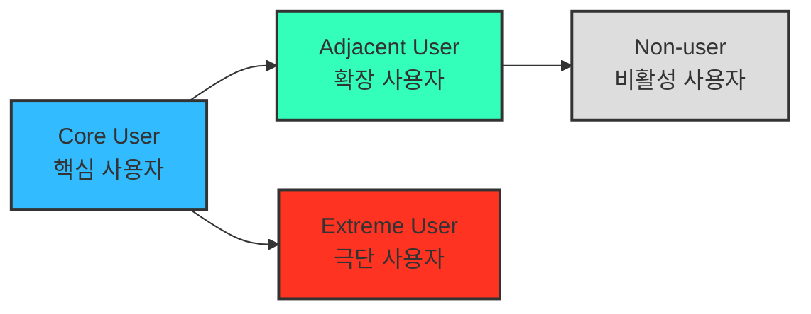
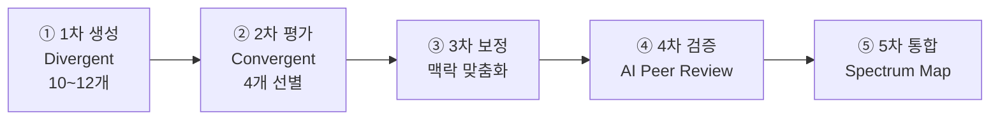

# 방법론 — 페르소나 스펙트럼 (Persona Spectrum)

> 목적: 하나의 대표 페르소나가 아니라, 서비스를 둘러싼 **여러 유형의 페르소나와 유형별 특성**을 파악하고 구체적 사례까지 확보한다.
> 성격: **극단적·비전형적 사용자까지 포함**해 서비스의 **포용성(Inclusivity)** 과 **사용 맥락의 다양성**을 확보하는 분석 방법.
> 적용 대상: 한국 OTT 구독 관리(합법·안전 공동구독) 서비스 — 산출물은 `personas-from-market-segment.md`의 그룹을 스펙트럼으로 재배치·확장하는 데 사용.

---

## 1. 개념 — 왜 '스펙트럼'인가

단일 페르소나는 "이상적 주력 고객" 하나만 비추어 **경계 밖 사용자·실패 상황·거부 요인**을 놓친다. 페르소나 스펙트럼은 핵심에서 시작해 **인접 → 극단 → 비활성**으로 시야를 넓혀, 제품이 누구를 붙잡고 누구를 놓치는지를 한 장에 드러낸다.

---

## 2. 스펙트럼 유형별 정의

| 구분 | 설명 | 목적 | 생성 포인트 |
|---|---|---|---|
| **핵심(Core)** | 이상적인 주요 고객군 | 주력 타깃 설정 | 매출/사용 빈도 중심 |
| **확장(Adjacent)** | 유사 문제를 가진 인접 시장군 | 확장 기회 탐색 | 유사 니즈 / 다른 맥락 |
| **극단(Extreme)** | 제약·극단적 상황을 가진 사용자 | 제품 개선 및 포용적 설계 | 실패·불편·대안 사용 중심 |
| **비활성(Non-user)** | 아직 사용하지 않거나 회피하는 집단 | 시장 진입 장벽 및 거부 요인 파악 | 인식·가치·신뢰 결여 중심 |

---

## 3. 도출 핵심 질문

스펙트럼의 바깥쪽(확장·극단·비활성) 유형은 다음 질문으로 강제로 끌어낸다.

- **(확장)** "유사한 제품/서비스를 사용하고 있는 사람은 누구인가?"
- **(비활성)** "이 제품/서비스를 **사용할 수 없는 사람**은 누구인가?"
- **(극단)** "가장 자주 실패를 경험하는 사람은 누구인가?"

> 💡 **AI 활용 방향**: AI를 고객의 '다양한 가능성'을 빠르게 탐색하는 **프로토타이핑 파트너**로 삼아, 각 사용자 군의 맥락적 특성과 감정적 동기를 가상으로 생성한다.

---

## 4. AI 기반 다중 페르소나 생성·평가 워크플로우

| 단계 | 목적 | AI 프롬프트 예시 | 산출물 |
|---|---|---|---|
| **① 1차 생성** (Divergent Thinking) | 각 스펙트럼 유형별 3~5개 버전 생성 | "핵심 사용자 5명, 확장 사용자 3명, 극단 사용자 2명, 비활성 사용자 2명을 만들어줘. 각자는 이름, 직무, 문제, 목표, 감정, 대체 솔루션을 포함해." | 총 10~12개 페르소나 원본 |
| **② 2차 평가** (Convergent Filtering) | 생성된 페르소나를 평가·선별 | "각 페르소나를 문제·행동·맥락의 현실성 기준으로 평가해, 상위 1개씩만 추천해줘." | 4개 대표 페르소나 (Core, Adjacent, Extreme, Non-user) |
| **③ 3차 보정** (Contextual Rewriting) | 사업 주제에 맞게 언어·상황 맞춤화 | "우리 서비스 맥락(합법·안전 공동구독 플랫폼)에 맞춰 다시 기술해줘." | 실제 적용 가능한 4종 페르소나 카드 |
| **④ 4차 검증** (AI Peer Review) | 다중 AI 교차검증 | "이 4명의 페르소나가 실제 시장에서 존재할 확률과 근거를 설명해줘." | 검증 코멘트 요약 리포트 |
| **⑤ 5차 통합** (Spectrum Map) | 페르소나 간 관계 구조화 | Mermaid / Figma로 시각화 | Persona Spectrum Map 완성 |

### 워크플로우 흐름

---

## 5. 산출물 정의

- **1차**: 스펙트럼 4유형 × 각 3~5버전의 원본 페르소나 풀(총 10~12개)
- **최종**: 유형별 대표 1개씩 = **Core / Adjacent / Extreme / Non-user 4종 페르소나 카드**
- **통합**: 4종의 관계를 담은 **Persona Spectrum Map**(핵심→확장/극단→비활성)

---

## 참고

- 기존 페르소나 자산: `personas-from-market-segment.md`(마켓 세그먼트 기반 5종). 이 5종을 스펙트럼 4유형으로 재배치·보완하는 입력으로 사용.
- 전통적 페르소나 vs AI 확장형(과업·맥락 중심)의 구분은 상위 리서치 방법론 참조.
