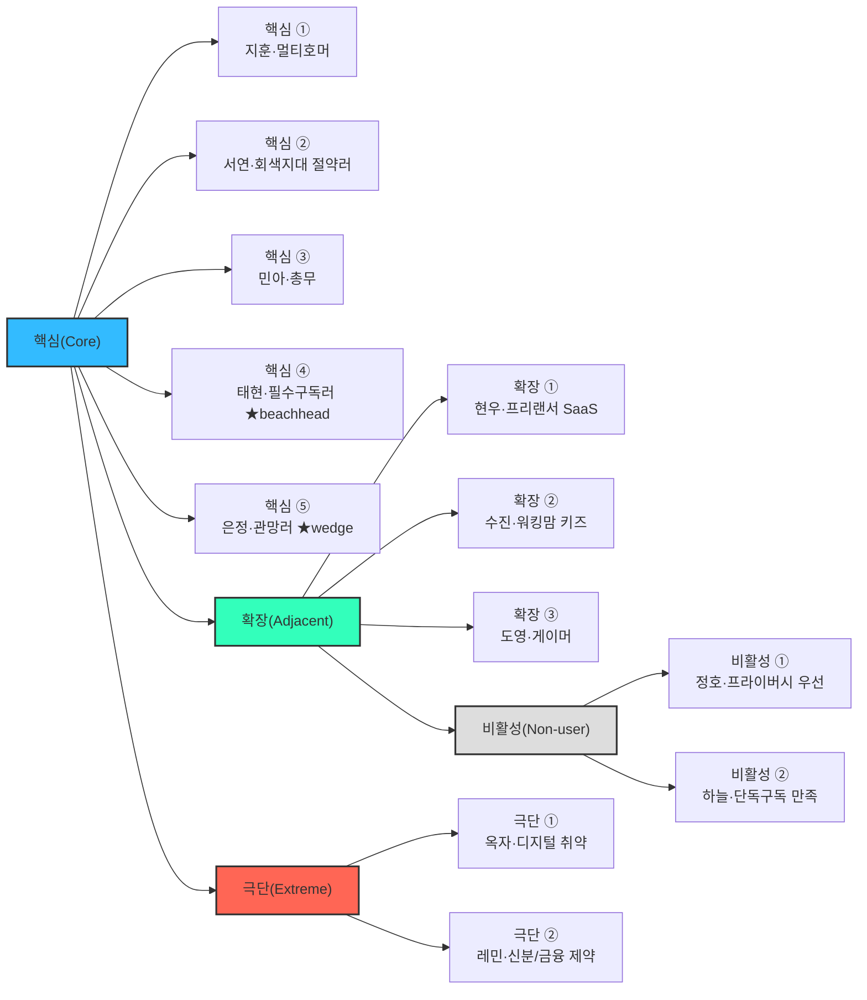

# 페르소나 스펙트럼 — 한국 OTT 구독 관리(공동구독) 서비스

> 대상 서비스: 한국 OTT 구독 관리 = **합법·안전 공동구독 플랫폼**(가칭 세이프팟, 모델 α)
> 방법론: `methodology-persona-spectrum.md` — 핵심(Core) → 확장(Adjacent) → 극단(Extreme) → 비활성(Non-user)의 4유형 스펙트럼
> 근거: `../04-subscription-market-segment/cosubscription-market/analysis-korea-cosubscription.md`(TAM-SAM-SOM · 세그먼트 맵) · `../04-subscription-market-segment/problem-definition/ott-cost-and-discovery.md`(Pivot Log) · `../04-subscription-market-segment/analysis-2-ott-streaming.md`
> 성격: **AI 확장형 페르소나** — 인구통계가 아니라 **과업·문제·맥락**을 중심으로 하되, 스펙트럼 바깥(극단·비활성)까지 포함해 제품의 포용성과 진입 장벽을 함께 드러낸다.

---

## 0. 이 문서의 구성 — 왜 12명인가

단일 대표 페르소나는 "이상적 주력 고객" 하나만 비추어 **경계 밖 사용자·실패 상황·거부 요인**을 놓친다. 스펙트럼은 핵심에서 시작해 인접·극단·비활성으로 시야를 넓혀, 제품이 **누구를 붙잡고 누구를 놓치는지**를 한 장에 드러낸다.

| 유형 | 인원 | 도출 질문 | 이 서비스에서의 의미 |
|---|---|---|---|
| **핵심(Core)** | 5 | 매출·사용 빈도의 중심은 누구인가 | 주력 타깃 — 기존 P1~P5를 심화 |
| **확장(Adjacent)** | 3 | 유사 문제를 다른 맥락에서 겪는 사람은 누구인가 | OTT 밖(업무 SaaS·육아·게임)으로의 확장 기회 |
| **극단(Extreme)** | 2 | 가장 자주 **실패**를 경험하는 사람은 누구인가 | 접근성·금융/신분 제약 → 포용적 설계 과제 |
| **비활성(Non-user)** | 2 | 이 서비스를 **쓸 수 없거나 회피**하는 사람은 누구인가 | 진입 장벽·거부 요인 |

> 각 카드는 **이름·직무·나이·기술 수준 / 문제(Pain)·목표(Goal) / 사용 상황(Context)과 감정 / 대체 솔루션(Competitor) / 기대 개선점(Expected Gain)** 순으로 기술한다.

---

## 1. 스펙트럼 한눈에



---

## 2. 핵심 사용자 (Core) — 5명

주력 타깃. 세그먼트 맵(합법성 × 절감 효과)상 대부분 **우하단(정가·저절감)** 또는 **좌상단(회색·고절감)**에 있어, 세이프팟이 **우상단(합법 고절감) 빈 땅**으로 끌어올려야 하는 수요다.

### 핵심 ① — 지훈 · 다 켜두고 다 못 보는 멀티호머

- **이름 / 직무 / 나이 / 기술 수준**: 지훈 / IT 스타트업 마케터 / 32세 / **상** — 앱·자동결제·구독 관리에 익숙, 신규 서비스 얼리어답터
- **문제(Pain)**: OTT 3개+ 동시 구독, 월 4만 원+ 지출. 세 번째 슬롯 실사용률은 **~15%**(좀비 구독)인데 해지 타이밍을 놓쳐 방치. **실지출을 2.5배 과소인지**하고, "이번 달 뭘 켜고 뭘 끊을지"를 매번 새로 고민하는 결정 피로에 시달린다.
- **목표(Goal)**: 볼 건 놓치지 않으면서 **안 보는 구독을 정리**해 총지출 최적화. "필요할 때만 켜고, 안 볼 땐 안전하게 빼두기."
- **사용 상황 & 감정**:
  - 월말 카드 명세서·결제 알림을 볼 때 → *짜증 + 죄책감* ("이게 아직도 나가?")
  - 새 화제작 공개 소식에 재구독을 고민할 때 → *조급함 + 자기합리화* ("이번 한 달만 볼까")
- **대체 솔루션(Competitor)**: 카드사 앱의 정기결제 내역, 뱅크샐러드·토스의 구독 관리 위젯, 머릿속 메모 — 지출을 *보여주긴* 하지만 **끊고 다시 켜는 행동까지 이어주지 못함**.
- **기대 개선점(Expected Gain)**: 좀비구독 자동 감지·해지 리마인드 + **볼 때만 켜고 파티로 되메꾸는** 흐름. 대시보드로 유입시켜 절감으로 전환.

### 핵심 ② — 서연 · 잘릴까 불안한 절약러

- **이름 / 직무 / 나이 / 기술 수준**: 서연 / 대기업 사무직 3년차 / 27세 / **상** — 피클플러스 등 중개 플랫폼을 능숙하게 쓰는 현역 공동구독자
- **문제(Pain)**: 낯선 사람과 4인 파티로 넷플릭스·디즈니+ 비용을 분할 중. 절감폭은 크지만 **계정 공유 단속**의 상시 위협 아래 있고, 단속 뉴스가 뜰 때마다 계정정지·**먹튀·환급 지연** 걱정이 재발한다. 싸다는 만족과 "언제 잘릴지 모른다"는 불안이 공존.
- **목표(Goal)**: 지금의 절감은 유지하되 **잘릴 걱정·사기 걱정을 제거**. "가격은 그대로, 마음은 편하게."
- **사용 상황 & 감정**:
  - 넷플릭스 단속 기사·커뮤니티 피해 후기를 접할 때 → *불안 + 피로* ("나도 곧 잘리나")
  - 파티장이 잠수하거나 미납해 파티가 깨질 때 → *배신감 + 번거로움* (새 파티 다시 구해야 함)
- **대체 솔루션(Competitor)**: 피클플러스·링키드 등 회색지대 중개 플랫폼 — **싸지만 합법성·안정성이 약점**.
- **기대 개선점(Expected Gain)**: **"절대 안 잘리는 합법 상품"** — 절감폭은 지키면서 단속·먹튀 리스크를 제거해 경쟁사에서 이탈시킨다.

### 핵심 ③ — 민아 · 관계가 불편한 총무

- **이름 / 직무 / 나이 / 기술 수준**: 민아 / 초등교사 / 29세 / **중** — 앱 결제·카톡 정산은 하지만 새 핀테크 도구엔 보수적
- **문제(Pain)**: 친구·가족·연인끼리 계정을 나눠 쓰는 그룹의 **사실상 총무**. 결제는 본인 카드, 매달 나머지에게 걷는다. 정산이 **카톡·수기**라 "누가 언제 냈는지" 관리가 마찰. 돈 얘기가 관계를 어색하게 만들고, 신뢰 밖으로는 **확장이 안 된다**.
- **목표(Goal)**: **관계를 상하지 않게** 깔끔히 나눠 쓰기. 정산 자동화, 미납·독촉 스트레스 제거.
- **사용 상황 & 감정**:
  - 매달 'n분의 1'을 걷을 때, 한 명이 안 낼 때 → *난처함 + 스트레스* ("내가 또 말해야 하나")
  - 새 멤버를 넣고 싶은데 신뢰가 애매할 때 → *망설임* ("돈 문제 생기면 관계 틀어질라")
- **대체 솔루션(Competitor)**: 카카오페이 정산·토스 더치페이 + 수기 장부 — 정산 계산은 되지만 **자동 수납·미납 강제·에스크로가 없음**.
- **기대 개선점(Expected Gain)**: 자동 정산·에스크로로 **"돈 얘기 대신 앱이 하게"** — 사적 공유(미조직 1,400만)를 처음으로 조직화하는 훅.

### 핵심 ④ — 태현 · 혼자 다 무는 필수구독러 *(★ 1차 진입 beachhead)*

- **이름 / 직무 / 나이 / 기술 수준**: 태현 / 사회초년생 개발자 / 25세 / **상** — 여러 SaaS·구독을 개인 요금제로 결제하는 디지털 네이티브
- **문제(Pain)**: 음원(스포티파이·유튜브 프리미엄), 클라우드(구글/애플), MS365 등 **거의 매일 쓰는 필수 구독을 혼자 정가로** 결제. **가족요금제가 훨씬 싸다는 걸 알지만 같이 묶을 사람이 없다.** 합법적으로 아낄 길을 코앞에 두고 못 쓴다 — **매칭 채널의 부재**가 유일한 병목.
- **목표(Goal)**: 필수 구독을 **합법·안전하게 반값 수준**으로. 화려함보다 "매달 나가는 고정비를 확실히 줄이기."
- **사용 상황 & 감정**:
  - 유튜브 프리미엄·스포티파이 **개인 요금제**를 결제·갱신할 때 → *아까움* ("가족요금제 반값인데")
  - 클라우드 용량이 꽉 차 상위 요금제로 올릴 때 → *부담* ("이것도 나눠 쓰면 좋을 텐데")
- **대체 솔루션(Competitor)**: 없음에 가까움 — 지인에게 직접 제안하거나 그냥 정가 결제. 넷플릭스 중심 중개 플랫폼은 **필수재(음원·클라우드) 매칭을 안 다룸**.
- **기대 개선점(Expected Gain)**: **"약관상 다인/가족이 허용된 상품만"** 자동 매칭 → 넷플릭스 없이도 강한 구매 이유(필수재 절감). **세이프팟의 첫 조각.**

### 핵심 ⑤ — 은정 · 아끼고 싶지만 무서운 관망러 *(★ 안전 wedge 핵심)*

- **이름 / 직무 / 나이 / 기술 수준**: 은정 / 중견기업 회계팀 / 34세 / **중** — 일상 앱은 능숙하나 낯선 플랫폼엔 신중, 리스크 회피 성향
- **문제(Pain)**: 공동구독으로 아낄 수 있다는 걸 **알면서도 하지 않는** 잠재 수요자. 중개 플랫폼 가입 직전까지 갔다가 그만둔 경험이 있다. **먹튀·계정정지·개인정보 유출** 우려가 진입 장벽이라, "절감"이라는 유인만으로는 절대 움직이지 않는다.
- **목표(Goal)**: **"절대 안 잘리고, 절대 사기 안 당한다"가 보장될 때만** 절감에 참여. 신뢰가 구매의 선행 조건.
- **사용 상황 & 감정**:
  - 중개 플랫폼 가입 폼 앞에서 망설일 때 → *두려움 + 의심* ("이거 진짜 안전한 거 맞아?")
  - 커뮤니티에서 피해 사례를 검색할 때 → *불신 강화* ("역시 하지 말자")
- **대체 솔루션(Competitor)**: 아무것도 안 함(정가 단독 결제). 대체 솔루션의 부재 자체가 특징.
- **기대 개선점(Expected Gain)**: 에스크로·본인인증·재매칭/환불 보장을 전면에 세워 **절감보다 안전을 먼저 판다**. 세이프팟의 신뢰 해자가 가장 직접적으로 작동하는 대상.

### 핵심 5인 현재 위치 → 빈 땅 이동

```mermaid
quadrantChart
    title 핵심 고객 현재 위치 — 합법성(X) x 절감 효과(Y) · 세이프팟 목표는 우상단
    x-axis 낮은 합법성·안전성 --> 높은 합법성·안전성
    y-axis 낮은 절감 효과 --> 높은 절감 효과
    quadrant-1 합법 고절감 빈 땅(세이프팟)
    quadrant-2 회색지대 공동구독
    quadrant-3 고위험 주변부
    quadrant-4 안전하나 저효용
    서연 절약러: [0.28, 0.85]
    민아 총무: [0.46, 0.58]
    지훈 멀티호머: [0.74, 0.2]
    태현 필수구독러: [0.8, 0.24]
    은정 관망러: [0.86, 0.16]
    세이프팟 목표: [0.82, 0.86]
```

---

## 3. 확장 사용자 (Adjacent) — 3명

> 도출 질문: **"유사한 문제를 *다른 맥락*에서 겪는 사람은 누구인가?"** — OTT를 넘어 업무용 SaaS·육아 콘텐츠·게임 구독으로 확장하는 인접 시장.

### 확장 ① — 현우 · 업무 SaaS를 혼자 무는 프리랜서

- **이름 / 직무 / 나이 / 기술 수준**: 현우 / 프리랜스 디자이너(1인 스튜디오) / 36세 / **상** — 여러 SaaS 시트를 직접 계약·관리
- **문제(Pain)**: 어도비 CC, 캔바 프로, ChatGPT Plus, 노션 등 **업무용 구독을 전부 개인 요금제로** 결제. 팀 요금제가 시트당 싸지만 **혼자라 인원 요건을 못 채운다.** 비슷한 처지의 프리랜서가 많은데 서로 묶을 창구가 없다.
- **목표(Goal)**: 업무 필수 SaaS를 **팀 요금제 단가로**, 세금계산서·정산까지 깔끔하게.
- **사용 상황 & 감정**:
  - 연 단위 SaaS 갱신 결제 알림을 받을 때 → *부담 + 억울함* ("1인이라 손해 보는 느낌")
  - 협업 툴 시트가 남는데 채울 사람이 없을 때 → *아까움*
- **대체 솔루션(Competitor)**: 프리랜서 오픈채팅방에서 지인끼리 시트 나눔(비공식·불안정), 정가 개인 결제.
- **기대 개선점(Expected Gain)**: OTT에서 검증된 **합법 매칭·에스크로를 B2B SaaS로 확장** → 세금계산서 발행까지 붙이면 1인 사업자 시장이 통째로 인접 확장.

### 확장 ② — 수진 · 키즈 콘텐츠·교육 구독을 나누고 싶은 워킹맘

- **이름 / 직무 / 나이 / 기술 수준**: 수진 / 워킹맘(마케팅 팀장) / 38세 / **중** — 육아·교육 앱은 능숙, 정산 도구는 낯섦
- **문제(Pain)**: 아이용 디즈니+·유튜브 프리미엄·키즈 교육 구독(스마트올·아이스크림 등)을 **가정별로 정가 결제**. 같은 어린이집·아파트 엄마들과 나누고 싶지만, 아이 계정·프로필이 얽혀 사적 공유가 껄끄럽다.
- **목표(Goal)**: **믿을 만한 이웃 가정과** 키즈·교육 구독을 안전하게 분담. 아이 프로필·시청 기록은 분리 보장.
- **사용 상황 & 감정**:
  - 아이 교육 구독을 갱신할 때 → *부담* ("교육비에 이것까지")
  - 엄마 모임에서 "그거 같이 쓸래요?" 얘기가 나올 때 → *관심 + 조심스러움* ("돈 문제로 관계 틀어지면")
- **대체 솔루션(Competitor)**: 맘카페·단톡방의 비공식 공유, 가족 계정 억지 확장.
- **기대 개선점(Expected Gain)**: **실명 인증 + 이웃/지인 범위 매칭 + 프로필 격리**로 "아이 것도 안심하고 나눈다" — 신뢰 민감도가 가장 높은 확장군.

### 확장 ③ — 도영 · 게임·클라우드 구독 헤비 게이머

- **이름 / 직무 / 나이 / 기술 수준**: 도영 / 대학생(공대) / 22세 / **상** — 콘솔·PC·클라우드 게이밍을 넘나드는 헤비 유저
- **문제(Pain)**: Xbox Game Pass Ultimate, PS Plus, 지포스나우 등 **게임 구독을 여러 개 정가로** 유지. 실제로 몰아서 하는 시즌은 짧은데 연간 구독을 놓고 있어 유휴 지출이 크다.
- **목표(Goal)**: **볼(할) 때만 켜고** 안 할 땐 파티로 단가를 낮추기. 게임 구독까지 한 곳에서 관리.
- **사용 상황 & 감정**:
  - 신작 출시 시즌에 구독을 몰아 켤 때 → *흥분 + 계획성 부재*
  - 시험기간·방학에 안 켜는 달의 결제 알림 → *아까움* ("이번 달 한 번도 안 했는데")
- **대체 솔루션(Competitor)**: 지역 계정 우회 구매(회색지대·리스크), 커뮤니티 계정 공유, 정가 단독.
- **기대 개선점(Expected Gain)**: **월 단위 On/Off + 합법 파티 매칭**을 게임 구독으로 확장 → OTT와 동일한 "볼 때만 켜기" 로직을 그대로 이식.

---

## 4. 극단 사용자 (Extreme) — 2명

> 도출 질문: **"가장 자주 *실패*를 경험하는 사람은 누구인가?"** — 제약·극단적 상황에서 가입·정산·매칭이 반복적으로 좌절되는 사용자. 이들을 붙잡는 설계가 곧 **포용적 설계**의 기준선이 된다.

### 극단 ① — 옥자 · 디지털·접근성 취약 사용자

- **이름 / 직무 / 나이 / 기술 수준**: 옥자 / 은퇴 후 소일거리 / 63세 / **하** — 스마트폰 통화·카톡·유튜브 시청 정도, 복잡한 인증·정산 UI에서 자주 막힘 (저시력 겸함)
- **문제(Pain)**: 자녀가 넣어준 OTT를 보긴 하는데 **본인인증·비밀번호·에스크로 절차에서 반복 실패**. 글자가 작고 단계가 많으면 중도 포기. 미납 알림이 와도 어떻게 처리하는지 몰라 파티에서 자주 튕긴다.
- **목표(Goal)**: **누가 대신 세팅해주면** 그냥 보기만 하고 싶다. 복잡한 절차 없이, 실수해도 돈이 새지 않는 안전장치.
- **사용 상황 & 감정**:
  - 본인인증·OTP 입력 화면에서 → *당황 + 좌절* ("뭘 누르라는 거야")
  - 미납·재인증 알림을 받을 때 → *불안 + 무력감* ("또 뭐가 잘못됐나")
- **대체 솔루션(Competitor)**: 자녀·가족이 대신 관리(가족 의존), 못 하면 그냥 포기.
- **기대 개선점(Expected Gain)**: **대리 관리(보호자 위임)·큰 글씨·최소 단계·음성/스크린리더 대응**. 실패해도 에스크로가 자동 환불 → "실수해도 손해 안 나는" 접근성 설계의 기준.

### 극단 ② — 레민 · 신분·금융 제약 사용자

- **이름 / 직무 / 나이 / 기술 수준**: 레민(Le Minh) / 외국인 유학생(대학원) / 24세 / **상** — 앱은 능숙하나 **국내 본인인증·결제 인프라에서 반복 차단**
- **문제(Pain)**: 국내 휴대폰 본인인증·신용카드·계좌 기반 에스크로가 **외국인 등록번호·해외카드에서 자주 실패**. 가입 자체가 막혀 회색지대 커뮤니티 공유에 내몰리고, 그래서 먹튀 피해에 더 취약하다.
- **목표(Goal)**: 내국인과 **동일한 조건으로** 합법·안전하게 공동구독에 참여. 결제·인증 수단 때문에 배제되지 않기.
- **사용 상황 & 감정**:
  - 본인인증 단계에서 "지원하지 않는 형식"으로 튕길 때 → *소외감 + 답답함*
  - 해외카드 결제가 거절될 때 → *포기 직전* ("결국 커뮤니티에서 계정 사야 하나")
- **대체 솔루션(Competitor)**: 유학생 커뮤니티·페이스북 그룹의 비공식 계정 공유(고위험), 친구 명의 빌리기.
- **기대 개선점(Expected Gain)**: **외국인 등록증 인증·해외 결제수단·다국어 UI 지원**. 배제되던 층을 합법 트랙으로 흡수 → 대학가·외국인 밀집 지역의 숨은 SAM.

---

## 5. 비활성 사용자 (Non-user) — 2명

> 도출 질문: **"이 서비스를 *쓸 수 없거나 회피*하는 사람은 누구인가?"** — 인식·가치·신뢰의 결여로 진입하지 않는 층. 이들의 거부 이유가 곧 **시장 진입 장벽**의 실체다.

### 비활성 ① — 정호 · 프라이버시·보안 우선 회피형

- **이름 / 직무 / 나이 / 기술 수준**: 정호 / 대기업 보안팀 / 41세 / **상** — 보안·프라이버시에 매우 민감, 소득 여유 있음
- **문제(Pain)**: 문제라기보다 **거부**. "몇천 원 아끼자고 내 계정·개인정보를 모르는 사람과 엮는 건 리스크 대비 실익이 없다"고 본다. 공동구독 자체를 **계정 탈취·정보 유출의 표면 확대**로 인식.
- **목표(Goal)**: 구독 지출을 줄이는 것보다 **엮이지 않는 것**이 우선. 절감보다 프라이버시.
- **사용 상황 & 감정**:
  - 공동구독 광고를 볼 때 → *경계 + 무관심* ("남 계정에 내 정보 왜 넣어")
  - 지인이 파티를 권할 때 → *정중한 거절* ("난 그냥 혼자 쓸게")
- **대체 솔루션(Competitor)**: 전 구독 정가 단독 결제(의도적 선택).
- **기대 개선점(Expected Gain) / 전환 조건**: 단기 전환 어려움. **"계정 정보 미공유·완전 격리·본인인증 파티만"** 구조를 *증명*해야 겨우 관심. 절감이 아니라 **보안 아키텍처 자체가 상품**이어야 하는 층 → 신뢰 메시지의 상한선 테스트베드.

### 비활성 ② — 하늘 · 단독구독 만족·저관여형

- **이름 / 직무 / 나이 / 기술 수준**: 하늘 / 사회초년생 사무직 / 26세 / **중** — 앱은 쓰지만 구독 최적화엔 무관심
- **문제(Pain)**: **문제를 못 느낌.** 넷플릭스 하나(또는 유튜브 프리미엄만)로 충분하고, 월 1만~1.7만 원은 "그 정도는 낼 만하다"고 여긴다. 공동구독의 존재는 알지만 **번거로움 > 절감액**이라 판단.
- **목표(Goal)**: 딱히 없음 — 지금이 불편하지 않다. 굳이 남과 엮이거나 앱 하나 더 깔 이유를 못 느낌.
- **사용 상황 & 감정**:
  - 결제 알림을 볼 때 → *무감각* ("이 정도야 뭐")
  - 공동구독 추천을 받을 때 → *귀찮음* ("정산하고 매칭하고… 그 시간에 그냥 낼래")
- **대체 솔루션(Competitor)**: 단일 OTT 정가 구독 — 대체 필요를 안 느낌.
- **기대 개선점(Expected Gain) / 전환 조건**: **가입 3분·정산 자동·기존 구독 그대로 승계** 수준으로 마찰이 0에 수렴해야 움직임. 구독 개수가 늘거나(멀티호머화) 지출이 부담되는 **생애 이벤트(자취·결혼·육아)**가 전환 트리거. 지금은 마케팅 우선순위 밖.

---

## 6. 스펙트럼 → 전략 연결 (요약)

| 유형 | 페르소나 | 세이프팟에 주는 값 | 우선순위 |
|---|---|---|---|
| 핵심 | 태현 필수구독러 | 넷플릭스 없이 성립하는 **1차 진입 수요**(음원·클라우드) | ★ beachhead |
| 핵심 | 은정 관망러 | "안전" 메시지의 **전환 증명** — 신뢰 해자의 존재 이유 | ★ wedge |
| 핵심 | 민아 총무 | **미조직 1,400만 조직화**의 실마리(자동 정산 훅) | ◎ 확장 코어 |
| 핵심 | 서연 절약러 | 피클 회색지대 리스크의 **이탈 수요** | ○ 기회주의적 |
| 핵심 | 지훈 멀티호머 | **비용 자각 트래픽** — 대시보드로 유입, 절감으로 전환 | ○ 상단 깔때기 |
| 확장 | 현우 프리랜서 | OTT 검증 후 **B2B SaaS 시장**으로 확장 | ▲ 2차 확장 |
| 확장 | 수진 워킹맘 | **키즈·교육 구독** — 신뢰 민감·재구매율 높음 | ▲ 2차 확장 |
| 확장 | 도영 게이머 | "볼 때만 켜기" 로직의 **게임 구독 이식** | ▲ 3차 확장 |
| 극단 | 옥자 접근성 | **포용적 설계**의 기준선(대리 관리·최소 단계) | △ 설계 원칙 |
| 극단 | 레민 신분/금융 | 배제된 층 흡수 — **인증·결제 인프라 과제** | △ 설계 원칙 |
| 비활성 | 정호 프라이버시 | 신뢰 메시지의 **상한선 테스트** | ▽ 관찰 |
| 비활성 | 하늘 저관여 | **마찰 0** 목표치 + 생애 이벤트 전환 트리거 | ▽ 관찰 |

> **읽는 법**: 핵심 5인으로 진입(★ 태현·은정 우선)하고, 신뢰·정산 엔진이 검증되면 확장 3인(현우·수진·도영)으로 시장을 넓힌다. 극단 2인(옥자·레민)은 매출 타깃이 아니라 **설계가 통과해야 할 포용성 기준**이며, 비활성 2인(정호·하늘)은 **진입 장벽의 상·하한**을 알려주는 관찰 대상이다.

---

## 출처

- 고객 그룹·계층 근거 — 위 근거 문서(TAM-SAM-SOM · 세그먼트 맵 · Pivot Log)에 정리된 실측/추정치에 근거. 원 출처는 각 문서의 '출처' 절 참조(KISDI 유료이용률 53.4%·공유율 57%, 피클플러스 규모·NPS, 계정공유 단속·피해 등).
- 확장·극단·비활성 페르소나 — `methodology-persona-spectrum.md`의 도출 질문(§3)과 1차 생성 워크플로우(§4)에 따라 생성한 탐색용 가설.

> 페르소나는 **행동·맥락 중심 모델**로, 이름·나이·기술 수준은 이해를 돕는 예시일 뿐 통계 대표값이 아니다. 실제 행동 데이터가 쌓이면 갱신할 것.
