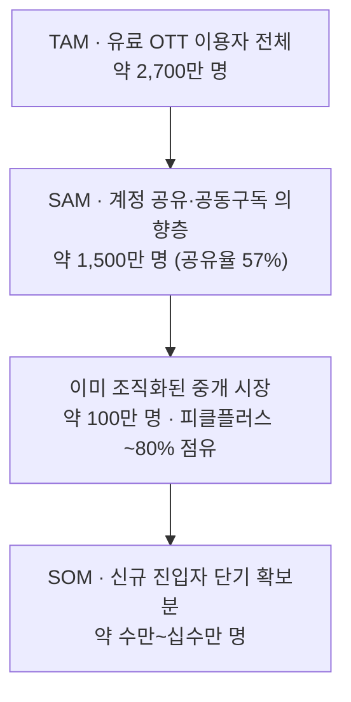

# 한국 공동구독(OTT 계정 공유) 중개 시장 — 신규 진입자 가능성 분석 (TAM-SAM-SOM)

> 대상: 한국에서 서비스 중인 **OTT 공동구독 중개 시장** (피클플러스·링키드·벗츠·위즈니 등)
> 관점: **기존 1위(피클플러스)의 시각에서 신규 진입자의 가능성**을 평가
> 방법: `../04-market-sizing/methodology.md`(TAM-SAM-SOM) + `../01-five-forces/methodology.md`(신규 진입자의 위협)
> 지표: **이용자 수(사람) 기준** · 중개 매출(수수료)은 보조 스케치 · 한국 한정 · 2025 기준
> 탐색 배경: 이 분석에 이르기까지의 과정은 `../05-problem-definition/ott-cost-and-discovery.md`(Pivot Log)에 기록

---

## 1. 시장 지형 (요약)

공동구독 중개는 **낯선 사람끼리 4인 계정을 매칭해 비용을 분할**하고 플랫폼이 수수료를 받는 모델이다. 한국 OTT 구독 관리 3갈래(공동구독 중개 / 통합 관리·해지 앱 / 통신사 번들) 중 **유일하게 독립 흑자**를 내는 갈래다.

| 플레이어 | 이용자 | 특징 |
|---|---|---|
| **피클플러스**(1위) | 회원 **80만+**(2025), MAU ~70만 | 2024 매출 **30.8억**, 영업이익률 ~**20%**, NPS **71** |
| 링키드 | **10만+** | 2위권 |
| 벗츠·위즈니·겜스고 등 | 소규모 | 롱테일 |

**시장을 흔드는 변수**: 넷플릭스·디즈니+의 **계정 공유 단속**(가구 외 인증). 공식 공유를 막자 → 중개 플랫폼 수요가 자극됐지만, 동시에 **이용정지·먹튀·환급지연 등 소비자 피해**가 급증(약관·법적 회색지대).

## 2. 신규 진입자의 위협 분석 — 피클플러스의 해자 ↔ 진입의 틈

기존 1위 관점에서 "내 자리는 얼마나 방어적인가"를 5 Forces의 '신규 진입자 위협'으로 본다.

### 피클플러스의 진입장벽(해자)

1. **양면 네트워크 효과** — 참여자 풀이 클수록 4인 매칭이 빠르고 안전. 80만 회원이 **매칭 유동성**을 선점 → 후발주자는 "빈자리를 못 채우는" 콜드스타트에 걸린다.
2. **신뢰·안전 자산** — 먹튀·이용정지 피해가 만연한 시장에서 **"안전 보장·환불" 평판(NPS 71)**이 곧 해자. 신뢰는 돈으로 못 사고 시간이 필요하다.
3. **흑자 → 재투자 여력** — 영업이익률 ~20%로 마케팅·피해 보증 재원을 자체 조달. 적자 출혈 경쟁을 견딘다.

### 신규 진입자의 틈 (그럼에도 열려 있는 곳)

1. **회색지대 정면 회피** — 피클의 최대 약점은 **넷플릭스 단속·약관 위반 리스크**. 이를 **합법 구조**(공식 파트너십, 가족요금제 대행, 또는 계정 공유를 *허용*하는 상품 — 음원·오피스·클라우드 등 — 집중)로 우회하면 피클이 못 서는 땅에 설 수 있다.
2. **미조직 시장 개척** — 아래 TAM-SAM-SOM이 보이듯, 공유 의향층 대부분은 **아직 중개 플랫폼을 쓰지 않는다**(지인끼리 사적 공유). 피클과 100만을 두고 싸우는 게 아니라 **1,400만 미조직층을 조직화**하는 쪽에 진짜 기회가 있다.
3. **인접 번들로 CAC 우회** — 피클은 순수 독립 플랫폼. **통신사·핀테크·카드사 제휴**로 대량 유입 경로를 확보하면 마케팅비 없이 규모에 도달할 수 있다(04·KSF의 '번들' 교훈).

> **판단**: 조직화된 중개 시장 안에서는 피클플러스의 해자(네트워크·신뢰·흑자)가 견고해 **정면 진입은 위험**. 그러나 그 해자는 **"이미 중개를 쓰는 100만"에만 유효**하다. 신규 진입자의 승산은 피클의 회색지대 리스크를 회피하는 **합법 모델**로 **미개척 1,400만**을 여는 데 있다.

## 3. TAM-SAM-SOM (이용자 수 기준, 2025)

| 계층 | 정의 | 규모(이용자) | 산정 근거 |
|---|---|---|---|
| **TAM** | 한국의 유료 OTT 이용자 전체 (구독 비용 최적화의 이론적 전체 수요) | **약 2,700만 명** | 국민 53.4% 유료 OTT 이용(인구 ~5,100만) |
| **SAM** | 그중 계정 공유·공동구독으로 절감할 의향·행동이 있는 층 | **약 1,500만 명** | 유료 이용자의 **계정 공유율 57%** 적용 |
| **SOM** | 신규 진입자가 단기(현 리소스)로 확보 가능한 몫 | **약 수만~십수만 명** | 조직화 중개 시장 ~100만(피클 80만·점유 ~80%) 중 신규 확보 가능분 + 미조직층 초기 전환 |

**해석 — 신규 진입자에게 주는 신호**
- **조직화율이 낮다**: SAM 1,500만 중 중개 플랫폼을 쓰는 층은 ~100만(약 **6~7%**)뿐. 나머지 **~1,400만은 미조직**(사적 공유·비용 민감층) → **시장의 진짜 파이는 미개척지에 있다.**
- **정면 SOM은 좁다**: 조직화 시장 100만은 피클이 ~80% 선점 → 여기서 뺏는 SOM은 수만~십수만에 그침. **피클과 정면 승부하면 SOM이 작다.**
- **결론**: 신규 진입자의 SOM을 키우는 유일한 길은 **조직화율 자체를 끌어올리는 것** — 즉 피클이 못 건드리는 **합법·안전 모델**로 미조직 1,400만의 일부를 처음으로 조직화하는 것.

**중개 매출(수수료) 보조 스케치**: 피클플러스 2024 매출 30.8억(회원 50만대 시기) → 1인당 연 수천 원대 중개 마진 추정. 조직화 시장(~100만) 기준 현 시장 매출은 대략 **수십억~100억 원 초기 규모**. 미조직 SAM(1,400만)을 열면 매출 잠재는 **10배+**로 확장 가능(구독 시장 전체는 100조·연 11% 성장이라는 업계 추정도 배경).

---

## 출처

- 유료 OTT 이용률·계정 공유율 — [KISDI/한국콘텐츠진흥원(53.4%·공유율 57%)](https://www.kisdi.re.kr/report/view.do?key=m2101113025891), [MHN(10명 중 9명·57% 공유)](https://www.mhnse.com/news/articleView.html?idxno=358294)
- 피클플러스 규모·재무 — [헤럴드경제(MAU·영업이익률 20%)](https://biz.heraldcorp.com/article/10559662), [사람인(2024 매출 30.8억)](https://www.saramin.co.kr/zf_user/company-info/view-inner-finance/csn/cHNaK1VBNXdSbU01RzFMZGVNRkxkUT09), [ZDNet(이용자·링키드 10만+)](https://zdnet.co.kr/view/?no=20240622164836)
- 계정공유 피해·단속 — [한경매거진(피해 급증)](https://magazine.hankyung.com/business/article/202502219979b), [뉴시스(단속 후 재부상)](https://www.newsis.com/view/NISX20240709_0002804957)

> 수치는 조사기관·정의(이용 인구 vs MAU vs 구독 계정)에 따라 편차가 있어 **개략치**로 표기했다. TAM은 유료 이용 인구, SOM은 조직화 시장 점유 기반 추정이라 계층 간 단순 나눗셈 해석은 지양.
