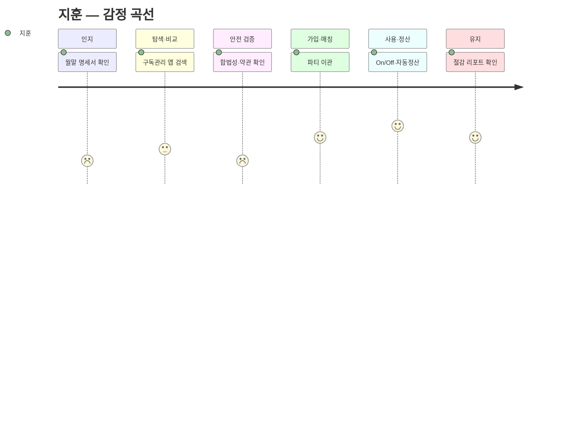
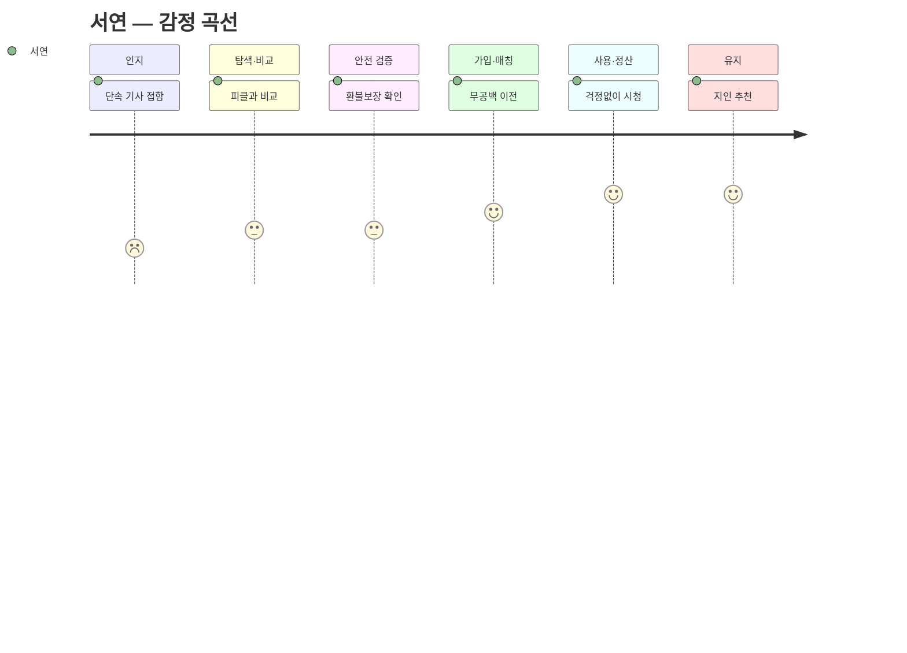
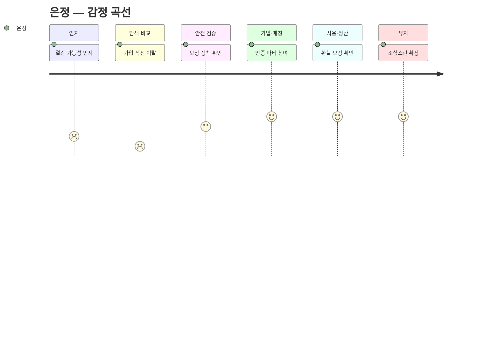
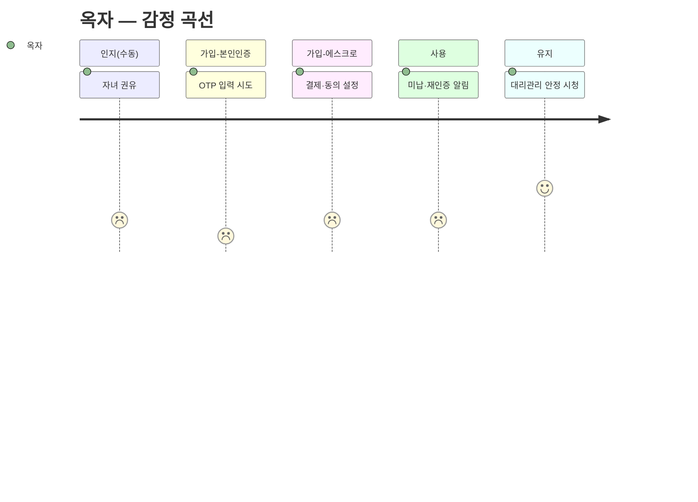
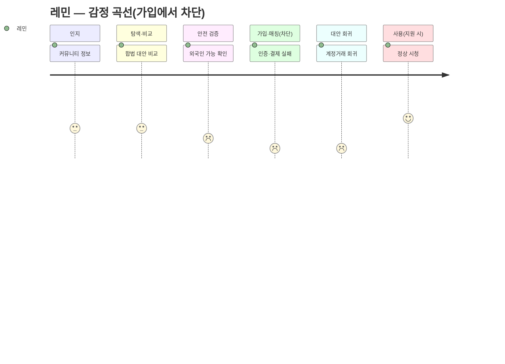
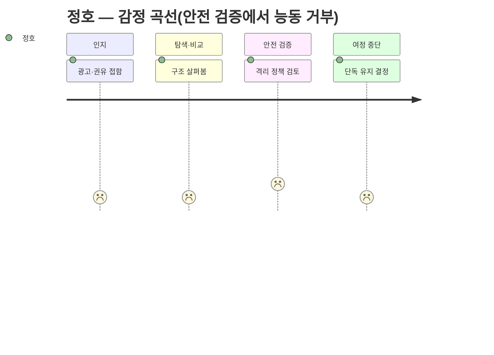
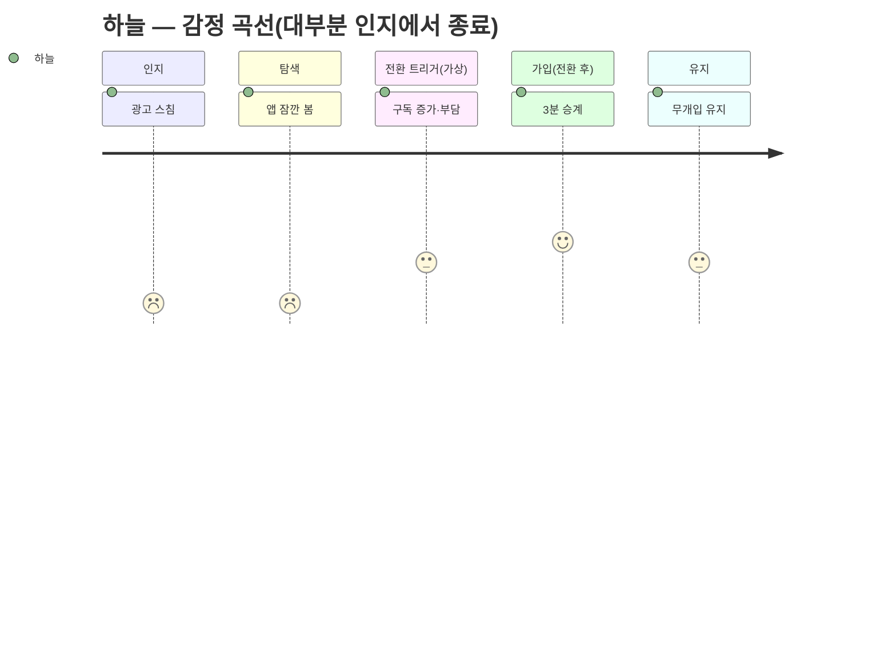

# 고객 여정 맵 — 세이프팟 (페르소나 스펙트럼 12종)

> 방법론: `methodology-customer-journey-map.md` 적용
> 여정 주체: `../05-persona/personas-from-market-segment.md`의 스펙트럼 12종 전원 — 핵심 5 / 확장 3 / 극단 2 / 비활성 2. (★ = `../05-persona/03-representative-personas.md`의 대표 4종)
> 맵 유형: **현재 상태 + 기대(미래) 상태 혼합** — 세이프팟은 신규 서비스라 '접하기 전' 행동은 As-Is, '가입 이후'는 To-Be(기대 여정)로 기술.
> 범위: 서비스를 **접하기 전(문제 자각)부터 구매 후(유지·재구독)까지** 전 라이프사이클.

---

## 0. 핵심 단계 재정의 ⚠️ (방법론 경고 반영)

표준 5단계("인지→고려→결정→온보딩→충성")를 그대로 쓰지 않는다. 세이프팟은 **① 신뢰가 진입 조건**이고 **② 구독형(매칭·정산·해지방어 루프)**이라는 특성이 있어, 아래 **6단계 백본**으로 재정의한다.

| # | 세이프팟 핵심 단계 | 표준 대비 | 왜 이 단계가 필요한가 |
|---|---|---|---|
| 1 | **인지** (문제 자각) | 인지 | 서비스 접하기 전, 지출·불안을 스스로 자각하는 지점 |
| 2 | **탐색·비교** | 고려 | 정가/피클/지인공유 등 대안을 저울질 |
| 3 | 🔑 **안전 검증** | *(신설)* | **신뢰가 구매의 선행 조건** — '결정' 앞에 불안 해소 관문을 별도로 세움 |
| 4 | **가입·매칭** | 결정+온보딩 | 본인인증·에스크로·**파티 매칭**(구독형 고유) |
| 5 | **사용·정산** | 온보딩 | 실사용 + **자동 정산**(공동구독 고유) |
| 6 | **유지·재구독/해지방어** | 충성 | 구독형의 **충성도 루프** — 재구독·이탈 방어 |

> **페르소나별 단계는 이 백본에서 가감된다** — 방법론 경고대로 단계는 고정이 아니다.
> - **옥자·레민(극단)**: 가입 단계가 **본인인증 / 결제·에스크로**로 쪼개지고 각 관문에서 실패·차단된다.
> - **은정(관망)**: 여정이 **탐색·안전 검증에서 이탈**했다가 보장 증명 시에만 재진입.
> - **정호·하늘(비활성)**: 여정이 **인지~탐색에서 종료** — 정호는 능동 거부, 하늘은 무관심. 이후 단계는 가상 분기로만 기술.

---

# Ⅰ. 핵심 (Core) — 5명

## 1.1 지훈 ★ · 다 켜두고 다 못 보는 멀티호머

> 32세, IT 마케터, 기술 상. 비용 자각은 크지만 해지·재구독이 귀찮아 방치. 신뢰 관문은 낮음(얼리어답터).

| 단계 | 고객 행동 | 고객 생각 | 감정 | **Pain Point** | 세이프팟 개선 기회 |
|---|---|---|---|---|---|
| 인지 | 월말 카드 명세서 확인 | "이게 아직도 나가?" | 짜증·죄책감 | **실지출을 실제의 1/2.5로 과소인지**해 손실을 자각조차 못함 | 통합 대시보드로 실지출·좀비구독 가시화 |
| 탐색·비교 | 구독관리 앱·커뮤니티 검색 | "합법으로 되메꿀 방법 없나?" | 기대·반신반의 | **토스·뱅크샐러드는 '보여주기'만** — 해지→재구독 행동을 대신 안 해줌 | "안 보는 슬롯, 파티로 월 ○○원" 행동 제안 |
| 안전 검증 | 합법성 문구·약관 확인 | "이거 피클이랑 뭐가 달라?" | 경계 | **'합법 공동구독'이 회색지대와 한눈에 구분되지 않음** | 약관 허용 상품만·에스크로 배지로 차별점 명시 |
| 가입·매칭 | 본인인증→단독구독을 파티로 이관 | "생각보다 간단하네" | 안도 | **이관 시 시청 이력·프로필 유실 우려** | 프로필 승계·무중단 전환 보장 |
| 사용·정산 | 안 보는 달 Off, 볼 때 On·자동 정산 | "이제 안 새네" | 통제감·만족 | **On/Off 타이밍을 놓치면 다시 좀비구독으로 재발** | 저사용 자동 감지→Off 리마인드 |
| 유지 | 대시보드 재방문·절감액 확인 | "관리되는 느낌" | 신뢰 | **절감폭이 체감 안 되면 관리 자체가 또 다른 귀찮음** | 월 절감 리포트로 성과 가시화 |

## 1.2 서연 · 잘릴까 불안한 절약러 *(피클 이탈 수요)*

> 27세, 사무직, 기술 상. 이미 회색지대 공동구독 중. 여정의 무게중심은 **안전 검증(이동 결심)** 과 **무공백 이전**.

| 단계 | 고객 행동 | 고객 생각 | 감정 | **Pain Point** | 세이프팟 개선 기회 |
|---|---|---|---|---|---|
| 인지 | 넷플릭스 단속 기사·피해 후기 접함 | "나도 곧 잘리나" | 불안 | **현재 절감은 크지만 계정정지·먹튀 위협이 상시라 마음이 안 편함** | 단속 이슈 시점에 '합법' 메시지 노출 |
| 탐색·비교 | 피클 vs 세이프팟 가격·안전 비교 | "합법인데 가격은 비슷한가?" | 기대·의심 | **합법으로 옮기면 절감폭이 줄 거란 선입견** | 절감폭 유지+합법 동시 입증(비교표) |
| 안전 검증 | 약관 허용·에스크로·환불보장 확인 | "진짜 안 잘리는 거 맞지?" | 반신반의→안도 | **'절대 안 잘림'을 증명할 근거(약관 명시)가 없으면 이동 안 함** | 약관 허용 상품 배지·공식 근거 |
| 가입·매칭 | 피클 파티 해지→세이프팟 파티 이전 | "옮기는 게 번거롭진 않네" | 안도 | **기존 파티 해지와 신규 가입 사이 결제 공백·이중 지출 우려** | 무공백 이전·첫 달 브릿지 |
| 사용·정산 | 자동 정산, 단속 걱정 없이 시청 | "이제 기사 봐도 안 불안" | 편안·만족 | **파티원 미납 시에도 내 시청이 끊기면 안 됨** | 에스크로 선충전·미납 자동 보전 |
| 유지 | 안정 시청·지인에게 추천 | "잘릴 걱정이 없네" | 신뢰·지지 | **합법 프리미엄(가격 差)이 커지면 회색지대로 회귀 유혹** | 합법 프리미엄 최소화한 가격 유지 |

## 1.3 민아 · 관계가 불편한 총무

> 29세, 초등교사, 기술 중. 지인 사적 공유의 총무. 여정 핵심은 **정산 마찰 해소**와 **총무 리스크 제거**.

| 단계 | 고객 행동 | 고객 생각 | 감정 | **Pain Point** | 세이프팟 개선 기회 |
|---|---|---|---|---|---|
| 인지 | 매달 카톡으로 n분의1 걷다 지침 | "내가 또 말해야 하나" | 스트레스 | **정산이 카톡·수기라 누가 언제 냈는지 매달 수동 추적** | 자동 정산 대시보드 |
| 탐색·비교 | 카카오페이 더치페이 등 알아봄 | "이걸로 되려나" | 반신반의 | **기존 정산앱은 계산만, 미납 수납·강제는 못함** | 자동 수납+에스크로 |
| 안전 검증 | 내 카드로 결제하는 구조 점검 | "총무만 손해 보는 거 아냐?" | 경계 | **결제자(총무)가 미납 리스크를 혼자 떠안는 구조** | 에스크로 선결제로 총무 리스크 제거 |
| 가입·매칭 | 기존 지인 그룹을 파티로 등록 | "멤버 그대로 옮기면 되네" | 안도 | **지인들에게 '앱 깔고 인증하라' 설득 자체가 부담** | 초대 링크·간편 합류 |
| 사용·정산 | 앱이 자동 청구·수납 | "돈 얘기 안 해도 되네" | 해방감 | **한 명이 앱 사용을 거부하면 결국 수기 병행** | 미가입자 대체 수납(문자 청구) |
| 유지 | 새 멤버도 부담없이 추가 | "이제 확장도 되네" | 만족 | **관계가 틀어지면 파티 자체가 깨짐(신뢰 의존 여전)** | 분쟁 조정·탈퇴 자동 정산 |

## 1.4 태현 · 혼자 다 무는 필수구독러 *(1차 진입 beachhead)*

> 25세, 개발자, 기술 상. 음원·클라우드를 개인 정가로 결제. 핵심 병목은 **매칭 채널 부재**.

| 단계 | 고객 행동 | 고객 생각 | 감정 | **Pain Point** | 세이프팟 개선 기회 |
|---|---|---|---|---|---|
| 인지 | 유튜브 프리미엄·스포티파이 개인요금제 결제 | "가족요금제 반값인데" | 아까움 | **가족요금제가 싼 걸 알지만 같이 묶을 사람이 없음** | 필수재 매칭 채널 제공 |
| 탐색·비교 | 지인 제안 고민·커뮤니티 검색 | "누구한테 같이 하자 하지?" | 막막함 | **지인 제안은 애매하고, 넷플릭스 중심 플랫폼은 음원·클라우드를 안 다룸** | 음원·클라우드 전용 매칭 |
| 안전 검증 | 낯선 사람과 가족요금제 묶어도 되는지 확인 | "이거 약관 위반 아냐?" | 경계 | **'가족'요금제를 남과 쓰는 게 합법인지 불확실** | 약관상 다인 허용 상품만 매칭 |
| 가입·매칭 | 본인인증→필수구독 파티 자동 매칭 | "바로 매칭되네" | 기대·안도 | **매칭 대기가 길면 그냥 정가로 결제해버림** | 빠른 매칭·대기 시 알림 |
| 사용·정산 | 반값 수준으로 자동 정산 | "고정비 확 줄었다" | 만족 | **파티원이 요금제 등급을 임의 변경하면 내 혜택도 흔들림** | 요금제 잠금·변경 합의 |
| 유지 | 다른 필수구독도 파티로 확장 | "웬만한 건 다 나눠 쓰자" | 충성 | **매칭 풀이 얕으면 다음 상품은 파티가 안 만들어짐** | 카테고리 확대·매칭 풀 성장 |

## 1.5 은정 · 아끼고 싶지만 무서운 관망러 *(안전 wedge)*

> 34세, 회계, 기술 중. 리스크 회피형. 여정이 **탐색·안전 검증에서 이탈**했다가 보장 증명 시에만 재진입.

| 단계 | 고객 행동 | 고객 생각 | 감정 | **Pain Point** | 세이프팟 개선 기회 |
|---|---|---|---|---|---|
| 인지 | 공동구독으로 아낄 수 있다는 것만 인지 | "아끼고는 싶은데…" | 관심·불안 | **절감 유인은 알지만 회색지대라는 성격 자체가 심리적 벽** | 안전 메시지 우선 노출 |
| 탐색·비교 | 중개 플랫폼 가입 폼 앞까지 갔다 그만둠 | "이거 진짜 안전해?" | 두려움 | **가입 직전 피해 사례를 검색하고 결국 이탈(무행동 회귀)** | 피해 없는 구조 시연 |
| 🔑 안전 검증 | 에스크로·본인인증·환불보장 꼼꼼히 확인 | "먹튀·정지 진짜 없어?" | 의심→조심스러운 신뢰 | **'절대 안 잘리고 절대 사기 안 당함'이 보장으로 증명돼야만 첫 발을 뗌** | 보장 정책 전면화·검증된 후기 |
| 가입·매칭 | 본인인증된 사람과만 소규모 파티 | "인증된 사람들이라 낫네" | 안도 | **파티원이 익명이면 아무리 절감돼도 참여 안 함** | 실명 인증 파티·프로필 최소 공유 |
| 사용·정산 | 에스크로로 결제, 문제 시 환불 확인 | "문제 생겨도 돌려받네" | 안심 | **사소한 분쟁에도 즉시 환불·재매칭이 안 되면 바로 이탈** | 원클릭 분쟁·자동 환불 |
| 유지 | 안정 경험 후 다른 구독도 조심스레 확장 | "여긴 믿을 만하네" | 신뢰 | **단 한 번의 사고 경험이 전체 신뢰를 무너뜨림** | 무사고 이력·보장 재확인 |

---

# Ⅱ. 확장 (Adjacent) — 3명

## 2.1 현우 · 업무 SaaS를 혼자 무는 프리랜서

> 36세, 프리랜스 디자이너, 기술 상. B2B 성격 — **세금계산서·작업물 안전**이 여정에 추가된다.

| 단계 | 고객 행동 | 고객 생각 | 감정 | **Pain Point** | 세이프팟 개선 기회 |
|---|---|---|---|---|---|
| 인지 | 어도비·캔바·ChatGPT Plus 연 갱신 결제 | "1인이라 팀요금 손해네" | 부담·억울 | **팀 요금제가 시트당 싸지만 혼자라 인원 요건을 못 채움** | 프리랜서 시트 매칭 |
| 탐색·비교 | 프리랜서 오픈채팅 시트 나눔 알아봄 | "이거 믿을 만한가?" | 조심스러움 | **오픈채팅 시트 공유는 비공식·불안정하고 세금처리가 안 됨** | 공식 매칭+세금계산서 |
| 안전 검증 | 결제·탈퇴 시 데이터/작업물 안전 확인 | "내 작업 파일은 안전해?" | 경계 | **업무 계정이라 데이터·작업물 유실이 곧 사업 리스크** | 워크스페이스 격리·권한 분리 |
| 가입·매칭 | 동종 프리랜서와 팀 시트 구성 | "단가 확 내려가네" | 안도·만족 | **시트 인원이 빠지면 팀 요금제 자격이 깨져 단가 원복** | 자동 재충원·자격 유지 |
| 사용·정산 | 자동 정산+세금계산서 발행 | "경비처리까지 되네" | 만족 | **세금계산서·경비처리가 안 되면 사업자에겐 무용지물** | 자동 세금계산서·경비 리포트 |
| 유지 | 다른 업무 SaaS도 팀으로 전환 | "웬만한 툴 다 이걸로" | 충성 | **B2B 상품 라인업이 얕으면 핵심 툴만 되고 나머지는 정가** | SaaS 카테고리 확장 |

## 2.2 수진 ★ · 아이 구독을 믿을 이웃과 나누고 싶은 워킹맘

> 38세, 워킹맘, 기술 중. 신뢰 관문이 **가장 높음**(아이 계정). 매칭은 지인·이웃 범위 안에서만 성립.

| 단계 | 고객 행동 | 고객 생각 | 감정 | **Pain Point** | 세이프팟 개선 기회 |
|---|---|---|---|---|---|
| 인지 | 교육구독 갱신 알림 + 엄마모임 "같이 쓸래요?" | "교육비에 이것까지…" | 부담·관심 | **콘텐츠 구독이 교육비에 얹혀 고정비를 압박하나 혼자선 못 줄임** | 키즈·교육 카테고리 절감 시뮬레이션 |
| 탐색·비교 | 맘카페·단톡 비공식 공유 알아봄 | "믿을 만한가?" | 조심스러움 | **비공식 공유는 아이 프로필이 노출되고 먹튀 시 하소연할 곳이 없음** | 실명 인증 파티로 대체 |
| 안전 검증 | 세이프팟 실명인증·프로필 격리 확인 | "아이 것도 안전한가" | 반신반의→안심 | **'아이 계정이 남과 안 섞인다'는 보장이 없으면 절감 유인이 아예 작동 안 함** | 프로필 격리·시청기록 분리 전면 배치 |
| 가입·매칭 | 아는 엄마들과 파티 구성·프로필 분리 설정 | "이 사람들이면 되겠다" | 신뢰 | **신뢰 범위(아는 엄마) 안에 인원이 부족하면 파티가 성립 안 됨** | 검증된 이웃 매칭 풀 확대 |
| 사용·정산 | 자동 정산으로 돈 얘기 없이 분담 | "관계 안 상하고 좋네" | 편안 | **아이가 프로필을 헷갈려 시청 이력이 엉뚱하게 섞임** | 키즈 프로필 잠금·간편 전환 |
| 유지 | 다음 학기 교육구독도 파티로 확장 | "이건 계속 쓰겠다" | 충성 | **한 가정이 이탈하면 아이가 보던 콘텐츠가 갑자기 끊김** | 이탈 시 자동 재매칭·무중단 보장 |

## 2.3 도영 · 게임·클라우드 구독 헤비 게이머

> 22세, 대학생, 기술 상. 유휴 지출이 커 **On/Off**가 핵심. 지역계정 우회(회색지대)와 밴 우려가 배경.

| 단계 | 고객 행동 | 고객 생각 | 감정 | **Pain Point** | 세이프팟 개선 기회 |
|---|---|---|---|---|---|
| 인지 | 안 켠 달의 게임패스·PS Plus 결제 알림 | "이번 달 한 번도 안 했는데" | 아까움 | **시즌만 몰아 하는데 연간 구독이라 유휴 지출이 큼** | 월 단위 On/Off |
| 탐색·비교 | 지역계정 우회 구매 알아봄 | "싼데 이거 위험하지 않나" | 유혹·불안 | **지역 우회는 싸지만 계정 정지·결제 리스크(회색지대)** | 합법 On/Off로 대체 |
| 안전 검증 | 합법 파티가 밴 위험 없는지 확인 | "밴 안 당하는 거 맞아?" | 경계 | **게임 계정공유는 약관이 특히 빡빡해 밴 우려가 큼** | 약관 허용 상품 한정·밴 보장 |
| 가입·매칭 | 시즌 단위 파티 구성 | "필요할 때만 켜면 되네" | 기대 | **하고 싶은 신작 시즌에 파티가 없으면 무의미** | 인기작 시즌 매칭 우선 편성 |
| 사용·정산 | 몰아 하는 달만 On, 자동 정산 | "돈값 하네" | 만족 | **On/Off 전환이 즉시 안 되면 출시일 타이밍을 놓침** | 즉시 활성화·예약 On |
| 유지 | 다음 시즌도 파티 재구성 | "쭉 이렇게 쓰자" | 충성 | **합법 매칭 가능한 게임 상품이 적어 선택지가 좁음** | 합법 가능 타이틀 확대 |

---

# Ⅲ. 극단 (Extreme) — 2명

## 3.1 옥자 ★ · 디지털·접근성 취약 사용자

> 63세, 저시력·기술 하. **인지는 자녀가 대신**하고, **가입 단계가 쪼개지며 각 관문에서 실패**한다. 감정 곡선이 가장 낮다.

| 단계 | 고객 행동 | 고객 생각 | 감정 | **Pain Point** | 세이프팟 개선 기회 |
|---|---|---|---|---|---|
| 인지 *(수동)* | 자녀가 "이거 같이 쓰면 싸" 하고 권함 | "그런가 보다" | 수동·무관심 | **서비스 필요·존재를 스스로 인지 못해, 자녀 없이는 진입이 시작조차 안 됨** | 보호자 초대·대리 세팅 링크 |
| 가입 ① 본인인증 | OTP·인증번호 입력 시도 | "뭘 누르라는 거야" | 당황·좌절 | **인증 단계가 많고 글자가 작아 첫 관문에서 중도 포기** | 큰 글씨·최소 단계·음성 안내 |
| 가입 ② 에스크로·결제 | 결제수단·에스크로 동의 | "이게 맞나…" | 불안 | **절차 의미를 몰라 자녀에게 매번 전화로 물어야 함(자녀 의존)** | 보호자 위임(대리 승인) |
| 사용 | 시청은 함, 미납·재인증 알림 수신 | "또 뭐가 잘못됐나" | 무력감 | **미납·재인증 알림 처리법을 몰라 방치→파티에서 튕김** | 실수해도 에스크로 자동 환불·자동 재인증 |
| 유지 | 자녀 대리관리 하에 안정 시청 | "이제 그냥 보면 되네" | 안도 | **대리관리자(자녀)가 손 떼는 순간 다시 아무것도 못함(자립 불가)** | 원터치 재시청·상시 대리 모드 |

## 3.2 레민 · 신분·금융 제약 사용자

> 24세, 외국인 유학생, 기술 상. 인지·탐색은 수월하나 **가입 본인인증에서 즉시 차단**되어 회색지대로 내몰린다.

| 단계 | 고객 행동 | 고객 생각 | 감정 | **Pain Point** | 세이프팟 개선 기회 |
|---|---|---|---|---|---|
| 인지 | 유학생 커뮤니티서 공동구독 정보 접함 | "한국서도 아낄 수 있네" | 기대 | **정보는 접하지만 국내 서비스가 외국인을 받아줄지 불확실** | 다국어 안내·외국인 지원 명시 |
| 탐색·비교 | 세이프팟 vs 커뮤니티 계정거래 비교 | "합법 쪽이 낫겠지" | 기대·걱정 | **커뮤니티 계정거래는 접근 쉽지만 먹튀 위험이 높음** | 합법·안전 대안 강조 |
| 안전 검증 | 외국인도 가입 가능한지 확인 | "나도 되는 거 맞아?" | 반신반의 | **외국인 지원 여부가 불명확해 시도 자체를 주저** | '외국인 가입 가능' 배지 |
| 가입·매칭 ⛔ | 본인인증·해외카드 결제 시도 | "또 안 되네…" | 좌절·소외감 | **국내 휴대폰 본인인증·신용카드가 외국인등록번호·해외카드를 거부해 가입 자체가 차단** | 외국인등록증 인증·해외 결제수단 |
| *(차단 시)* 대안 회귀 | 커뮤니티 계정거래로 되돌아감 | "결국 이거밖에" | 체념·불안 | **합법 트랙에서 배제돼 고위험 회색지대로 내몰림** | 인증 인프라 확충으로 배제 해소 |
| 사용·유지 *(지원 시)* | 정상 가입 후 안정 시청 | "이제 나도 되네" | 안도 | **다국어 지원 없으면 정산·분쟁 처리에서 다시 막힘** | 다국어 UI·고객지원 |

---

# Ⅳ. 비활성 (Non-user) — 2명

## 4.1 정호 · 프라이버시·보안 우선 회피형

> 41세, 보안팀, 기술 상. 여정이 **탐색·안전 검증에서 능동적으로 종료**된다(무관심이 아닌 평가 후 거부). 진입 장벽의 **상한**.

| 단계 | 고객 행동 | 고객 생각 | 감정 | **Pain Point** | 세이프팟 개선 기회 |
|---|---|---|---|---|---|
| 인지 | 공동구독 광고·지인 권유 접함 | "남 계정에 내 정보 왜 넣어" | 경계·무관심 | **절감보다 '엮이지 않는 것'이 우선이라 유인 자체가 무의미** | 절감이 아닌 보안 아키텍처로 소구 |
| 탐색·비교 | (마지못해) 구조 살펴봄 | "계정·정보 공유가 전제잖아" | 불신 | **공동구독을 계정 탈취·정보 유출의 표면 확대로 인식** | 정보 미공유·완전 격리 구조 증명 |
| 🔑 안전 검증 *(상한 테스트)* | 격리·미공유 정책 검토 | "그래도 리스크 대비 실익 없음" | 회의 | **아무리 안전해도 '리스크 존재 자체'가 참여를 막음(제로 리스크 요구)** | 무공유 아키텍처·제3자 감사 인증 |
| — *여정 중단(능동 거부)* | 정가 단독 유지 결정 | "난 그냥 혼자 쓸게" | 단호 | **신뢰 메시지로도 넘지 못하는 진입 장벽의 상한** | 전환 타깃에서 제외·관찰 대상 |
| 가입 *(예외 전환·가상)* | B2B급 보안 보장 시에만 고려 | "이 정도면 고려" | 조건부 | **요구 보안 수준이 과도해 충족 비용이 절감액을 초과** | 고보안 옵션의 수익성 검토 |

## 4.2 하늘 ★ · 단독구독 만족·저관여

> 26세, 저관여. **여정이 '인지'에서 사실상 종료**. 3~6단계는 '전환 트리거' 이후의 가상 분기.

| 단계 | 고객 행동 | 고객 생각 | 감정 | **Pain Point** | 세이프팟 개선 기회 |
|---|---|---|---|---|---|
| 인지 | 광고·지인 추천을 스침 | "공동구독? 나랑 상관없음" | 무관심 | **단일 구독에 만족해 '문제'로 인식조차 안 함 — 여정이 시작되지 않음** | 문제화 대신 '생애 이벤트' 타깃 노출 |
| 탐색 *(대부분 생략)* | 어쩌다 앱을 잠깐 봄 | "정산하고 매칭하고… 귀찮다" | 귀찮음 | **예상 수고(설치·매칭·정산)가 예상 절감액(월 몇천 원)보다 커 보여 즉시 이탈** | 3분 온보딩·기존 구독 승계 |
| — *여정 중단* | *(대안: 정가 단독 유지)* | "그냥 낼래" | 무던함 | **어떤 안전·절감 메시지도 트리거 전엔 작동하지 않음(타이밍 문제)** | 전환 트리거 대기·리타깃팅 |
| ⟳ 전환 트리거 | 자취·결혼·육아로 구독 증가 | "이제 좀 부담되네" | 재고 | **트리거가 와도 마찰이 조금이라도 있으면 "역시 안 해"로 즉시 이탈(임계값 낮음)** | 트리거 시점 원클릭 승계 제안 |
| 가입 *(전환 후·가상)* | 3분 온보딩·구독 승계 | "생각보다 별거 아니네" | 의외 | **온보딩 마찰 임계값이 극도로 낮아 한 단계만 번거로워도 이탈** | 가입 단계 수 최소화·기본값 자동화 |
| 유지 *(도달 시)* | 능동 관리 없이 유지 | "딱히 신경 안 씀" | 무던함 | **관리를 안 해 좀비구독화, 그러나 본인은 문제로 못 느낌** | 자동 최적화·무개입 절감 |

---

## Ⅴ. 단계별 최우선 Pain Point 요약 (12종 교차)

| 여정 단계 | 가장 날카로운 Pain Point | 해당 페르소나 | 우선 대응 |
|---|---|---|---|
| 인지 | 손실을 자각 못하거나(지훈), 문제로 인식조차 안 함(하늘·정호) | 지훈·하늘·정호 | 대시보드 가시화 / 생애 이벤트·보안 소구 |
| 탐색·비교 | 기존 도구는 '보여주기'만(지훈·민아), 비공식 공유는 노출·먹튀(수진·현우) | 지훈·민아·수진·현우 | 행동 제안 + 실명 인증 파티 |
| 🔑 안전 검증 | 합법이 회색지대와 구분 안 됨(지훈·서연), 아이 격리 보장 없음(수진), 제로 리스크 요구(은정·정호) | 서연·수진·은정·정호 | 에스크로 배지·프로필 격리·보장 정책 전면화 |
| 가입·매칭 | 인증 관문에서 실패·차단(옥자·레민), 신뢰 범위 인원 부족(수진·태현) | 옥자·레민·수진·태현 | 접근성 UI·외국인 인증 / 매칭 풀 확대 |
| 사용·정산 | On/Off 놓치면 재발(지훈·도영), 알림 처리 못해 튕김(옥자), 미가입자 병행(민아) | 지훈·도영·옥자·민아 | 자동 감지·자동 재인증·대체 수납 |
| 유지 | 절감 체감 안 됨(지훈), 이탈 시 콘텐츠 끊김(수진·서연), 자립 불가(옥자) | 지훈·수진·서연·옥자 | 절감 리포트·자동 재매칭·상시 대리 모드 |

> **읽는 법**: 🔑 **안전 검증**은 세이프팟이 표준 여정에 신설한 관문이자, 핵심·확장이 공통으로 걸리는 병목이다 — 여기서의 신뢰 증명이 전환을 좌우한다. **가입·매칭**은 극단(옥자·레민)에게 여정을 끝내버리는 벽이라 포용적 설계의 성패가 갈린다. **비활성(정호·하늘)**은 인지~탐색에서 여정이 끊기며, 정호는 '신뢰 상한(제로 리스크 요구)', 하늘은 '마찰 하한(임계값 낮음)'이라는 서로 다른 장벽을 대표한다.
