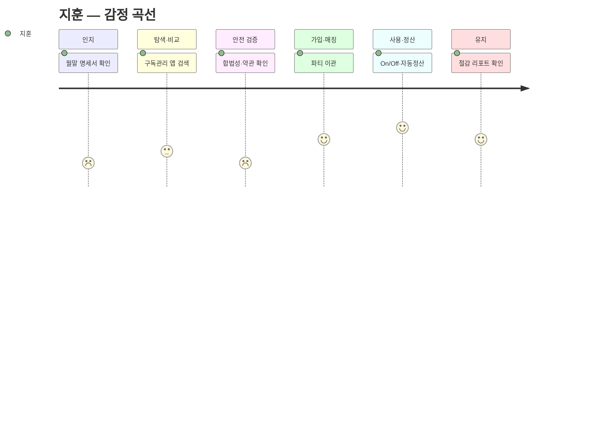
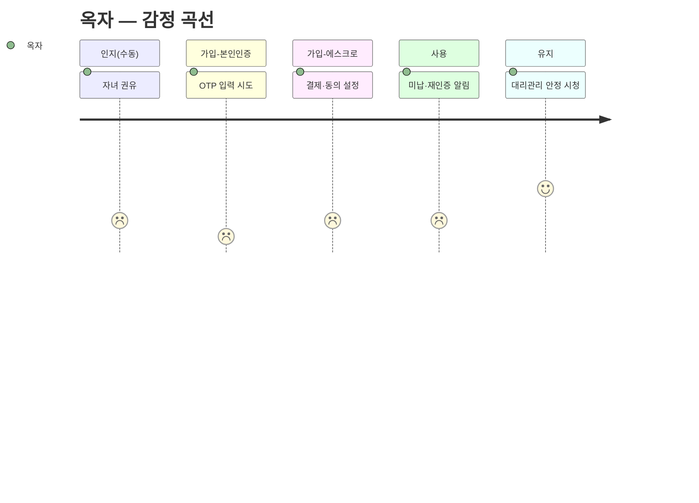
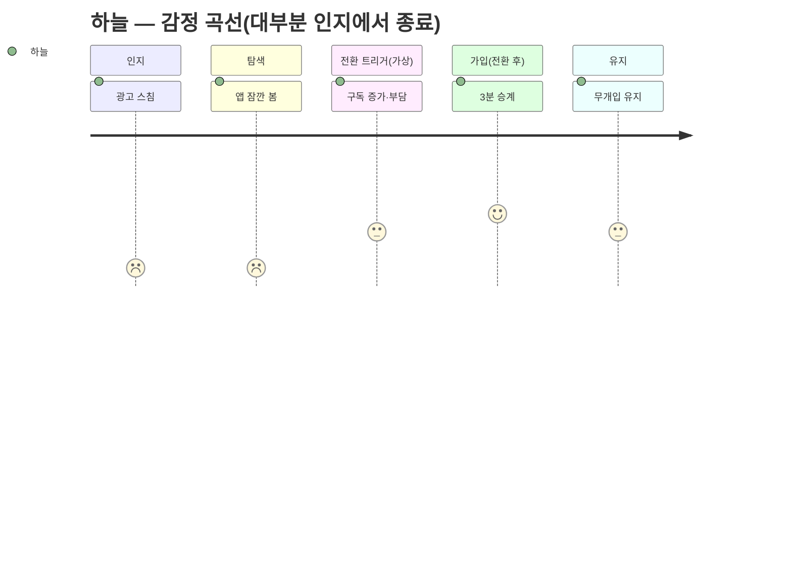

# 고객 여정 맵 — 세이프팟 (대표 페르소나 4종)

> 방법론: `methodology-customer-journey-map.md` 적용
> 여정 주체: `../05-persona/03-representative-personas.md`의 대표 4종 — 핵심 **지훈** / 확장 **수진** / 극단 **옥자**(+레민) / 비활성 **하늘**
> 맵 유형: **현재 상태 + 기대(미래) 상태 혼합** — 세이프팟은 신규 서비스라 '접하기 전' 행동은 As-Is, '가입 이후'는 To-Be(기대 여정)로 기술.
> 범위: 서비스를 **접하기 전(문제 자각)부터 구매 후(유지·재구독)까지** 전 라이프사이클.

---

## 0. 핵심 단계 재정의 ⚠️ (방법론 경고 반영)

표준 5단계("인지→고려→결정→온보딩→충성")를 그대로 쓰지 않는다. 세이프팟은 **① 신뢰가 진입 조건**이고 **② 구독형(매칭·정산·해지방어 루프)**이라는 특성이 있어, 아래 **6단계 백본**으로 재정의한다.

| # | 세이프팟 핵심 단계 | 표준 대비 | 왜 이 단계가 필요한가 |
|---|---|---|---|
| 1 | **인지** (문제 자각) | 인지 | 서비스 접하기 전, 지출·불안을 스스로 자각하는 지점 |
| 2 | **탐색·비교** | 고려 | 정가/피클/지인공유 등 대안을 저울질 |
| 3 | 🔑 **안전 검증** | *(신설)* | **신뢰가 구매의 선행 조건** — '결정' 앞에 불안 해소 관문을 별도로 세움 |
| 4 | **가입·매칭** | 결정+온보딩 | 본인인증·에스크로·**파티 매칭**(구독형 고유) |
| 5 | **사용·정산** | 온보딩 | 실사용 + **자동 정산**(공동구독 고유) |
| 6 | **유지·재구독/해지방어** | 충성 | 구독형의 **충성도 루프** — 재구독·이탈 방어 |

> **페르소나별 단계는 이 백본에서 가감된다** — 방법론 경고대로 단계는 고정이 아니다.
> - **옥자(극단)**: 4단계(가입·매칭)가 **본인인증 / 에스크로·결제 설정**의 하위 단계로 쪼개지고, 각 관문에서 실패한다.
> - **하늘(비활성)**: 여정이 **1단계(인지)에서 사실상 종료** — 3~6단계에 도달하지 못한다. '전환 트리거' 이후를 가상 분기로만 기술.

---

## 1. 핵심(Core) — 지훈 · 멀티호머

> 32세, IT 마케터, 기술 상. 비용 자각은 크지만 해지·재구독이 귀찮아 방치. 신뢰 관문은 낮음(얼리어답터).

| 단계 | 고객 행동 | 고객 생각 | 감정 | **Pain Point** | 세이프팟 개선 기회 |
|---|---|---|---|---|---|
| 인지 | 월말 카드 명세서 확인 | "이게 아직도 나가?" | 짜증·죄책감 | **실지출을 실제의 1/2.5로 과소인지**해 손실을 자각조차 못함 | 통합 대시보드로 실지출·좀비구독 가시화 |
| 탐색·비교 | 구독관리 앱·커뮤니티 검색 | "합법으로 되메꿀 방법 없나?" | 기대·반신반의 | **토스·뱅크샐러드는 '보여주기'만** — 해지→재구독 행동을 대신 안 해줌 | "안 보는 슬롯, 파티로 월 ○○원" 행동 제안 |
| 안전 검증 | 합법성 문구·약관 확인 | "이거 피클이랑 뭐가 달라?" | 경계 | **'합법 공동구독'이 회색지대와 한눈에 구분되지 않음** | 약관 허용 상품만·에스크로 배지로 차별점 명시 |
| 가입·매칭 | 본인인증→단독구독을 파티로 이관 | "생각보다 간단하네" | 안도 | **이관 시 시청 이력·프로필 유실 우려** | 프로필 승계·무중단 전환 보장 |
| 사용·정산 | 안 보는 달 Off, 볼 때 On·자동 정산 | "이제 안 새네" | 통제감·만족 | **On/Off 타이밍을 놓치면 다시 좀비구독으로 재발** | 저사용 자동 감지→Off 리마인드 |
| 유지 | 대시보드 재방문·절감액 확인 | "관리되는 느낌" | 신뢰 | **절감폭이 체감 안 되면 관리 자체가 또 다른 귀찮음** | 월 절감 리포트로 성과 가시화 |

---

## 2. 확장(Adjacent) — 수진 · 워킹맘(키즈 구독)

> 38세, 워킹맘, 기술 중. 신뢰 관문이 **가장 높음**(아이 계정). 매칭은 지인·이웃 범위 안에서만 성립.

| 단계 | 고객 행동 | 고객 생각 | 감정 | **Pain Point** | 세이프팟 개선 기회 |
|---|---|---|---|---|---|
| 인지 | 교육구독 갱신 알림 + 엄마모임 "같이 쓸래요?" | "교육비에 이것까지…" | 부담·관심 | **콘텐츠 구독이 교육비에 얹혀 고정비를 압박하나 혼자선 못 줄임** | 키즈·교육 카테고리 절감 시뮬레이션 |
| 탐색·비교 | 맘카페·단톡 비공식 공유 알아봄 | "믿을 만한가?" | 조심스러움 | **비공식 공유는 아이 프로필이 노출되고 먹튀 시 하소연할 곳이 없음** | 실명 인증 파티로 대체 |
| 안전 검증 | 세이프팟 실명인증·프로필 격리 확인 | "아이 것도 안전한가" | 반신반의→안심 | **'아이 계정이 남과 안 섞인다'는 보장이 없으면 절감 유인이 아예 작동 안 함** | 프로필 격리·시청기록 분리 전면 배치 |
| 가입·매칭 | 아는 엄마들과 파티 구성·프로필 분리 설정 | "이 사람들이면 되겠다" | 신뢰 | **신뢰 범위(아는 엄마) 안에 인원이 부족하면 파티가 성립 안 됨** | 검증된 이웃 매칭 풀 확대 |
| 사용·정산 | 자동 정산으로 돈 얘기 없이 분담 | "관계 안 상하고 좋네" | 편안 | **아이가 프로필을 헷갈려 시청 이력이 엉뚱하게 섞임** | 키즈 프로필 잠금·간편 전환 |
| 유지 | 다음 학기 교육구독도 파티로 확장 | "이건 계속 쓰겠다" | 충성 | **한 가정이 이탈하면 아이가 보던 콘텐츠가 갑자기 끊김** | 이탈 시 자동 재매칭·무중단 보장 |

---

## 3. 극단(Extreme) — 옥자 · 디지털·접근성 취약  *(+레민 병기)*

> 63세, 저시력·기술 하. **인지는 자녀가 대신**하고, **가입 단계가 쪼개지며 각 관문에서 실패**한다. 감정 곡선이 가장 낮다.

| 단계 | 고객 행동 | 고객 생각 | 감정 | **Pain Point** | 세이프팟 개선 기회 |
|---|---|---|---|---|---|
| 인지 *(수동)* | 자녀가 "이거 같이 쓰면 싸" 하고 권함 | "그런가 보다" | 수동·무관심 | **서비스 필요·존재를 스스로 인지 못해, 자녀 없이는 진입이 시작조차 안 됨** | 보호자 초대·대리 세팅 링크 |
| 가입 ① 본인인증 | OTP·인증번호 입력 시도 | "뭘 누르라는 거야" | 당황·좌절 | **인증 단계가 많고 글자가 작아 첫 관문에서 중도 포기** | 큰 글씨·최소 단계·음성 안내 |
| 가입 ② 에스크로·결제 | 결제수단·에스크로 동의 | "이게 맞나…" | 불안 | **절차 의미를 몰라 자녀에게 매번 전화로 물어야 함(자녀 의존)** | 보호자 위임(대리 승인) |
| 사용 | 시청은 함, 미납·재인증 알림 수신 | "또 뭐가 잘못됐나" | 무력감 | **미납·재인증 알림 처리법을 몰라 방치→파티에서 튕김** | 실수해도 에스크로 자동 환불·자동 재인증 |
| 유지 | 자녀 대리관리 하에 안정 시청 | "이제 그냥 보면 되네" | 안도 | **대리관리자(자녀)가 손 떼는 순간 다시 아무것도 못함(자립 불가)** | 원터치 재시청·상시 대리 모드 |

> **레민 병기(신분·금융 제약)**: 레민은 옥자와 달리 인지·탐색은 수월하나 **가입 ① 본인인증에서 즉시 차단**된다.
> **Pain Point — 국내 휴대폰 본인인증·신용카드/계좌 에스크로가 외국인등록번호·해외카드를 거부해 가입 자체가 불가**, 결국 회색지대 커뮤니티로 내몰려 먹튀 위험에 더 노출. → 개선: 외국인등록증 인증·해외 결제수단·다국어 UI.

---

## 4. 비활성(Non-user) — 하늘 · 단독구독 만족·저관여

> 26세, 저관여. 방법론 경고대로 **여정이 '인지'에서 사실상 종료**된다. 3~6단계는 '전환 트리거' 이후의 **가상 분기**로만 존재.

| 단계 | 고객 행동 | 고객 생각 | 감정 | **Pain Point** | 세이프팟 개선 기회 |
|---|---|---|---|---|---|
| 인지 | 광고·지인 추천을 스침 | "공동구독? 나랑 상관없음" | 무관심 | **단일 구독에 만족해 '문제'로 인식조차 안 함 — 여정이 시작되지 않음** | 문제화 대신 '생애 이벤트' 타깃 노출 |
| 탐색 *(대부분 생략)* | 어쩌다 앱을 잠깐 봄 | "정산하고 매칭하고… 귀찮다" | 귀찮음 | **예상 수고(설치·매칭·정산)가 예상 절감액(월 몇천 원)보다 커 보여 즉시 이탈** | 3분 온보딩·기존 구독 승계로 마찰 최소화 |
| — *여정 중단* — | *(대안: 정가 단독 유지)* | "그냥 낼래" | 무던함 | **어떤 안전·절감 메시지도 트리거 전엔 작동하지 않음(타이밍 문제)** | 전환 트리거 대기·리타깃팅 |
| ⟳ 전환 트리거 | 자취·결혼·육아로 구독 증가 | "이제 좀 부담되네" | 재고 | **트리거가 와도 마찰이 조금이라도 있으면 "역시 안 해"로 즉시 이탈(임계값 낮음)** | 트리거 시점 원클릭 승계 제안 |
| 가입 *(전환 후·가상)* | 3분 온보딩·구독 승계 | "생각보다 별거 아니네" | 의외 | **온보딩 마찰 임계값이 극도로 낮아 한 단계만 번거로워도 이탈** | 가입 단계 수 최소화·기본값 자동화 |
| 유지 *(도달 시)* | 능동 관리 없이 유지 | "딱히 신경 안 씀" | 무던함 | **관리를 안 해 좀비구독화, 그러나 본인은 문제로 못 느낌** | 자동 최적화·무개입 절감 |

---

## 5. 페르소나 교차 Pain Point 요약 & 우선 대응

| 여정 단계 | 가장 날카로운 Pain Point | 해당 페르소나 | 우선 대응 |
|---|---|---|---|
| 인지 | 손실을 자각 못하거나(지훈), 문제로 인식조차 안 함(하늘) | 지훈·하늘 | 대시보드 가시화 / 생애 이벤트 타깃팅 |
| 탐색·비교 | 기존 도구는 '보여주기'만, 비공식 공유는 노출·먹튀 위험 | 지훈·수진 | 행동 제안 + 실명 인증 파티 |
| 🔑 안전 검증 | 합법이 회색지대와 구분 안 됨(지훈) / 아이 계정 격리 보장 없음(수진) | 지훈·수진 | 에스크로 배지·프로필 격리 전면화 |
| 가입·매칭 | 인증 관문에서 실패(옥자·레민) / 신뢰 범위 인원 부족(수진) | 옥자·레민·수진 | 접근성 UI·대리 위임 / 매칭 풀 확대 |
| 사용·정산 | On/Off 놓치면 재발(지훈) / 알림 처리 못해 튕김(옥자) | 지훈·옥자 | 자동 감지·자동 재인증·자동 환불 |
| 유지 | 절감 체감 안 됨(지훈) / 이탈 시 콘텐츠 끊김(수진) / 자립 불가(옥자) | 지훈·수진·옥자 | 절감 리포트·자동 재매칭·상시 대리 모드 |

> **읽는 법**: 🔑 **안전 검증**은 세이프팟이 표준 여정에 새로 끼워 넣은 단계이자, 핵심·확장 페르소나가 공통으로 걸리는 관문이다 — 여기서의 신뢰 증명이 전환의 병목. **가입·매칭** 단계는 극단(옥자·레민)에게 **여정을 끝내버리는 벽**이라, 포용적 설계의 성패가 갈린다. **비활성(하늘)**은 인지에서 여정이 끊기므로, 제품 개선보다 **전환 트리거를 기다리는 타이밍·마찰 최소화**가 관건이다.
