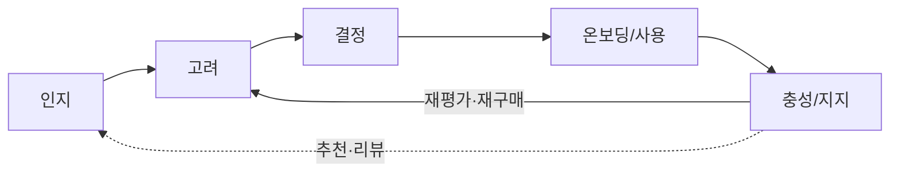
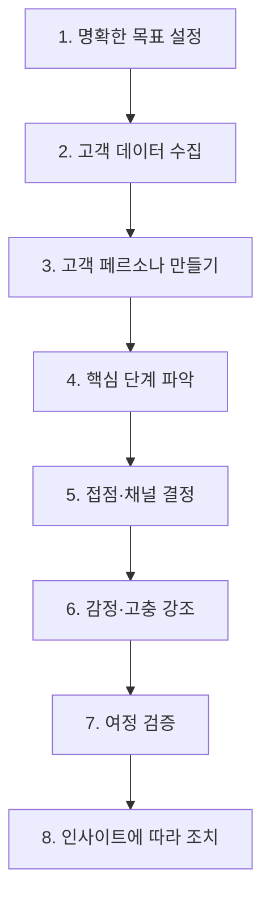

# 방법론 — 고객 여정 맵 (Customer Journey Map)

> 목적: 고객이 브랜드·제품·서비스와 맺는 **모든 경험을 소비자 관점에서 시각화**해, 접점·감정·문제점(Pain)을 한 장에 드러내고 개선 기회를 도출한다.
> 성격: 특정 상호작용(예: 조사 단계)만 다루기도 하고, 인지→구매 후 지지까지 **전체 라이프사이클**을 다루기도 하는 **가변 범위** 도구.
> 적용 대상: 한국 OTT 구독 관리(합법·안전 공동구독) 서비스 — 산출물은 `../05-persona/03-representative-personas.md`의 대표 4종(지훈·수진·옥자·하늘)을 여정의 주체로 삼아 세이프팟 CJM을 그리는 데 사용.

---

## 1. 개념 — 고객 여정 맵이란

고객 여정 맵은 고객이 브랜드와 관계를 맺는 동안 접하는 **접점(Touchpoint)·감정(Emotion)·문제점(Pain)** 을 소비자 시점에서 시각화한 것이다. 기업은 이를 통해 개선이 필요한 영역을 파악하고, 프로세스를 최적화하며, **고객 중심의 매끄러운 경험**을 설계한다.

상호작용은 영업·마케팅·제품·지원 등 **여러 부서에 흩어져** 일어나므로, 이 시각화는 팀 간 협업을 촉진해 복잡한 상호작용을 통합적으로 파악하게 한다. 동시에 고객의 요구·동기·경험을 강조해 조직이 **소비자를 의사결정의 중심**에 두도록 돕는다.

### 고객 여정 맵 vs 구매자 여정 맵

| 구분 | 범위 |
|---|---|
| **구매자 여정 맵** | 고객이 **구매 결정에 이르기까지**의 단계에 한정 |
| **고객 여정 맵** | 브랜드 지지 등 **구매 후 상호작용까지** 포함하는 더 넓은 라이프사이클 |

---

## 2. 진화 — 선형 퍼널 → 충성도 루프

디지털 커머스 이전에는 고객이 한두 단계만 거쳐 구매했고, "인지 → 구매"로 **선형적으로 진행되는 단일 판매 퍼널**이 주된 매핑 방식이었다. 오늘날은 웹·앱·챗봇·지원센터·매장 등 **수많은 접점**과 지인 추천·리뷰 조사가 얽혀 여정이 복잡해졌다.

2000년대 후반 McKinsey는 소비자 여정이 **구매 후 평가가 동시에 일어나는 연속적 사이클**에 가깝다고 보았고, 이를 지속적인 **"충성도 루프(Loyalty Loop)"** 라 불렀다. 현대의 CJM은 이 루프를 닮아, 여러 행동·경험이 **동시에** 발생하는 것을 전제한다.

---

## 3. 이점

| 이점 | 요지 |
|---|---|
| 고객 경험 향상 | 마찰 지점을 발견해 만족도·충성도 제고 |
| 고객 유지율 향상 | 구매 후·지원 단계의 이탈 요인 조기 식별 |
| 팀 간 연계성 향상 | 부서 공통의 통합 이해 도구 |
| 제품 개발 고도화 | 여정 인사이트에서 신규 기능·개선점 도출 |
| 마케팅 효과 향상 | 고객이 있는 곳에서 만나는 타깃 캠페인 |
| 고객 심리 이해 | 단계별 감정 매핑으로 동기·고충·의사결정 파악 |
| 중요 접점 식별 | 영향력 큰 접점에 리소스 우선 배치 |
| 경쟁 우위 강화 | 경쟁사 공백·차별적 경험 설계 |

> 참고: 우수한 고객 경험은 평균 **3배 수익**과 연결된다는 조사가 있을 만큼, 옴니채널 환경에서 CJM의 전략적 가치가 크다.

---

## 4. 고객 여정 맵의 유형

| 유형 | 초점 | 언제 쓰나 |
|---|---|---|
| **현재 상태 맵** (As-Is) | 지금 존재하는 고객 행동 | 가장 일반적 — 현재 문제 진단·개선 영역 식별 |
| **미래 상태 맵** (To-Be) | 원하는 이상적 여정 | 전략적 변화 계획·개선 벤치마크 설정 |
| **일상 생활 맵** (Day-in-the-Life) | 고객의 하루 전반과 그 안에서의 제품 위치 | 기대·과제의 넓은 맥락 이해 |
| **서비스 청사진** (Service Blueprint) | 여정 + **이면의 내부 프로세스·직원·시스템** | 부적절한 경험의 **근본 원인** 규명 |

---

## 5. 구성 요소

CJM은 **요청 데이터**(NPS·만족도 설문·피드백 등)와 **비요청 데이터**(구매 내역·이탈률·체류 시간·상담 기록 등)를 결합해 만든다. 범위·목적에 따라 다르지만 일반적 구성 요소는:

- **여정의 단계(Stages)** — 인지·고려·결정·온보딩·충성 등
- **고객 페르소나** — 여정의 주체가 되는 세그먼트별 프로필
- **고객의 기대치(Expectations)** — 단계마다 달라지는 기준·가정
- **접점(Touchpoints)** — 각 단계의 구체적 상호작용
- **고객 행동(Actions)** — 각 단계에서 취하는 행동·결정
- **감정(Emotions)** — 단계별 좌절·혼란·만족의 순간
- **채널(Channels)** — 상호작용이 일어나는 플랫폼·매체
- **공고/인사이트(Insights)** — 맵에서 도출된 개선 기회·놓친 연결

---

## 6. 고객 여정 맵을 만드는 8단계

1. **명확한 목표 설정** — 무엇을 개선할지(구매 최적화·이탈 원인·온보딩 등)와 개선할 **KPI**를 먼저 정한다.
2. **고객 데이터 수집** — 피드백·설문·인터뷰·상담 기록·지원 로그·웹 분석 등 여러 소스에서 확보.
3. **고객 페르소나 만들기** — 세그먼트별 데이터 기반 프로필로 여정에 맥락을 부여(→ 세이프팟은 대표 4종 활용).
4. **핵심 단계 파악** — 여정의 중요 단계를 정의. **인지~구매 후 전체**일 수도, **구매 후만**일 수도, **특정 기능 여정**일 수도 있다.
5. **접점·채널 결정** — 고객이 브랜드와 상호작용하는 위치·방법(광고·이메일·소셜·지원·앱 등).
6. **감정·고충 강조** — 단계별 감정의 고조·하락과 Pain을 데이터로 분석.
7. **여정 검증** — 실제 고객·테스트로 맵이 실제 경험을 정확히 반영하는지 확인.
8. **인사이트에 따라 조치** — 접점 커뮤니케이션 강화·리소스 재배치·기술 투자 등 개선 실행.

---

## 7. 흔한 과제와 극복

| 과제 | 극복 방향 |
|---|---|
| **깨끗한 데이터 우선순위** | 정확·무오류·신뢰 가능한 데이터. 소스·도구를 정기 감사해 최신성 유지 |
| **과도한 단순화 방지** | 페르소나별 다중 맵, 또는 여러 레이어·데이터 포인트를 얹은 맵으로 복잡성 보존 |
| **내부 운영에 집중** | 서비스 청사진 병행, 내부 팀과 종속성·워크플로 이해 |
| **협력적 팀 환경 조성** | 협업 도구·부서 간 공유 KPI로 단편적 매핑 방지 |

---

## 8. 산출 템플릿 (예시 골격)

세이프팟 CJM은 아래 골격을 페르소나별로 채워 작성한다. (아래는 **일반 예시** — 단계·항목은 서비스에 맞게 조정)

| 단계 | 고객 행동 | 고객 생각 | 감정 | Pain Point | 개선 기회 |
|---|---|---|---|---|---|
| 문제 인식 | 불편함을 느낌 | "이 문제 왜 생기는 거지?" | 불안 | 정보 부족 | 문제 원인 콘텐츠 제공 |
| 탐색 | 대안을 찾음 | "이건 괜찮아 보이는데?" | 기대 | 복잡한 비교 | 비교 툴 제공 |
| 의사결정 | 선택 고민 | "이걸 사도 될까?" | 불안 | 신뢰 부족 | 후기·데모 제공 |
| 사용 | 실제 사용 | "생각보다 어렵네" | 실망 | UX 미흡 | 온보딩 개선 |
| 유지 | 반복 사용 | "이제 익숙해졌네" | 안정 | 가치 감소 | 리텐션 캠페인 |

---

> ## ⚠️ 경고 — 핵심 단계는 고정 템플릿이 아니다
>
> **고객 여정 맵의 결과물은 항상 같은 단계로 작성되지 않는다.** "인지 → 고려 → 결정 → 온보딩 → 충성"이나 위 예시의 "문제 인식 → 탐색 → 의사결정 → 사용 → 유지"는 **하나의 일반형일 뿐 표준 정답이 아니다.**
>
> 핵심 단계(§6-4)는 **서비스의 특성에 따라 반드시 다르게 정의되어야 한다.** 예:
> - **구독형 vs 거래형** — 구독 서비스는 '구매'보다 **온보딩·재구독·해지 방어·재활성화** 루프가 핵심 단계가 된다.
> - **신뢰가 진입 조건인 서비스**(예: 세이프팟) — '결정' 앞에 **'안전 검증·불안 해소'** 단계를 별도로 세워야 실제 여정을 반영한다.
> - **재구매 주기·무료체험·매칭 대기·정산** 등 서비스 고유의 이벤트가 있으면, 그것이 곧 하나의 독립된 핵심 단계가 될 수 있다.
> - **페르소나별로 단계 자체가 달라진다** — 비활성층(하늘)은 '인지'조차 형성되지 않고, 접근성 취약층(옥자)은 '온보딩'이 여러 하위 단계로 쪼개진다.
>
> 따라서 이 방법론의 5단계·8단계·예시 표를 **그대로 복사해 채우지 말 것.** 목표(§6-1)와 페르소나(§6-3)를 먼저 확정한 뒤, **그 서비스에 맞는 핵심 단계를 새로 정의**하는 것이 CJM 품질을 좌우하는 결정 변수다.

---

## 참고

- 페르소나 자산: `../05-persona/03-representative-personas.md`(대표 4종) — CJM의 여정 주체로 사용.
- 상위 리서치 흐름: 05-persona → 06-customer-journey. 페르소나에서 정의한 Pain·감정·대체 솔루션이 여정의 단계별 입력이 된다.
