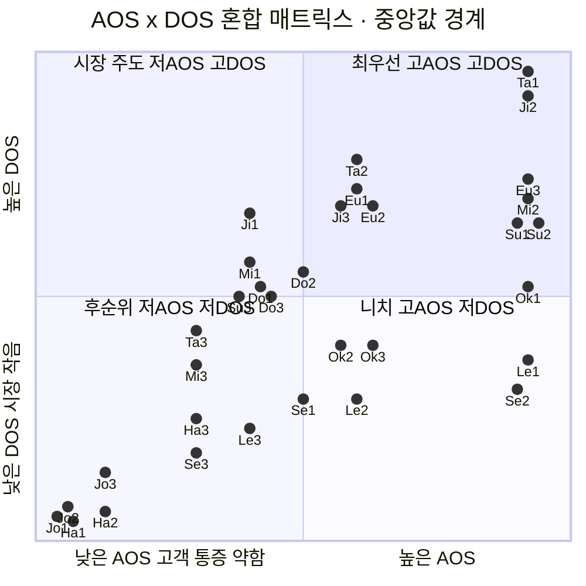

# AOS × DOS 혼합 매트릭스 — 세이프팟

> 목적: 고객 체감 기회(AOS)와 시장 가중 기회(DOS)를 두 축에 놓아, **고객도 아프고 시장도 큰** 최우선 기회를 한눈에 가린다.
> 입력: `aos-scoring.md`(AOS) · `dos-scoring.md`(DOS **SAM 버전** = 장기 기회 크기).
> 축: **X = AOS**(고객 통증) · **Y = DOS**(시장 파급력). 경계 = 각 지표 **중앙값**(AOS 3.0 · DOS-SAM 0.50).
> 범위: OTT 공동구독 33개 Pain-Goal. 현우(B2B 3개)는 DOS가 별도 모수(프리랜서 SaaS)라 축에서 제외(§4).

---

## 1. 사분면의 의미

| 사분면 | 조건 | 이름 | 뜻 |
|---|---|---|---|
| 우상단 | AOS ↑ · DOS ↑ | 🔥 **최우선** | 고객도 아프고 시장도 크다 |
| 좌상단 | AOS ↓ · DOS ↑ | 💰 **시장 주도** | 개인의 고통은 덜하지만 자금 규모가 크다 |
| 우하단 | AOS ↑ · DOS ↓ | 🎯 **니치** | 절실하지만 그 사람들이 내는 돈이 적다 |
| 좌하단 | AOS ↓ · DOS ↓ | ⬜ **후순위** | 둘 다 작다 |

---

## 2. 매트릭스 (Mermaid)

> 점 = 코드(§3 범례). 좌표는 가독성을 위한 근사이며 정확 점수는 범례 표를 본다.

---

## 3. 범례 & 사분면 배치

> 코드 = 페르소나 이니셜 + Pain 번호. 정렬은 사분면별 DOS 내림차순.

### 🔥 최우선 (고AOS · 고DOS) — 12개

| 코드 | 페르소나 · Pain → Goal | AOS | DOS(SAM) |
|---|---|:---:|:---:|
| Ta1 | 태현 · 매칭 부재 → 자동 매칭 | 4.0 | 2.80 |
| Ji2 | 지훈 · '보여주기'만 → 대신 실행 | 4.0 | 2.40 |
| Ta2 | 태현 · 음원·클라우드 → 필수재 분담 | 3.2 | 1.80 |
| Eu3 | 은정 · 제로 리스크 → 보장 확보 | 4.0 | 1.60 |
| Eu1 | 은정 · 심리적 벽 → 떳떳한 절약 | 3.2 | 1.50 |
| Mi2 | 민아 · 총무 독박 → 공정 구조 | 4.0 | 1.40 |
| Ji3 | 지훈 · On/Off 재발 → 재발 없는 유지 | 3.2 | 1.35 |
| Eu2 | 은정 · 무행동 회귀 → 확인 후 진입 | 3.2 | 1.35 |
| Su1 | 수진 · 아이 노출 → 노출 없는 분담 | 4.0 | 1.20 |
| Su2 | 수진 · 격리 보장 → 안 섞임 확신 | 4.0 | 1.20 |
| Do2 | 도영 · 밴 우려 → 밴 없는 공유 | 3.0 | 0.75 |
| Ok1 | 옥자 · 인증 포기 → 쉬운 가입 | 4.0 | 0.60 |

### 💰 시장 주도 (저AOS · 고DOS) — 5개

| 코드 | 페르소나 · Pain → Goal | AOS | DOS(SAM) |
|---|---|:---:|:---:|
| Ji1 | 지훈 · 과소인지 → 가시화 | 2.4 | 1.30 |
| Mi1 | 민아 · 수동 추적 → 자동 정산 | 2.4 | 0.80 |
| Do1 | 도영 · 유휴 지출 → 월 단위 과금 | 2.4 | 0.60 |
| Su3 | 수진 · 인원 부족 → 믿는 이웃 성립 | 2.4 | 0.50 |
| Do3 | 도영 · On/Off 지연 → 즉시 켜기 | 2.4 | 0.50 |

### 🎯 니치 (고AOS · 저DOS) — 6개

| 코드 | 페르소나 · Pain → Goal | AOS | DOS(SAM) |
|---|---|:---:|:---:|
| Ok2 | 옥자 · 알림 튕김 → 끊김 없는 시청 | 3.2 | 0.36 |
| Ok3 | 옥자 · 자립 불가 → 혼자 유지 | 3.2 | 0.36 |
| Le1 | 레민 · 인증 차단 → 가입 성공 | 4.0 | 0.32 |
| Se2 | 서연 · 증명 근거 → 확신 이동 | 4.0 | 0.24 |
| Se1 | 서연 · 상시 위협 → 안심 시청 | 3.0 | 0.21 |
| Le2 | 레민 · 회색지대 → 합법 잔류 | 3.2 | 0.21 |

### ⬜ 후순위 (저AOS · 저DOS) — 10개

| 코드 | 페르소나 · Pain → Goal | AOS | DOS(SAM) |
|---|---|:---:|:---:|
| Ta3 | 태현 · 대기 이탈 → 즉시 매칭 | 1.8 | 0.40 |
| Mi3 | 민아 · 수기 병행 → 전원 포함 | 1.8 | 0.30 |
| Ha3 | 하늘 · 낮은 임계값 → 원클릭 해결 | 1.8 | 0.15 |
| Le3 | 레민 · 다국어 → 언어 장벽 없는 처리 | 2.4 | 0.12 |
| Se3 | 서연 · 회귀 유혹 → 합법+저가 유지 | 1.8 | 0.05 |
| Jo3 | 정호 · 제로 리스크 → 감사 입증 | 0.8 | 0.00 |
| Jo2 | 정호 · 표면 확대 → 미공유 구조 | 0.0 | −0.10 |
| Ha2 | 하늘 · 지각 역전 → 확실할 때만 이동 | 0.8 | −0.12 |
| Jo1 | 정호 · 유인 무효 → 완전한 비관여 | 0.0 | −0.15 |
| Ha1 | 하늘 · 무인식 → 편하게 유지 | 0.4 | −0.20 |

---

## 4. 별도 — 현우 (B2B, 축 제외)

현우 3개는 DOS가 **프리랜서 SaaS라는 다른 모수** 기준이라 위 축(OTT SAM)에 올릴 수 없다. 참고 수치만:

| 페르소나 · Pain → Goal | AOS | DOS(B2B) |
|---|:---:|:---:|
| 현우 · 세무 부재 → 공식 지출 인정 | 4.0 | 2.60 |
| 현우 · 작업물 유실 → 완전 격리 | 3.0 | 1.80 |
| 현우 · 인원 미달 → 팀 자격 확보 | 2.4 | 1.40 |

→ 자체 시장 안에선 🔥급이나, α beachhead 밖이라 **β/γ 확장 로드맵**에서 재평가한다.

---

## 5. 해설

**1. 🔥 최우선 12개 = MVP 코어.** AOS·DOS가 함께 높은 항목으로, **태현(매칭·필수재) · 지훈(대신 실행·재발) · 은정(보장·떳떳함·확인) · 민아(총무) · 수진(아이 노출·격리)** 이 몰려 있다. "합법 증명 + 자동 실행 + 필수재 매칭"이라는 MVP 골격과 정확히 겹친다.

**2. 💰 시장 주도 5개 = 규모 레버(코어에 얹는 기능).** 지훈-가시화·민아-자동정산·도영-월과금/즉시On·수진-이웃성립은 **개별 통증(AOS)은 중간이나 시장이 큰** '넓게 얕게' 기능이다. 단독 진입 이유는 약해도 코어 위에 얹으면 리텐션·규모를 끌어올린다 — 대시보드·자동정산 같은 **횡단 기능**으로 다룬다.

**3. 🎯 니치 6개 = 절실하나 모수 작음, 전용 트랙.** 서연(피클 이탈)은 조직화 100만이라 작고, 옥자·레민(극단)은 소수다. 규모로는 후순위지만 **AOS가 높아** 버리면 안 된다 — 서연은 '피클 이탈 캠페인', 옥자·레민은 '접근성·외국인 인증 인프라'로 **별도 트랙**. `methodology-dos.md`의 **MR(규모) ≠ 전략가치** 원칙 적용 지점.

**4. ⬜ 후순위 10개 = 보류·제외.** 정호·하늘의 음수 DOS는 전환 대상 제외 확정. 태현-즉시매칭·민아-전원포함 같은 엣지는 코어 성숙 후 개선 백로그로.

**5. DOS를 SOM으로 바꾸면 우상단이 재편된다.** 이 매트릭스는 DOS(SAM) 기준이다. **SOM 버전으로 바꾸면** 안전·합법 증명 항목(특히 Se2 서연-증명, 0.24→0.80)이 우상단(🔥)으로 올라온다 — 즉 "장기 시장 크기"로는 니치여도 "단기 beachhead가 실제로 사는 이유"로는 최우선이라는 뜻. **판매 메시지는 SOM 매트릭스의 우상단**에서 읽는다.

---

## 참고

- 입력: `aos-scoring.md`(AOS) · `dos-scoring.md`(DOS SAM·SOM).
- 방법론: `methodology-opportunity-score.md`(AOS) · `methodology-dos.md`(DOS).
- 후속: 🔥 최우선 + 💰 시장 주도 상위를 JTBD 인터뷰·MVP 실험으로.
