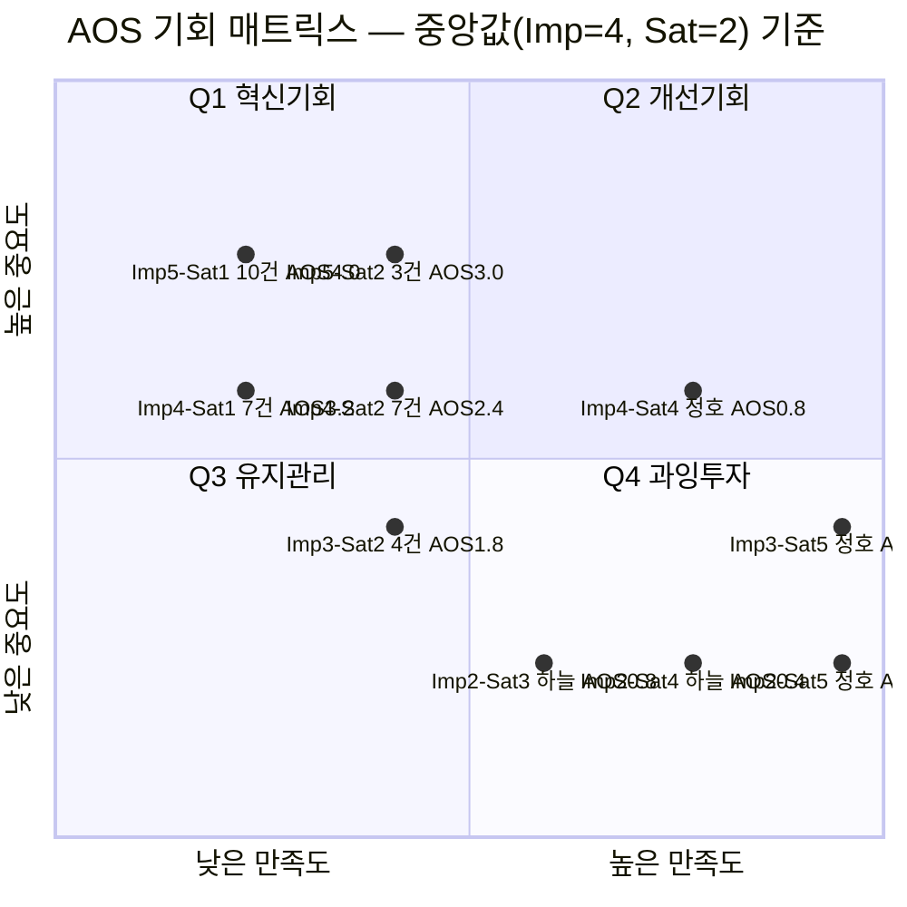

# AOS 기회점수 산출 — 세이프팟 (36 Pain-Goal)

> 목적: `pain-points-by-persona.md`에서 정돈한 12종 페르소나 × 3 = **36개 Pain-Goal**에 Importance·Satisfaction을 부여하고 AOS를 산출해, 혁신 기회를 사분면에 배치·서열화한다.
> 방법론: `methodology-opportunity-score.md` §5 ②~⑤ 적용. `AOS = Importance × (1 − Satisfaction / 5)`.
> 채점 기준:
> - **Importance(1~5)** = 그 Pain 해소가 **페르소나의 상위 Goal 달성**에 얼마나 중요한가.
> - **Satisfaction(1~5)** = **현재 쓰는 대체 솔루션**이 그 Pain을 얼마나 해결하는가(=세이프팟 없이 지금 상태). 낮을수록 미충족.
> - 점수는 여정 지도(감정 곡선·Pain 서술) 근거의 **분석가 추정치**로, 최종 확정은 Q1 항목의 JTBD 인터뷰에서 검증한다.

---

## ②③④ 종합 점수표 (Importance · Satisfaction · AOS)

> 아래 한 표가 ② Importance Table · ③ Satisfaction Table · ④ AOS Table을 통합한다. `현재 대체 솔루션` 열이 Satisfaction 점수의 근거다. Q는 §⑤ 사분면(중앙값 기준) 분류.

| 페르소나 | Pain → Goal | 현재 대체 솔루션 (Satisfaction 근거) | Imp | Sat | **AOS** | Q |
|---|---|---|:---:|:---:|:---:|:---:|
| 지훈 | 실지출 과소인지 → 가시화 | 토스·뱅크샐러드(진단만, 실행 X) | 4 | 2 | **2.4** | Q1 |
| 지훈 | '보여주기'만 → 대신 실행 | 없음(해지·재구독 대행 부재) | 5 | 1 | **4.0** | Q1 |
| 지훈 | On/Off 재발 → 재발 없는 유지 | 수동 해지 관리 | 4 | 1 | **3.2** | Q1 |
| 서연 | 상시 위협 → 안심 시청 | 회색지대 공동구독(정지 위험) | 5 | 2 | **3.0** | Q1 |
| 서연 | 증명 근거 부재 → 확신 이동 | 없음(합법 근거 부재) | 5 | 1 | **4.0** | Q1 |
| 서연 | 회귀 유혹 → 합법+저가 유지 | 회색지대 저가 공유 | 3 | 2 | **1.8** | Q3 |
| 민아 | 수동 추적 → 자동 정산 | 카톡·수기, 더치페이앱(계산만) | 4 | 2 | **2.4** | Q1 |
| 민아 | 총무 독박 → 공정 구조 | 총무 개인 결제(리스크 독박) | 5 | 1 | **4.0** | Q1 |
| 민아 | 수기 병행 → 전원 포함 | 수기 병행 | 3 | 2 | **1.8** | Q3 |
| 태현 | 매칭 부재 → 상대 자동 매칭 | 지인 수소문(채널 없음) | 5 | 1 | **4.0** | Q1 |
| 태현 | 음원·클라우드 미지원 → 필수재 분담 | 넷플 중심 플랫폼(미지원) | 4 | 1 | **3.2** | Q1 |
| 태현 | 대기 이탈 → 즉시 매칭 | 정가 단독 결제 | 3 | 2 | **1.8** | Q3 |
| 은정 | 심리적 벽 → 떳떳한 절약 | 회색지대(성격상 거부) | 4 | 1 | **3.2** | Q1 |
| 은정 | 무행동 회귀 → 확인 후 진입 | 무행동(정가 단독) | 4 | 1 | **3.2** | Q1 |
| 은정 | 제로 리스크 → 보장 확보 | 없음(보장 정책 부재) | 5 | 1 | **4.0** | Q1 |
| 현우 | 인원 미달 → 팀 자격 확보 | 오픈채팅 시트 나눔(불안정) | 4 | 2 | **2.4** | Q1 |
| 현우 | 작업물 유실 → 완전 격리 | 오픈채팅(격리 없음) | 5 | 2 | **3.0** | Q1 |
| 현우 | 세무 부재 → 공식 지출 인정 | 없음(세금계산서 부재) | 5 | 1 | **4.0** | Q1 |
| 수진 | 아이 노출 → 노출 없는 분담 | 맘카페 비공식 공유(노출) | 5 | 1 | **4.0** | Q1 |
| 수진 | 격리 보장 부재 → 안 섞임 확신 | 없음(격리 보장 부재) | 5 | 1 | **4.0** | Q1 |
| 수진 | 인원 부족 → 믿는 이웃 성립 | 맘카페(신뢰 얕음) | 4 | 2 | **2.4** | Q1 |
| 도영 | 유휴 지출 → 월 단위 과금 | 연간 구독(수동 해지) | 4 | 2 | **2.4** | Q1 |
| 도영 | 밴 우려 → 밴 없는 공유 | 지역우회·회색 공유(밴 위험) | 5 | 2 | **3.0** | Q1 |
| 도영 | On/Off 지연 → 즉시 켜기 | 연간 구독(즉시 전환 불가) | 4 | 2 | **2.4** | Q1 |
| 옥자 | 인증 포기 → 쉬운 가입 | 자녀 대리(본인 불가) | 5 | 1 | **4.0** | Q1 |
| 옥자 | 알림 튕김 → 끊김 없는 시청 | 자녀 대리 | 4 | 1 | **3.2** | Q1 |
| 옥자 | 자립 불가 → 혼자 유지 | 자녀 대리(자립 불가) | 4 | 1 | **3.2** | Q1 |
| 레민 | 인증 차단 → 가입 성공 | 없음(국내 인증 차단) | 5 | 1 | **4.0** | Q1 |
| 레민 | 회색지대 내몰림 → 합법 잔류 | 커뮤니티 계정거래(고위험) | 4 | 1 | **3.2** | Q1 |
| 레민 | 다국어 부재 → 언어 장벽 없는 처리 | 부분 영어 지원 서비스 | 4 | 2 | **2.4** | Q1 |
| 정호 | 유인 무효 → 완전한 비관여 | 정가 단독(비관여 완전 충족) | 2 | 5 | **0.0** | Q4 |
| 정호 | 표면 확대 → 미공유 구조 | 정가 단독(완전 미공유) | 3 | 5 | **0.0** | Q4 |
| 정호 | 제로 리스크 → 감사 입증 | 정가 단독(제로 리스크) | 4 | 4 | **0.8** | Q2 |
| 하늘 | 무인식 → 편하게 유지 | 정가 단독(현상 만족) | 2 | 4 | **0.4** | Q4 |
| 하늘 | 지각 역전 → 확실할 때만 이동 | 정가 단독(수고 회피) | 2 | 3 | **0.8** | Q4 |
| 하늘 | 낮은 임계값 → 원클릭 해결 | 정가 단독(트리거 시 부담) | 3 | 2 | **1.8** | Q3 |

---

## ⑤-1. 중앙값 & 사분면 경계

36개 값의 중앙값으로 상하좌우 경계를 잡는다.

| 지표 | 값 분포(빈도) | **중앙값** | 경계 규칙 |
|---|---|:---:|---|
| Importance | 5→13개, 4→15개, 3→5개, 2→3개 | **4** | High(상) = Imp ≥ 4 · Low(하) = Imp ≤ 3 |
| Satisfaction | 1→17개, 2→14개, 3→1개, 4→2개, 5→2개 | **2** | Low(좌) = Sat ≤ 2 · High(우) = Sat ≥ 3 |

> 중앙값이 경계에 걸치는 값(Imp=4, Sat=2)은 **기회 쪽 사분면**으로 귀속한다 — Imp=4는 '중요(상)', Sat=2는 '미충족(좌)'으로 처리. 이 규칙에서 사분면 분포는 **Q1 27 · Q2 1 · Q3 4 · Q4 4**.

## ⑤-2. Matrix 시각화 (X: Satisfaction, Y: Importance)

> 버블 라벨은 동일 좌표(Imp×Sat) 셀을 묶은 것이며 괄호 밖 숫자는 건수, AOS는 그 셀의 점수다. 좌상단(Q1)에 27건이 밀집 — 이 시장이 **기회 과포화 구간**임을 보여준다. 따라서 Q1 안에서의 **AOS 서열**이 실제 우선순위를 가른다(§⑤-4).

## ⑤-3. 5×5 배치 그리드 (정밀 좌표)

세로선(‖)은 Satisfaction 중앙값(2|3 사이), 가로선(═)은 Importance 중앙값(3|4 사이) 경계.

| Imp ＼ Sat | **1** | **2** ‖ | **3** | **4** | **5** |
|:---:|---|---|---|---|---|
| **5** | 지훈·서연·민아·태현·은정·현우·수진×2·옥자·레민 **(10)** | 서연·현우·도영 **(3)** | | | |
| **4** | 지훈·태현·은정×2·옥자×2·레민 **(7)** | 지훈·민아·현우·수진·도영×2·레민 **(7)** | | 정호 **(1)** | |
| ═══ | ═(Q1 위 ／ Q3·Q4 아래)═ | | | | |
| **3** | | 서연·민아·태현·하늘 **(4)** | | | 정호 **(1)** |
| **2** | | | 하늘 **(1)** | 하늘 **(1)** | 정호 **(1)** |
| **1** | | | | | |

- **Q1 혁신기회**(좌상, Imp≥4·Sat≤2): 상단 2행 × 좌 2열 = **27건** — MVP 실험·JTBD 인터뷰 1순위 풀.
- **Q2 개선기회**(우상, Imp≥4·Sat≥3): 정호-제로리스크 **1건** — 중요하나 이미 (정가 단독으로) 충족.
- **Q3 유지관리**(좌하, Imp≤3·Sat≤2): 서연-회귀·민아-전원포함·태현-즉시매칭·하늘-원클릭 **4건** — 부가 개선.
- **Q4 과잉투자**(우하, Imp≤3·Sat≥3): 정호×2·하늘×2 **4건** — 투자 재검토(비활성층).

## ⑤-4. AOS 우선순위 서열 (기회 큰 순)

| 순위 | AOS | 항목(페르소나 · Pain→Goal) | Q |
|:---:|:---:|---|:---:|
| **T1** | **4.0** | 지훈-대신 실행 · 서연-증명 근거 · 민아-총무 리스크 · 태현-매칭 · 은정-보장 · 현우-세무 · 수진-노출 · 수진-격리 · 옥자-인증 · 레민-인증 **(10건)** | Q1 |
| **T2** | **3.2** | 지훈-재발 방지 · 태현-필수재 분담 · 은정-떳떳함 · 은정-확인 진입 · 옥자-알림 · 옥자-자립 · 레민-합법 잔류 **(7건)** | Q1 |
| **T3** | **3.0** | 서연-안심 시청 · 현우-격리 · 도영-밴 없음 **(3건)** | Q1 |
| **T4** | **2.4** | 지훈-가시화 · 민아-자동 정산 · 현우-팀 자격 · 수진-이웃 성립 · 도영-월 과금 · 도영-즉시 On · 레민-다국어 **(7건)** | Q1 |
| **T5** | **1.8** | 서연-회귀 · 민아-전원 포함 · 태현-즉시 매칭 · 하늘-원클릭 **(4건)** | Q3 |
| **T6** | **0.8** | 정호-감사 입증 (Q2) · 하늘-확실할 때만 이동 (Q4) **(2건)** | Q2/Q4 |
| **T7** | **≤0.4** | 하늘-편하게 유지(0.4) · 정호-비관여(0.0) · 정호-미공유(0.0) **(3건)** | Q4 |

## ⑤-5. 페르소나별 평균 AOS (타깃 매력도)

| 페르소나 | 평균 AOS | 스펙트럼 | 성격 |
|---|:---:|---|---|
| 은정 · 수진 · 옥자 | **3.47** | 핵심/확장/극단 | 안전·신뢰·포용 = 최고 기회 wedge |
| 지훈 · 레민 | **3.20** | 핵심/극단 | 자동화 실행 · 포용 인증 |
| 현우 | **3.13** | 확장 | B2B(세무·격리) |
| 태현 | **3.00** | 핵심 | 매칭 채널(beachhead) |
| 서연 · 민아 | **2.93 · 2.73** | 핵심 | 합법 전환 · 정산 해방 |
| 도영 | **2.60** | 확장 | On/Off · 밴 회피 |
| 하늘 | **1.00** | 비활성 | 트리거 대기(시점 의존) |
| 정호 | **0.27** | 비활성 | 관찰 대상(비전환) |

---

## 해설 — 무엇을 먼저 지을 것인가

**1. Q1이 27건 — 기회가 아니라 '선별'이 과제다.** 공동구독 시장은 기존 대체 솔루션(회색지대·수기·정가 단독)이 대부분의 Pain을 제대로 못 풀어, Satisfaction이 구조적으로 낮다(1~2에 31건 몰림). 그래서 웬만한 항목이 Q1로 쏠린다. 의미 있는 우선순위는 사분면이 아니라 **AOS 서열(§⑤-4)**에서 나온다.

**2. 최상위 T1(AOS 4.0, 10건)이 곧 MVP 정의서다.** 열 항목을 주제로 묶으면 세이프팟의 차별점과 정확히 겹친다 — ⑴ **합법·안전 증명**(서연-증명근거, 은정-보장, 수진-노출·격리 4건), ⑵ **실행·자동화**(지훈-대신실행, 민아-총무리스크 2건), ⑶ **매칭 채널**(태현 1건), ⑷ **포용 인증**(옥자, 레민 2건), ⑸ **B2B 세무**(현우 1건). 즉 AOS는 "에스크로 기반 합법 증명 + 자동 실행 + 인증 포용"을 **1차 제품의 뼈대**로 지목한다.

**3. 페르소나 평균은 wedge 순서를 알려준다.** 은정(안전)·수진(신뢰)·옥자(포용)가 3.47로 최상위 — 세이프팟이 앞선 리서치에서 세운 **안전 wedge → 신뢰 → 포용** 전략과 정량으로 일치한다. 반면 태현(3.00)은 평균은 중간이나 **매칭 채널이라는 단일 병목**만 풀면 즉시 전환되는 beachhead 성격이라, 평균이 아니라 '진입 난이도'로 따로 읽어야 한다.

**4. Q4·Q2의 비활성층은 지금 건드리지 않는다.** 정호·하늘은 현재 대체 솔루션(정가 단독)이 **그들의 Goal(비관여·무노력 유지)을 이미 충족**해 Satisfaction이 높고 AOS가 0 근처다 — 신규 투자로 전환시키려는 시도는 과잉투자(Q4)다. 정호는 진입 장벽의 상한을 재는 **관찰 대상**, 하늘은 생애 이벤트 **트리거를 기다리는 리타깃 대상**으로 분류하고, 자원은 T1~T2에 집중한다.

**5. 다음 단계.** T1·T2(AOS ≥ 3.2, 17건)를 JTBD 인터뷰 대상으로 삼아(§방법론 Q1 규칙) 실제 Job Statement를 검증하고, 그중 차별점이 가장 뾰족한 '합법 증명 + 자동 실행'을 MVP 실험 1번으로 세운다.

---

## 참고

- 입력: `pain-points-by-persona.md`(36 Pain-Goal) · `../06-customer-journey/customer-journey-maps.md`(감정 곡선·Pain 원문).
- 방법론: `methodology-opportunity-score.md` §5 ②~⑤.
- 후속: T1~T2 항목의 JTBD 인터뷰 → MVP 실험 설계.
