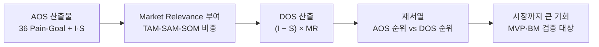

# 방법론 — 발견된 기회점수(DOS, Discovered Opportunity Score)

> 목적: AOS가 잡아낸 **고객 체감 미충족**에 **시장 규모·파급력**을 곱해, "고객도 아프고 시장도 큰" **진짜 기회 영역**을 가려낸다. VC·PM이 실제로 쓰는 `기회 강도 × 시장 확산성` 구조.
> 성격: AOS(고객 한 명 중심)의 **시장 가중형 확장** — 리서치 초기의 아이디어 탐색을 넘어 **비즈니스 모델 검증** 단계로 넘기는 다리.
> 적용 대상: 한국 OTT 구독 관리(합법·안전 공동구독) 서비스 — `aos-scoring.md`의 36 Pain-Goal에 `../04-subscription-market-segment`의 TAM-SAM-SOM을 곱해 시장 가중 순위를 재산출한다.

---

## 1. 개념 — AOS에서 DOS로: 왜 시장 가중인가

**AOS**는 고객 한 명의 관점에서 "이 사람에게 얼마나 중요하고 얼마나 안 풀렸나"를 잰다. 그러나 **아무리 아파도 그 사람이 소수라면 사업 기회는 작다.** 반대로 통증이 중간이어도 시장이 거대하면 기회는 크다. DOS는 이 **시장 축**을 곱해 넣는다.

> **DOS = 고객 미충족 × 시장 파급력** — "고객의 미충족 × 시장 가치"의 교차점이 곧 진짜 기회 영역이다.

```text
DOS = ( Importance − Satisfaction ) × Market Relevance
```

- `Importance − Satisfaction` = 고객 미충족 갭(원 갭). AOS와 달리 **비율(1−S/5) 조정 없이 원 갭**을 그대로 쓴다(§7 관계 참고).
- `Market Relevance` = 그 Pain이 시장에 갖는 **상대적 파급력**. 기본은 TAM-SAM-SOM 중 적정 모수에 대한 해당 Pain의 비중(0~1)이며, 시장 성장률·채택난이도·확산성으로 보정할 수 있다.

> ⇒ 지금까지 수행한 시장분석 자료(TAM-SAM-SOM·세그먼트 맵)를 AI에 투입하면 "기회 강도 × 시장 확산성"을 손쉽고 정확하게 도출할 수 있다.

---

## 2. AOS vs. DOS 비교

| 구분 | **AOS** | **DOS** |
|---|---|---|
| 계산 기준 | 고객 체감 중심 | 시장 가중 중심 |
| 데이터 출처 | 페르소나·인터뷰 | TAM/SAM/SOM·산업 리서치 |
| 목적 | 혁신 아이디어 탐색 | 시장 확장성 검증 |
| 적용 시점 | 리서치 초기 | 비즈니스 모델 검증 |
| AI 활용 | 중요도·만족도 평가 | 시장 규모 가중치 계산 |
| 수식 | `I × (1 − S/5)` | `(I − S) × Market Relevance` |

> 두 지표는 **대체가 아니라 병행**이다. AOS로 "고객이 아픈 곳"을 좁히고, DOS로 그중 "시장까지 큰 곳"을 고른다. 순위가 엇갈리는 항목이 곧 의사결정 포인트다(§6·§7).

---

## 3. 구성 요소

| 항목 | 설명 | 범위 |
|---|---|---|
| **Importance** | 고객에게 Pain/Goal이 얼마나 중요한가 (AOS와 동일 척도) | 1~5 |
| **Satisfaction** | 현재 대체 솔루션이 얼마나 해결하는가 (AOS와 동일 척도) | 1~5 |
| **I − S** | 고객 미충족 갭(원 갭). **음수면 과잉공급(overserved)** | −4 ~ +4 |
| **Market Relevance** | 적정 모수(TAM/SAM/SOM)에 대한 해당 Pain의 상대 비중 (+ 성장·확산 보정) | 0 ~ 1 |
| **DOS** | 시장 가중 기회 강도. **음수면 레드오션·과잉공급 신호** | −4 ~ +4 |

---

## 4. 계산식 적용 예시

| Pain | Importance | Satisfaction | Market Relevance* | DOS |
|---|:---:|:---:|:---:|:---:|
| 자동화 한계 | 5 | 2 | 0.8 | (5−2)×0.8 = **2.4** |
| AI 학습 피로 | 3 | 2 | 0.6 | (3−2)×0.6 = **0.6** |
| 신뢰 부족 | 2 | 4 | 0.7 | (2−4)×0.7 = **−1.4** |

> *Market Relevance = TAM-SAM-SOM 중 적정 모수에 대한 해당 Pain/Goal의 비중.

**부호 해석이 DOS의 핵심이다.**
- **DOS > 0** — 미충족이 남아 있고 시장도 있는 **기회 영역**. 클수록 우선.
- **DOS ≈ 0** — 적정 충족되었거나 시장 파급력이 미미.
- **DOS < 0** — Satisfaction > Importance, 즉 **이미 과잉 공급된 레드오션**('신뢰 부족' 예시처럼 −1.4). 시장이 커도 신규 진입 실익이 없어 **회피 대상**이다. AOS 사분면의 Q4(과잉투자)를 시장 축까지 확장한 신호.

---

## 5. Market Relevance 산정 방법

`Market Relevance`는 "이 Pain을 겪는 사람이 시장에서 얼마나 큰 덩어리인가"를 0~1로 환산한 값이다.

1. **적정 모수 선택** — Pain의 성격에 맞는 기준을 고른다. 전 국민이 아니라 **그 Pain이 실제로 작동하는 모수**여야 한다.
   - 예: '아이 계정 격리' Pain → SAM(공유 의향 가정) 중 자녀 있는 가구 비중.
   - 예: '외국인 인증 차단' Pain → 전체 SAM 중 외국인 비중(작지만 대체재 전무).
2. **상대 비중 산출** — 선택한 모수 안에서 해당 Pain이 차지하는 비율. `../04-subscription-market-segment`의 TAM-SAM-SOM(예: 공유 의향층 SAM ~1,500만, 중개 이용 ~100만)을 분모로 쓴다.
3. **보정(선택)** — 단순 규모 외에 **시장 성장률·채택 난이도·확산성(네트워크 효과)**으로 가중을 조정한다. 빠르게 크는·바이럴한 Pain은 가중을 올리고, 채택이 어려운 Pain은 내린다.
4. **AI 투입** — 위 시장분석 자료를 AI에 넣어 모수별 비중 추정을 빠르게 초안화하고, 사람 검수로 확정한다.

> ⚠️ **일관성 규칙**: 항목마다 다른 모수(TAM vs SAM vs SOM)를 섞으면 DOS 간 비교가 깨진다. **동일 비교군 안에서는 같은 모수 기준**으로 Market Relevance를 매긴다. 모수를 바꿔야 하면 별도 그룹으로 나눠 비교한다.

---

## 6. 시각화 — 미충족 × 시장 파급력 매트릭스

X축에 시장 파급력(Market Relevance), Y축에 미충족 갭(I−S)을 놓으면, **우상단이 곧 진짜 기회**다. 갭이 음수(과잉공급)면 하단으로 내려가 레드오션으로 분리된다.

```mermaid
quadrantChart
    title DOS 매트릭스 — 미충족 갭(I-S) x 시장 파급력(Market Relevance)
    x-axis 낮은 시장 파급력 --> 높은 시장 파급력
    y-axis 과잉공급(음수 갭) --> 높은 미충족(양수 갭)
    quadrant-1 진짜 기회(우선 진입)
    quadrant-2 니치(통증O 시장 작음)
    quadrant-3 무시(저통증 저시장)
    quadrant-4 과잉공급(레드오션)
    자동화 한계 DOS2.4: [0.8, 0.875]
    AI 학습 피로 DOS0.6: [0.6, 0.625]
    신뢰 부족 DOS-1.4: [0.7, 0.25]
```

| 사분면 | 조건 | 의미 | 전략 |
|---|---|---|---|
| **Q1 진짜 기회** | 고미충족 × 고시장 | 고객도 아프고 시장도 큼 | MVP·BM 검증 1순위 |
| **Q2 니치** | 고미충족 × 저시장 | 통증은 크나 모수가 작음 | 확장 경로·인접 시장 확인 후 진입 |
| **Q3 무시** | 저미충족 × 저시장 | 통증·시장 모두 약함 | 후순위·보류 |
| **Q4 과잉공급** | 저미충족(음수 갭) × 고시장 | 이미 잘 풀린 레드오션 | 회피 — 진입 실익 없음 |

---

## 7. 적용 워크플로우 — AOS 산출물을 DOS로 확장



1. **입력 재사용** — `aos-scoring.md`의 36 Pain-Goal과 이미 부여한 Importance·Satisfaction을 그대로 가져온다.
2. **Market Relevance 부여** — 각 Pain에 §5 방식으로 시장 비중(0~1)을 매긴다.
3. **DOS 산출** — `(I − S) × MR`로 계산. 음수 항목은 과잉공급으로 분리.
4. **재서열·교차 비교** — DOS 순위를 AOS 순위와 나란히 놓는다.
   - **AOS↑ & DOS↑** → 고객·시장 모두 큰 핵심 기회(최우선).
   - **AOS↑ & DOS↓** → 통증은 크나 시장이 작은 니치(확장 경로 필요).
   - **AOS↓ & DOS↑** → 개별 통증은 약하나 모수가 커 규모로 미는 기회.
5. **검증 대상 확정** — 상위 DOS를 MVP·비즈니스 모델 검증으로 넘긴다.

---

## 8. AOS와의 관계 — 왜 수식이 다른가 (주의)

DOS는 미충족을 **원 갭 `(I − S)`** 로 쓰고, AOS는 **조정형 `I × (1 − S/5)`** 로 쓴다. 목적이 다르기 때문이다.

| | AOS의 `I × (1 − S/5)` | DOS의 `(I − S)` |
|---|---|---|
| 값 범위 | 0 ~ 4 (**항상 양수**) | −4 ~ +4 (**음수 가능**) |
| 노림 | 중요도 이중 반영 왜곡 교정 — 순수 '기회 강도' | **과잉공급(음수)까지 판별** — 시장 진입 실익 |
| 곱하는 대상 | (없음, 고객 강도 그 자체) | × Market Relevance(시장 축) |

- DOS가 원 갭을 쓰는 이유는 **음수(과잉공급) 판별**이 목적이라서다. 조정형은 항상 양수라 레드오션을 못 걸러낸다.
- 두 지표는 **함께** 본다. AOS로 '고객이 아픈가'를, DOS로 '시장까지 큰가·과잉공급은 아닌가'를 검증한다. 한 지표만으로 결론내지 않는다.
- **일관성**: DOS 비교군 내 Market Relevance는 같은 모수 기준으로(§5 규칙). 모수가 섞이면 순위가 오염된다.

---

## 참고

- 선행: `methodology-opportunity-score.md`(AOS 방법론) · `aos-scoring.md`(36 Pain-Goal + I·S 산출물) — DOS의 입력.
- 시장 데이터: `../04-subscription-market-segment`(TAM-SAM-SOM·세그먼트 맵) — Market Relevance의 근거.
- 후속: 상위 DOS 항목 → MVP·비즈니스 모델 검증.
