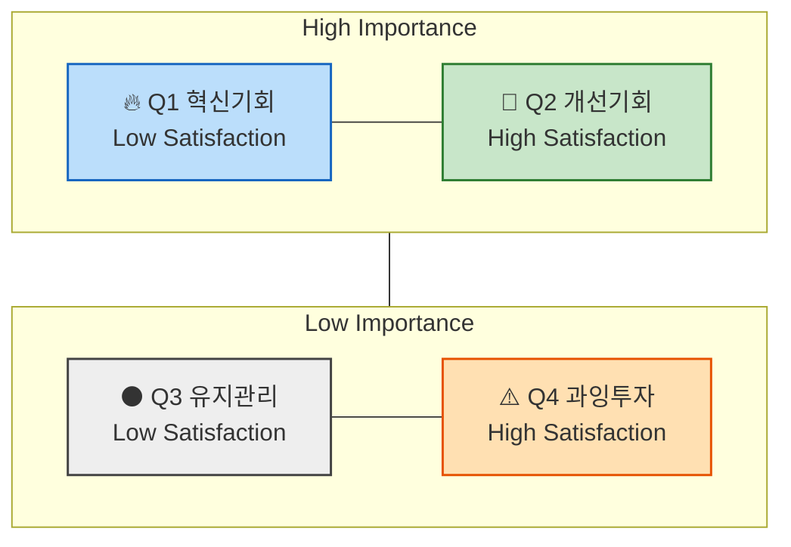
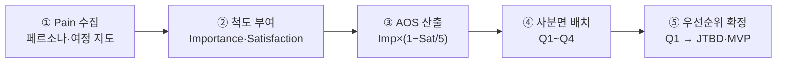

# 방법론 — 기회점수(OS) & 조정형 기회점수(AOS)

> 목적: 페르소나·고객 여정 지도에서 **정의한 Pain/Goal**을, "중요하지만 덜 해결된 문제"의 강도로 **정량 점수화**해 혁신 기회의 우선순위를 가린다.
> 성격: 전통적 기회점수(OS)의 **중요도 이중 반영 왜곡**을 교정한 **조정형 기회점수(AOS)** 를 표준으로 삼는 시장기획 분석 방법.
> 적용 대상: 한국 OTT 구독 관리(합법·안전 공동구독) 서비스 — `../05-persona/03-representative-personas.md`의 대표 페르소나와 `../06-customer-journey/customer-journey-maps.md`의 여정 단계별 Pain을 점수화 대상으로 삼는다.

---

## 1. 기회점수(OS)란, 그리고 왜 조정(AOS)이 필요한가

**기회점수(OS, Opportunity Score)** 는 고객의 **기대치(중요도, Importance)** 와 현재 **만족도(Satisfaction)** 를 결합해, "얼마나 중요한데 얼마나 안 풀렸는가"를 하나의 수치로 표현한다. 전통적 수식은 불만족 수준을 `중요도 − 만족도`로 잡고 여기에 다시 중요도를 더한다.

이때 문제가 생긴다 — **중요도(Importance)가 수식에 두 번 반영**된다.

```text
OS = Importance(기대치) + ( Importance(기대치) − Satisfaction(만족도) )
   = Importance × 2 − Satisfaction
```

중요도가 두 배로 실리면 **중요도가 높은 항목이 실제 시장감각보다 과대평가**되어, 우선순위가 왜곡된다.

**조정형 기회점수(AOS, Adjusted Opportunity Score)** 는 이 왜곡을 교정한다. 불만족 수준을 중요도와 **무관하게** — 만족도만으로 **비율(`1 − Satisfaction / 5`)** 로 도출한 뒤, 거기에 중요도를 **한 번만** 곱해 **현실적 혁신기회 강도**를 산출한다.

```text
AOS = Importance × ( 1 − Satisfaction(rate) / 5 )
```

| 구분 | 불만족 계산 | 중요도 반영 | 특성 |
|---|---|---|---|
| **OS (전통)** | Importance − Satisfaction | **2회** (이중) | 중요도 높은 항목 과대평가 |
| **AOS (조정)** | 1 − Satisfaction/5 (비율) | **1회** | 실제 시장감각에 근접 |

---

## 2. AOS의 정의

| 항목 | 설명 |
|---|---|
| **Importance** | 고객에게 Pain/Goal이 얼마나 중요한가 (1~5점) |
| **Satisfaction** | 현재 이 Pain이 얼마나 잘 해결되고 있는가 (1~5점) |
| **1 − Satisfaction/5** | 충족되지 않은 영역(Unmet Need)의 비율 (0~0.8) |
| **AOS** | "중요하지만 덜 해결된 문제"의 강도 (0~4.0) |

> 두 축 모두 1~5점 척도. `1 − Satisfaction/5`는 만족도 5 → 0(완전 충족), 만족도 1 → 0.8(대부분 미충족)의 **미충족 비율**이 된다. 따라서 AOS의 이론적 최대값은 `5 × 0.8 = 4.0`이다.

### 점수 해석 예시

| Pain / Goal | Importance | Satisfaction | 1−Sat/5 | AOS | 해석 |
|---|---|---|---|---|---|
| 리포트 자동화의 한계 | 5 | 2 (40%) | 0.6 | 5 × 0.6 = **3.0** | 명확한 혁신 기회 |
| AI 학습 피로감 | 3 | 2 (40%) | 0.6 | 3 × 0.6 = **1.8** | 부분적 개선 기회 |
| 데이터 공유 비효율 | 4 | 3 (60%) | 0.4 | 4 × 0.4 = **1.6** | 유지관리 대상 |
| 신뢰 부족 | 2 | 4 (80%) | 0.2 | 2 × 0.2 = **0.4** | 저기회 영역 |

---

## 3. 사분면 시각화 구조

AOS는 **중요도(Y축) × 만족도(X축)** 좌표평면 위에 사분면으로 시각화한다. 같은 AOS라도 어느 사분면에서 왔는지에 따라 전략 행동이 달라지므로, 단일 점수와 사분면 위치를 **함께** 읽는다.



- **X축**: Satisfaction (충족도) · **Y축**: Importance (중요도)

| 사분면 | 조건 | 의미 | 전략 행동 |
|---|---|---|---|
| **Q1** | High Importance + Low Satisfaction → **High AOS** | 혁신기회 | JTBD 인터뷰 대상, MVP 실험 우선 |
| **Q2** | High Importance + High Satisfaction → **중간 AOS** | 개선기회 | 지속적 개선 필요 |
| **Q3** | Low Importance + Low Satisfaction → **Low AOS** | 유지/보완 | UX·마케팅 최적화 중심 |
| **Q4** | Low Importance + High Satisfaction → **0 근처** | 과잉투자 위험 | 자원 분배 재검토 |

---

## 4. 평가 대상 정의 — 무엇을 점수화하는가

**`우리가 설계한 솔루션`** 에 대한 **페르소나 스펙트럼과 고객 여정 지도**를 재료로,
**`기존 솔루션 생태계`** 아래에서 **고객이 겪고 있는 Pain/Job 상황**을 평가한다.

| 분석 단계 | 평가 단위 = `고객 타겟` | 평가 대상 = `Pain 정의 내용` |
|---|---|---|
| **페르소나 단계** | 각 페르소나의 주요 Pain·Goal | "이 사람에게 가장 중요한 고통은 무엇인가?" |
| **고객 여정 지도** | 여정 단계별 Pain Point / 개선기회 | "고객 여정 중 어디서 좌절이 가장 큰가?" |
| ~~JTBD 인터뷰 사전 단계~~ | ~~Job Statement 단위~~ | ~~"이 고객이 진보를 이루기 위해 수행하는 일(Job)은 무엇인가?"~~ |

> Importance·Satisfaction 점수는 **기존 솔루션 생태계 기준**으로 매긴다. 즉 "우리 서비스가 있다면"이 아니라 "지금 고객이 쓰는 대안들로 이 Pain이 얼마나 풀리는가"를 만족도로 잡아야, AOS가 **아직 비어 있는 시장의 기회**를 가리킨다.

---

## 5. 적용 워크플로우



1. **Pain 수집** — 대표 페르소나의 주요 Pain·Goal과 여정 단계별 Pain Point를 목록화한다.
2. **척도 부여** — 각 항목에 Importance(1~5)·Satisfaction(1~5)을 **기존 대안 기준**으로 매긴다.
3. **AOS 산출** — `Importance × (1 − Satisfaction/5)`로 강도를 계산한다.
4. **사분면 배치** — 중요도×만족도 좌표에 올려 Q1~Q4로 분류한다.
5. **우선순위 확정** — Q1(High AOS)을 최우선 혁신 후보로 삼아 JTBD 인터뷰·MVP 실험으로 넘긴다.

---

## 참고

- 입력 자산 (페르소나): `../05-persona/03-representative-personas.md` — 대표 페르소나의 Pain·Goal이 점수화 대상.
- 입력 자산 (여정): `../06-customer-journey/customer-journey-maps.md` — 여정 단계별 Pain Point가 점수화 대상.
- 상위 리서치 흐름: 05-persona → 06-customer-journey → **07-opportunity-score**. 여정에서 드러난 Pain을 AOS로 서열화해, 다음 단계(JTBD·MVP)의 진입점을 정한다.
