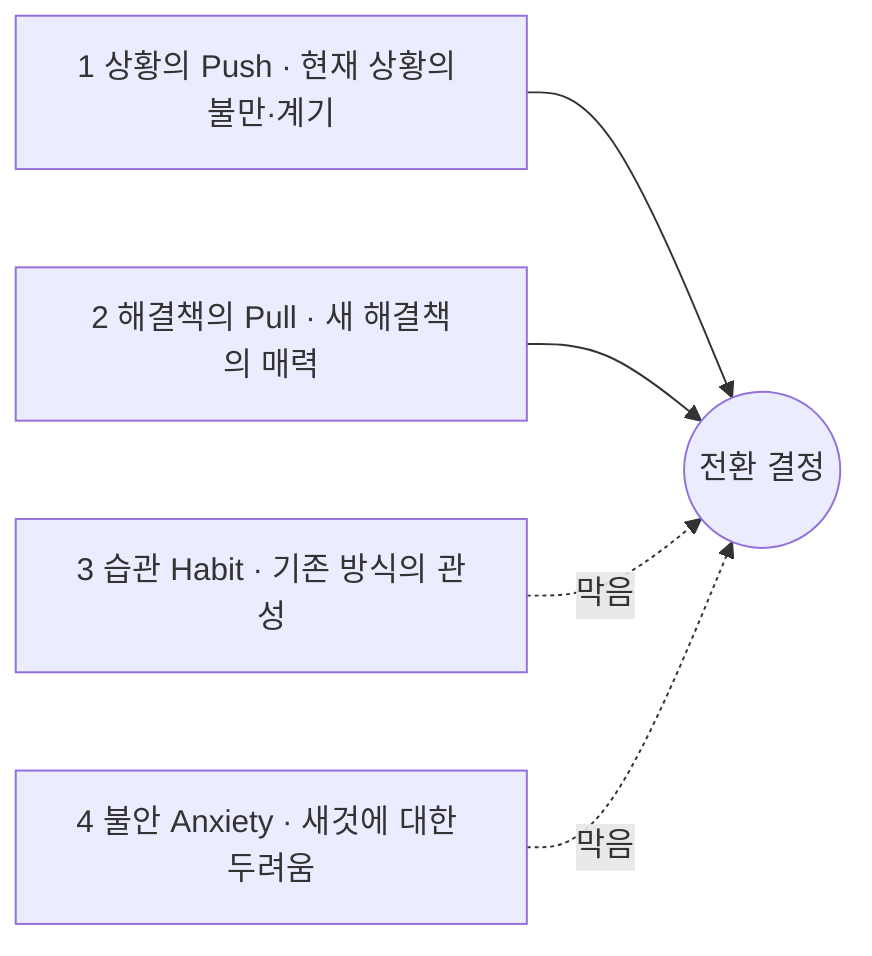

# 방법론 — JTBD 인터뷰 (Jobs To Be Done)

> 목적: 고객이 겪은 **전환 사건(switch event)** 의 이야기를 통해, 표면적 이유가 아니라 **행동을 유도한 더 깊은 목표(Job)** 와 그 전환을 밀고 당긴 힘을 밝혀낸다.
> 성격: 생성 연구(generative research)의 한 갈래로, **왜 지금 이 해결책으로 갈아탔는가**를 스토리텔링으로 재구성하는 정성 인터뷰.
> 적용 대상: 한국 OTT 구독 관리(합법·안전 공동구독) 서비스 — 인터뷰 대상은 `../07-opportunity-score/aos-dos-matrix.md`의 **🔥 최우선 · 💰 시장 주도** 항목을 겪는 페르소나(태현·지훈·은정·민아·수진 등)에서 스크리닝한다.

---

## 1. 인터뷰 준비 및 구조

### 시간 배정

| 항목 | 기준 |
|---|---|
| 세션 길이 | **60~90분** (클래식 생성 연구 세션에 준함) |
| 이유 | 이 기법에 익숙하지 않으면 편안해지는 데 시간이 걸리므로 충분히 배정 |

### 고유한 참가자 모집 (Recruiting)

JTBD의 핵심은 **전환 행동(switching behavior)** 을 이해하는 것이다. 특히 다음 **세 그룹**을 스크리닝해 모집한다.

| 그룹 | 대상 | 무엇을 알 수 있나 |
|---|---|---|
| **최근 시작** | 최근에 우리 제품/서비스를 **쓰기 시작한** 사람 | 무엇이 그들을 **전환**하게 했는가 |
| **최근 중단** | 최근에 우리 제품/서비스 사용을 **중단한** 사람 | 무엇이 그들을 **떠나게** 했는가 |
| **미인지** | 우리 제품/서비스를 **아직 들어본 적 없는** 사람 | 경쟁 제품으로 이끄는 힘, 대안의 실제 맥락 |

> 세 그룹을 통해 사람들이 우리 쪽으로 **전환하거나 떠나는 이유**, 그리고 경쟁 제품으로 이끄는 **푸시/풀(Pushes/Pulls)** 요소를 이해한다.

---

## 2. 심층 목표 파헤치기 (Focus on Deeper Goals)

- **표면적 답변 피하기** — "왜 다른 제품으로 바꿨나"를 직설적으로 묻지 않는다. 직설적 질문은 행동을 유도한 **더 깊은 목표에 도달하지 못한다.**
- **'전환 사건'에 집중** — 인터뷰이가 대화의 방향을 이끌게 허용하되, 연구자는 참가자가 **변화를 일으키게 된 '전환 사건(switch event)'** 에 초점을 유지한다.
- **스토리텔링 유도** — 사용자가 **무언가를 하기로 결정한 배경의 이야기**를 하도록 유도한다. 생성 연구처럼 심층적으로 파고들되, **특정 방식**(전환 사건 중심)으로 진행한다.

---

## 3. 핵심 질문 전략 (Interview Scripting)

### 3.1 대안 및 맥락 파악 질문

대화의 맥락을 잡는 주요 질문으로, **대안과 맥락**에 중점을 둔다.

- 제품/서비스를 시도하기 전에 **다른 어떤 해결책**을 고려했습니까?
- 이러한 해결책을 고려할 때 **무엇을 찾고** 있었습니까?
- **무엇을 해결**하려고 했습니까?
- 이 제품/서비스들을 **어떻게 찾아보았는지** 이야기해 주십시오.
- 실제로 **사용해 본 다른 해결책**은 무엇입니까?
- 시도·사용해 본 다른 해결책의 **좋았던 점과 싫었던 점**은 무엇입니까?
- 이 제품/서비스를 **사용할 수 없었다면 대신 무엇을** 했을 것입니까?
- **주변 사람들**이 시도·사용해 본 해결책은 무엇입니까?
- **과거와 비교**했을 때 지금 무엇을 하고 있습니까?

### 3.2 맥락 및 감정적 질문

경쟁사·잠재적 전환 행동을 파악한 뒤, **더 감정적인 질문**으로 깊이 파고든다.

- 문제를 해결할 무언가가 필요하다는 것을 **언제 처음 깨달았습니까?**
- 고려 중인 선택에 대해 **다른 사람과 이야기했습니까? 대화는 어땠습니까?**
- 이 제품/서비스를 사용하면 **어떤 모습일지 상상**했습니까?
- 제품/서비스로부터 **무엇을 원했습니까?**
- 이 제품/서비스를 구매·사용하는 것에 대해 **불안감(anxiety)** 이 있었습니까?
- 사용하는 것에 대해 **걱정하게 만드는 요소**가 있었습니까?

### 3.3 스토리텔링을 위한 연상 유도

기억은 **사람·장소·냄새·소리와의 연상**을 통해 회상되는 경우가 많다. 다음으로 장면을 되살린다.

- 그때는 **하루 중 몇 시**였습니까?
- **집**에 있었습니까, **직장**에 있었습니까?
- 뒤에서 **TV가 켜져** 있었습니까?
- 당신은 **어떤 상태**였습니까 (who they were)?

---

## 4. 경청해야 할 4가지 전환 동인 (Listening for the Switch)

인터뷰 내내, 전환을 유도한 동기·페인 포인트에 귀 기울인다. 전환은 **미는 두 힘(Push·Pull)** 과 **막는 두 힘(Habit·Anxiety)** 의 줄다리기다.

| # | 동인 | 무엇을 듣는가 |
|---|---|---|
| 1 | **상황의 푸시 (Push)** | 특정 상황 중 무엇이 그들을 **새 해결책을 찾도록** 이끌었나 |
| 2 | **새 해결책의 풀 (Pull)** | 새 해결책의 **어떤 점이** 그것을 시도하고 싶게 만들었나 |
| 3 | **발목을 잡는 습관 (Habits)** | 새 해결책 시도를 **방해할 수 있는 습관**은 무엇이었나 |
| 4 | **새것에 대한 불안 (Anxieties)** | 시도·사용에 대해 **어떤 불안**을 느꼈나 |

> 전환은 `Push + Pull > Habit + Anxiety`일 때 일어난다. 제품 설계는 **Push·Pull을 키우고 Habit·Anxiety를 줄이는** 방향이어야 한다.

---

## 5. 세이프팟 적용 노트

세이프팟은 아직 출시 전이라 "우리 제품 전환"은 **현재 대안 생태계로의 전환**으로 치환해 스크리닝한다.

- **최근 시작** ≈ 최근 **피클플러스·회색지대 공동구독**을 시작했거나 **지인 사적 공유 파티**를 꾸리기 시작한 사람.
- **최근 중단** ≈ 계정정지·먹튀·정산 마찰로 **공동구독을 접은** 사람.
- **미인지** ≈ 절감 여지는 있으나 아직 **어떤 공동구독도 시도 안 한** 미조직층(은정·하늘 유형).

각 인터뷰에서 §4의 네 힘을 세이프팟 맥락으로 매핑한다 — **Push**(단속·정산 스트레스·유휴 지출) / **Pull**(합법·안전·자동 정산) / **Habit**(정가 단독 결제·기존 지인 공유) / **Anxiety**(계정정지·먹튀·아이 계정 노출). 이 매핑이 `07-opportunity-score`의 AOS·DOS 가설을 **실제 전환 서사로 검증**하는 연결점이다.

---

## 참고

- 인터뷰 대상 선정: `../07-opportunity-score/aos-dos-matrix.md`(🔥 최우선·💰 시장 주도) · `../07-opportunity-score/dos-scoring.md`.
- 페르소나: `../05-persona/03-representative-personas.md` · `../05-persona/personas-from-market-segment.md`.
- 현재 대안 생태계: `../04-subscription-market-segment/cosubscription-market/analysis-korea-cosubscription.md`.
- 후속: 인터뷰 스크립트 작성 → 인터뷰 수행 → Job Statement·전환 서사 정리.
